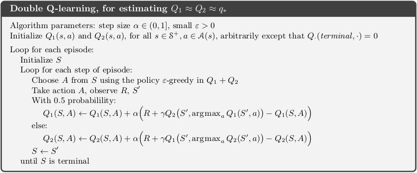

##### 1.马尔科夫决策过程

环境动态：$p(s', r\mid s,a) \dot= P(S_t=s',R_t=r\mid S_{t-1}=s,A_{t-1}=a)$

回报：$\begin{aligned}G_t&=R_{t+1}+\gamma R_{t+2}+\gamma^2 R_{t+3}+\cdots\\&=R_{t+1}+\gamma G_{t+1}\end{aligned}$

策略的状态价值函数：
$$
\begin{aligned}
v_\pi(s) &= \mathbb E_\pi[G_t\mid S_t=s]\\
&= \mathbb E_\pi\left[ \sum_{k=0}^\infty \gamma^kR_{t+k+1}\mid S_t=s \right]\\
\end{aligned}
$$
策略的行动价值函数：
$$
\begin{aligned}
q_\pi(s,a) &= \mathbb E_\pi[G_t\mid S_t=s,A_t=a]\\
&= \mathbb E_\pi\left[ \sum_{k=0}^\infty \gamma^kR_{t+k+1}\mid S_t=s,A_t=a \right]\\
\end{aligned}
$$
状态价值函数的贝尔曼方程：
$$
v_\pi(s) =\sum_a \pi(a\mid s)\sum_{s',r}p\left( s',r\mid s,a \right)\left[ r+\gamma v_\pi(s') \right]
$$
策略的价值函数$v_\pi$是贝尔曼方程的唯一解。

行动价值函数的贝尔曼方程：
$$
q_\pi(s,a) = \sum_{s',r}p(s',r\mid s,a)\left[ r+\gamma\sum_{a'}q_\pi(s',a') \right]
$$
状态价值的贝尔曼最优性方程：
$$
v_*(s) = \max_{a\in\mathcal A(s)}\sum_{s',r}p(s',r\mid s,a)[r+\gamma v_*(s')]
$$
对于有限MDP，贝尔曼最优性方程有与策略无关的唯一解。

行动价值的贝尔曼最优性方程：
$$
q_*(s,a) = \sum_{s',r} p(s',r\mid s,a)\left[ r+\gamma\max_{a'}q_*(s',a') \right]
$$

##### 2.动态规划

DP要求环境模型的完美假设，将贝尔曼最优性方程转换为赋值。

**策略评估（预测问题）**—计算任意策略$\pi$的状态价值函数：

若环境动态已知，则贝尔曼方程就是$\vert \mathcal S \vert$个$\vert \mathcal S \vert$元线性方程组。使用迭代方法，考虑近似价值函数序列$v_0,v_1,v_2,\dots$，每个$v_k$都是所有状态的一种价值函数，初始$v_0$可任意选择（除终止状态必须为0），然后按照下式更新：
$$
v_{k+1}(s) = \sum_a\pi(a\mid s)\sum_{s',r}p(s',r\mid s,a)[r+\gamma v_k(s')]
$$
更新规则的固定点是$v_k=v_\pi$。实现时有异地和就地两种更新方法，后者收敛更快。

**策略改善定理**：令$\pi$和$\pi'$为任意策略对，若$\forall s\in\mathcal S$都有$q_\pi(s,\pi'(s)) \ge v_\pi(s)$，则策略$\pi'$必然是比$\pi$同样好或更好的策略；考虑下面的贪心策略来进行策略改善定理：
$$
\begin{aligned}
\pi'(s) &= \arg\max_a q_\pi(s,a)\\
&=\arg\max_a \sum_{s',r}p(s',r\mid s,a)[r+\gamma v_\pi(s')]
\end{aligned}
$$
**策略迭代**：一旦某个策略$\pi$用$v_{\pi}$改善后，又能计算$v_{\pi'}$产生更好的$\pi''$，不但重复直到找到最优策略。

**价值迭代**：在保证收敛的条件下，将策略迭代截短为策略评估在一次扫描后就停止，即对$\forall s\in\mathcal S$：
$$
v_{k+1}(s) = \max_a\sum_{s'r} p(s',r\mid s,a)[r+\gamma v_k(s')]
$$
对任意$v_0$，序列能在与$v_*$存在同样的条件下收敛到$v_*$。

**广义策略迭代**：策略迭代由两个同时、交互的进程组成，一个使价值函数与当前策略一贯（策略评估），另一个使策略对当前价值函数贪婪（策略改善），只要两者持续更新所有状态，最终都会收敛到最优价值函数和最优策略。GPI中的评估和改善过程的竞争与合作，使这两个进程在交互找到联合解决方法：最优价值函数和最优策略。

##### 3.蒙特卡洛方法

MC方法从实际或模拟的经验中学习，无需DP所要求的全部环境动态。MC方法将样本回报求平均，这里仅为分节任务定义MC方法，仅当一个节结束时，价值评估和策略才会改变，因此是按节而非按步（在线）的方法。

**蒙特卡洛预测**：首访MC方法将$\pi_s$估计为所有节中首次访问$s$后获得回报的均值；每访MC是所有节中每次访问$s$。

与DP的情况一样，MC每个状态的估计都独立，不需要**引导(bootstrap)**。并且评估单个状态价值的成本独立于状态数，就能以所求状态开始生成样本节然后将其回报平均。

在无法得到模型时需要评估行动价值$q_\pi(s,a)$，这里的问题是很多状态-行动对很难被访问，一种解决方法是指定某个行动对开始样本节，即**探索启动**。

**蒙特卡洛控制**：总体思路依据GPI，探索启动MC：

为避免探索启动，产生了on-policy和off-policy方法。on-policy方法的策略通常是松弛的，即$\forall s\in\mathcal S,a\in\mathcal A$，都有$\pi(a\mid s)>0$，下面是$\varepsilon$-贪婪的首访MC方法：

**Off-Policy方法**：用**行为策略$b$**产生的行为来学习**目标策略$\pi$**。但要满足包含假设$\pi(a\mid s)>0\to b(a\mid s)>0$。**重要性采样**是一种通过其他分布的样本来估计一种分布的期望的方法，而**重要性采样率**则是目标和行为轨迹发生的相对概率，给定序列$S_t,A_t,S_{t+1},A_{t+1},\cdots$：
$$
\rho_{t:T-1} = \frac{\prod_{k=t}^{T-1}\pi(A_k\mid S_k)p(S_{k+1}\mid S_k,A_k)}{\prod_{k=t}^{T-1}b(A_k\mid S_k)p(S_{k+1}\mid S_k,A_k)} = \prod_{k=t}^{T-1}\frac{\pi(A_k\mid S_k)}{b(A_k\mid S_k)}
$$
记$\mathcal T(s)$为所有访问$s$的时间步，$T(t)$表示时间$t$后的首次终止时间，$G_t$为$t$后到$T(t)$的回报，可用常规重要性采样评估$v_\pi(s)$：
$$
V(s) \dot=\frac{\sum_{t\in\mathcal T(s)}\rho_{t:T(t)-1}G_t}{\vert \mathcal T(s) \vert}
$$
或加权重要性采样：
$$
V(s) \dot=\frac{\sum_{t\in\mathcal T(s)}\rho_{t:T(t)-1}G_t}{\sum_{t\in\mathcal T(s)}\rho_{t:T(t)-1}}
$$
令$W_i = \rho_{t:T(t)-1}$，则
$$
V_n \dot= \frac{\sum_{k=1}^{n-1}W_kG_k}{\sum_{k=1}^{n-1}W_k}, \qquad n \ge 2
$$
则更新规则可以递增的形式实现为($C_0\dot=0$)：
$$
\begin{aligned}
V_{n+1} &\dot= V_n + \frac{W_n}{C_n}\Bigl[ G_n - C_n \Bigr] \qquad n \ge 1\\
C_{n+1} &\dot= C_n + W_{n+1}
\end{aligned}
$$
具体的off-policy的预测算法为：

On-policy评估策略的价值并将其用于控制。而off-policy中这两个函数是分开的，好处是目标策略是确定贪婪的，行为策略可持续对所有可能的行动采样。下面算法为保证每个状态-行动回报数目为无穷，选择$b$为$\varepsilon$-松弛：

TD误差可以产生方差最小的更新效果最好：
$$
\delta_t = R_{t+1} + \gamma V(S_{t+1}) - V(S_t)
$$
则状态-价值的off-policy定义为：
$$
G_t^p = \sum_{k=t}^\infty \gamma^{k-t}\rho_{t:k}\delta_k + V(S_t)
$$
MC是一种离线算法，会等到节结束然后再回到这些时间步更新：
$$
V'(s) = \dot= \frac{\sum_{t\in\mathcal T(s)}G_t^p}{\vert \mathcal T(s) \vert}
$$

##### 4.时间差分学习

TD是MC和DP两者思想的结合。

**TD预测**：MC从经验中学习，其更新的思想是：$V(S_t)\leftarrow V(S_t)+\alpha\left[G_t-V(S_t)\right]$。TD也能从经验中学习，但在下个时间就能基于$R_{t+1}$和估计$V(S_{t+1})$更新：
$$
V(S_t) \leftarrow V(S_t) + \alpha\left[R_{t+1}+\gamma V(S_{t+1})-V(S_t)\right]
$$
MC更新的目标是$G_t$，而TD更新的目标是$R_{t+1}$。上面的是TD(0)或一步TD方法：

类似DP，TD(0)将更新部分基于一个已有的估计，这是一种自举(boostrap)方法。
$$
\begin{eqnarray}
v_\pi(s) &=& \mathbb E_\pi\left[ G_t\mid S_t=s \right] \tag{1}\\
&=& \mathbb E_\pi\left[ R_{t+1} + \gamma v_\pi(S_{t+1}) \right] \tag{2}
\end{eqnarray}
$$
MC将1作为更新目标，而TD使用2。TD和MC更新是**样本备份**，因其基于单个后继状态（或状态-行动对）样本，而DP的**全备份**基于所有可能后继者的完整分布。若获得的经验数量有限，这时就需重复展示这些样本，但价值函数仅在处理每个数据批后才更新，这种**批更新(batch updating)**只要$\alpha$选择足够小，TD和MC会确定性地收敛到不同的值，批MC总是寻求训练数据均方误差最小的估计，而批TD(0)则寻找符合MP最大似然模型的估计。若模型正确即能计算正确的价值函数估计，TD(0)收敛到这种**确定性等价估计**，而且可能是在巨量状态空间中唯一可行的近似确定性等价估计的方法。

**Sarsa—on-policy的TD控制**：先依据下面的更新计算行动价值函数：
$$
Q(S_t,A_t) \leftarrow Q(S_t,A_t) + \alpha\left[ R_{t+1}+\gamma Q(S_{t+1},A_{t+1}) - Q(S_t,A_t) \right]
$$
若$S_{t+1}$为终止状态，则$Q(S_{t+1},A_{t+1})$定义为0。具体算法为：

只要所有状态-行动对都能被无限次访问并且策略在极限时收敛于贪心，Sarsa就以1的概率收敛到最优测率额和行动价值函数。

**Q学习—off-policy的TD控制**：其更新定义为：
$$
Q(S_t,A_t) \leftarrow Q(S_t,A_t) + \alpha\left[ R_{t+1}+\gamma\max_aQ(S_{t+1},a)-Q(S_t,A_t) \right]
$$
已证明Q学习已1的概率收敛到$q_*$，具体算法为：

**期望Sarsa**：将Q学习中的最大值替换为期望值，算法移动的方向在期望上与Sarsa相同。其更新公式为：
$$
\begin{aligned}
Q(S_t,A_t) &\leftarrow Q(S_t,A_t) + \alpha\left[ R_{t+1}+\gamma\mathbb E[Q(S_{t+1},A_{t+1})\mid S_{t+1}]-Q(S_t,A_t) \right]\\
&\leftarrow Q(S_t,A_t) + \alpha\left[ R_{t+1}+\gamma\sum_a\pi(a\mid S_{t+1})Q(S_{t+1},a)-Q(S_t,A_t) \right]
\end{aligned}
$$
期望Sarsa排除了随机选择$A_{t+1}$造成的误差，表现好于Sarsa。通常使用与目标不同的行为策略，这时期望Sarsa就是off-policy，改善了Sarsa的同时包含并推广了Q-学习，除少量额外的计算，期望Sarsa完全优于前两者。

**最大化偏差和对偶学习**：前面的算法都将估计价值的最大作为最大价值的估计，比如状态$s$所有行动$q(s,a)$都为0，但估计时会将出现的最大正值作为估计，这就是最大化偏差，原因是确定最大行动和估计行动价值使用的样本相同。可将样本分为两部分分别学习两个独立估计，一个用于确定最大行动$A^*=\arg\max_aQ_1(a)$，另一个用于评估价值$Q_2(A^*)=Q_2\left(\arg\max_aQ_1(a)\right)$，此即对偶学习的思想。

可将对偶学习思想扩展到所有MDP算法上，比如对偶Q学习，每一局只随机更新一个估计：
$$
Q_1(S_t,A_t) \leftarrow Q_1(S_t,A_t) + \alpha\left[ R_{t+1}+\gamma Q_2\left(S_{t+1},\arg\max_aQ_1(S_{t+1},a)\right)-Q_1(S_t,A_t) \right]
$$
具体算法为：

**5.多步自举**