#### 第6章 时间差分学习

TD学习是MC和DP两者思想的结合，既能不用模型而从原始经验学习，又能基于已有估计更新而无需等待最终结果（引导，bootstrap），是RL的中心和创新领域，TD、DP和MC间的关系是RL的持久话题。


##### 6.1 TD预测

一个简单非平稳环境的每访MC方法是：
$$
V(S_t) \leftarrow V(S_t) + \alpha\Bigl[G_t-V(S_t)\Bigr] \tag{6.1}
$$
必须等到节终结才能确定$V(S_t)$的增量；TD方法则只需等到下个时间，其更新为：
$$
V(S_t) \leftarrow V(S_t) + \alpha\Bigl[R_{t+1}+\gamma V(S_{t+1})-V(S_t)\Bigr] \tag{6.2}
$$
MC更新的目标是$G_t$，而TD更新的目标是$R_{t+1}+\gamma V(S_{t+1})$，这种TD(0)或单步TD的具体算法为：

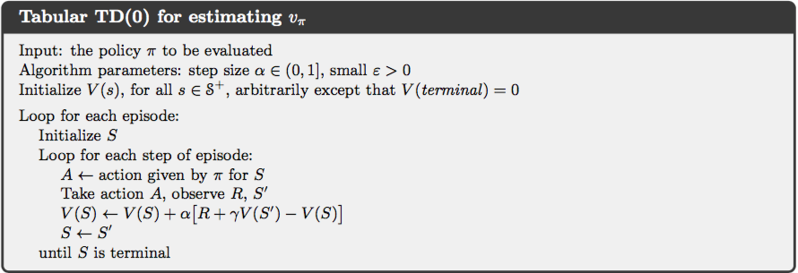

因TD(0)在$t+1$时对$S_{t}$的状态做出更新，此时$R_{t+1}$和$S_{t+1}$都已经获得，而前面已有$V(S_{t+1})$的估计，因此也是基于样本的估计。由MDP可得：
$$
\begin{eqnarray}
v_\pi(s) &\dot=& \mathbb E_\pi[G_t\mid S_t=s] \tag{6.3}\\
&=& \mathbb E_\pi[R_{t+1}+\gamma v_\pi(S_{t+1}) \mid S_t=s] \tag{6.4}
\end{eqnarray}
$$
大体上MC使用(6.3)的估计为目标；DP则是6.4；三者目标是估计，因MC使用了样本回报代替期望回报，DP使用了$V(S_{t+1})$而非$V_\pi(S_{t+1})$，TD则既使用了期望值样本又使用了当前$V$的估计。称TD和MC为采样更新，因其使用了一个后继状态样本和从中获得的激励来计算备份值。与DP的期望更新不同的是它基于单个后记样本而非所有后继的完整分布。TD(0)括号中的量为TD误差，衡量$S_t$估计值和更佳估计$R_{t+1}+\gamma V(S_{t+1})$的差异：

$$
\delta_t = R_{t+1} + \gamma V(S_{t+1}) - V(S_t) \tag{6.5}
$$
它是$V(S_t)$的误差，但在$t+1$时得到。另外若数组$V$在一节未变（如MC），则MC误差可写为TD误差之和：
$$
\begin{eqnarray}
G_t - V(S_t) &=& R_{t+1} + \gamma G_{t+1} - V(S_t) +\gamma V(S_{t+1}) - \gamma V(S_{t+1})\\
&=& \delta_{t} +\gamma \bigl( G_{t+1}-V(S_{t+1}) \bigr)\\
&=& \delta_t + \gamma\bigl( R_{t+2}+\gamma G_{t+2} - V(S_{t+1})+\gamma V(S_{t+2}) -\gamma V(S_{t+2}) \bigr)\\
&=& \delta_t + \gamma\delta_{t+1} + \gamma^2\bigl( G_{t+2}-V(S_{t+2}) \bigr)\\
&=& \sum_{k=t}^{T-1}\gamma^{k-t}\delta_k \tag{6.6}
\end{eqnarray}
$$
若在一节中$V$改变（如TD(0)），但步长参数很小的话，(6.6)也近似成立（证明见附录1）。对这个等式的推广在TD学习的理论和算法都占据了重要位置。

> **例6.1 开车回家**：尝试预测每天开车回家所需时间。假设周五pm 6:00离开公司并估计需30m到家；6:05到车上时发现下雨了，因此重新估计还需35m；6:20走完高速进入辅路时将总估计减为35m；但这时却堵在了拖拉机后面；6:40转到所住街道时才摆脱，3m后到家。因此状态、时间和预测序列就是：
>
> 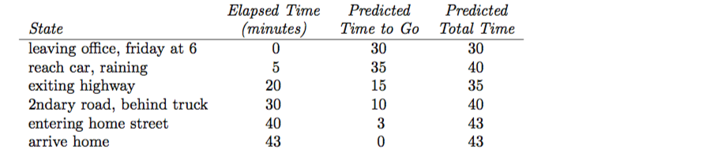激励为每段路程所花时间，不使用折扣($\gamma=1$)；每个状态的回报就是从此处到家所需的时间，价值为到家所需时间的期望。下图左侧描绘了常 $\alpha$-MC中预测的变化，箭头展示了$\alpha=1$时状态价值的增量($G_t-V(S_t)$)，但需回到家才能做(6.1)的更新；而其实堵在路上时就已经知道需调整原来的预测，下图右侧展示了TD中预测的变化，由(6.2)，TD会将每个估计向下个估计偏移。
>
> 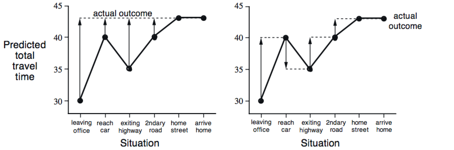


##### 6.2 TD预测的优点

相对于DP，TD无需环境模型；相对于MC，TD的关键优势是在线、全增量形式；另外，MC中若节中采取了试验行动则需丢弃，TD则没那么敏感。对任意固定策略$\pi$，已证明若常步长参数充分小则TD(0)收敛到$v_\pi$，若满足普通的随机近似条件则步长参数以1的概率减小。虽然关于TD和MC哪种方法学习更快、哪种数据效率更高还是个开放话题，但实践中通常发现TD收敛更快。

> **例6.2 随机游走**：马尔可夫激励模型，或MRP，是没有行动的MDP。下图的MRP每节从中心状态$\mathtt C$开始，每步等概率向左或向右，在最左端或最右端终结。在最右端会有1的激励，其他都为0。
>
> 任务无折扣，状态的价值就是从它出发后在最右端终结的概率，$\mathtt A$到$\mathtt E$分别是$\frac16,\frac26,\frac36,\frac46,\frac56$。下图左边展示TD(0)一次运行不同数量节后学到的价值，右边则是用均方根误差度量的两种方法在不同$\alpha$值下的学习曲线。 
>
> 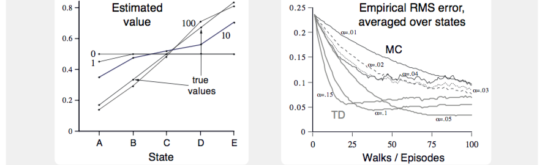


##### 6.3 TD的最优性

若仅能获得有限的经验，增量学习方法通常对给定的近似价值函数$V$，为每个访问非终结状态的时间$t$计算(6.1)或(6.2)确定的增量，累积这些增量进行一次更新；然后将所有经验用新的价值函数同样处理产生新的总增量；如此往复直至收敛。这就是批更新，仅在处理每个完整批数据后才更新。批更新中只要所选$\alpha$充分小，TD(0)和常$\alpha$-MC都确定性收敛，但收敛到不同值。

> **例6.3 批更新随机游走**：将批更新的TD(0)和常$\alpha$-MC应用到随机游走。每个新节后，视目前所有节为一批，反复呈现给算法；然后将价值函数的估计结果与$v_\pi(s)$比较，描绘出5个状态误差的均方根，获得下图的学习曲线。可以看到批TD一致优于批MC。
>
> 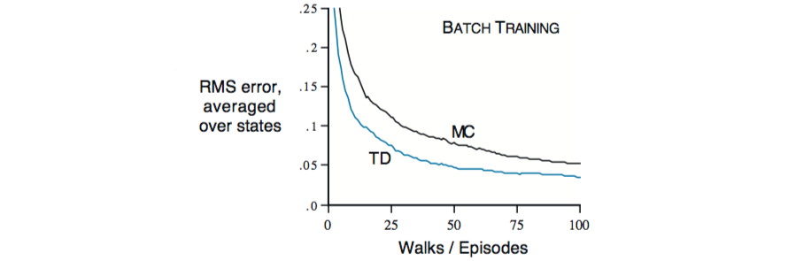

批训练中，常$\alpha$-MC收敛于访问状态后实际回报样本的均值$V(s)$，以最小化训练集均方根误差而言是最优的。但基于均方根误差度量，TD方法却表现更优，这是因为MC方法仅以有限方式最优。

> **例6.4 预言者** 观察到某未知MRP下面8个节，通过这批数据获得$V(\mathtt A),V(\mathtt B)$的最优估计：
>
> 
>
> 显然$V(\mathtt B)$是$\frac34$；$V(\mathtt A)$则有两种思路：一种是观察到在$\mathtt A$会100%立刻转移到$\mathtt B$且激励为0，因此$V(\mathtt A)$也是$\frac34$，相当于是先建立了下图的Markov过程(MP)，然后由此计算出估计：
>
> 
>
> 这也是TD(0)给出的答案；另一种思路是只看到$\mathtt A$一次且回报为0，因此$V(\mathtt A)$为0，这是批MC方法给出的答案，也是给出训练集上最小均方差的估计。但我们依然认为前者是更好的估计。

上例展示了批TD(0)和批MC估计的大体差异，批TD(0)总是寻找Markov过程最大似然的估计：从$i$到$j$的估计转移概率是观测到从$i$到$j$转移的一部分，相关的期望激励就是那些转移激励的均值。称只要模型正确就能计算正确价值函数为确定性等价估计，因等价于假设了基本过程的估计确切已知。批TD(0)收敛到这种确定性等价估计。

这就是TD方法收敛快于MC方法的原因。非批方法虽然不会收敛到确定性等价或最小均方差估计，但也在同样的方向行进。最后虽然确定性等价估计某种意义上是最优解，但$O(n^2)$的存储和$O(n^3)$的计算使其几乎不可能直接求解，在大型空间状态任务中，TD方法可能是唯一可行的近似确定性等价方法。


##### 6.4 Sarsa：on-policy的TD控制

遵循GPI模式的控制需先获得$q_\pi(s,a)$的估计，在与TD(0)同样的条件下，对应on-policy的行动价值也收敛：
$$
Q_(S_t,A_t) \leftarrow Q(S_t,A_t) + \alpha\Bigl[ R_{t+1} + \gamma Q(S_{t+1}, A_{t+1}) - Q(S_t,A_t) \Bigr]
$$
若$S_{t+1}$为终结，则$Q(S_{t+1},A_{t+1})$定义为0，它利用了构成行动-状态转移的五元组$(S_t,A_t,R_{t+1},S_{t+1},A_{t+1})$，这也是其名称的由来。并且行动价值的TD误差$\delta_t\dot=R_{t+1}+\gamma Q(S_{t+1},A_{t+1})$也满足：
$$
G_t-Q(S_t,A_t)=\sum_{k=t}^{T-1}\gamma^{k-t}\delta_k
$$
证明详见附录3。具体算法为：

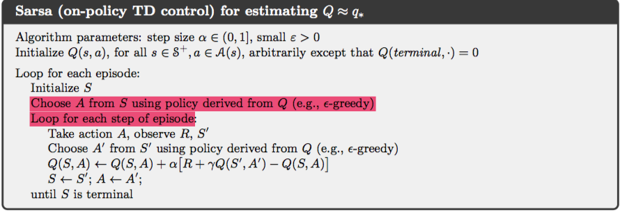

只要行动-价值对都能无限次访问并且策略在极限收敛于贪心，则Sarsa以概率1收敛到最优策略和行动价值函数。

> **例6.5 有风网格世界**：下图起点为$\mathtt S$目标为$\mathtt G$；中间区域的风会使上下左右的移动向上偏移表格底部风力数目的单位；设$\gamma=1$，除到达目标状态其余激励皆-1；表中轨迹为最优策略；以$\varepsilon=0.1$、$,\alpha=0.5$、所有初始$Q(s,a)=0$，将$\varepsilon$-贪心Sarsa应用到这个任务，结果为下图曲线，斜率增加表明达到目标的速率在加快。
>
> 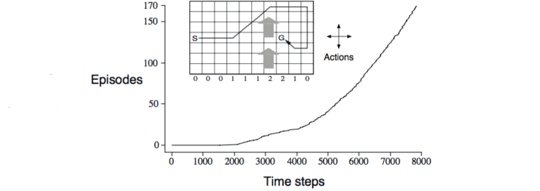
>
> 持续$\varepsilon$-贪心探索使节平均长度为17，略多于最小的15。注意无法在这里轻易使用MC方法，因节无法保证终结（比如原地踏步）；而基于步的方法在节中就能学习这个策略很糟转到其他，因此没有这个问题。


##### 6.5 Q-学习：off-policy的TD控制

Off-policy控制的一种经典算法是Q学习：
$$
Q(S_t,A_t) \leftarrow Q(S_t,A_t) + \alpha\left[ R_{t+1} + \gamma\max_aQ(S_{t+1},a)-Q(S_t,A_t) \right]
$$
这里学到的行动价值函数$Q$无视所遵循的策略，选择后继访问和更新的状态-行动对，直接近似$q_*$；在所有行动-状态对能被持续更新假设和步长参数序列随机近似条件的变体下，Q被证明以1的概率收敛到$q_*$，具体算法为：

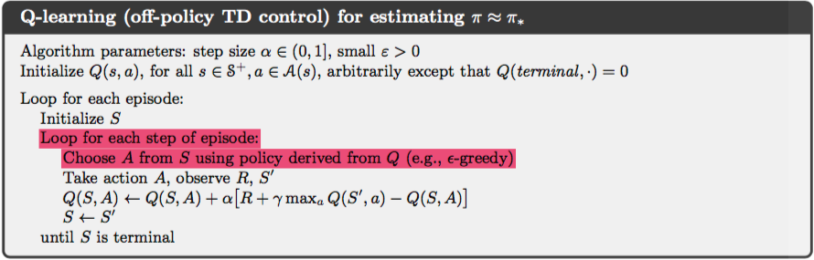

> **例6.6 漫步悬崖**：下图上部为起点为$\mathtt S$、目标为$\mathtt G$、无折扣、分节的网格世界；行动为上下左右；步入标为"Cliff"区域会招致-100的惩罚并回到起点，其余的移动激励都为-1。下图下部展示了$\varepsilon=0.1$的$\varepsilon$-贪心行动选择的Sarsa和Q-学习的表现。
>
> 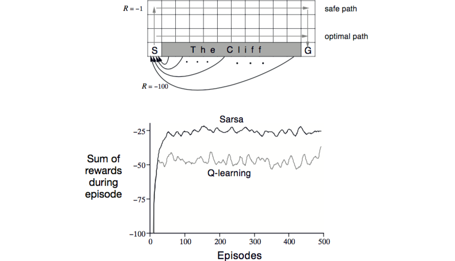
>
> Q-学习很快找到了沿悬崖边缘的最优路径，但$\varepsilon$-贪心的行动选择会使其偶尔坠入悬崖；而Sarsa考虑了行动选择学到了通过网格上部迂回但更安全的路径。因此尽管Q-学习找到了最优策略的价值，但在线性能劣于Sarsa。若$\varepsilon$逐渐减小，则两个方法都渐近收敛于最优策略。

注意Sarsa和Q-学习算法红色标出两步的区别。Sarsa的行为（在状态$s$选择的行动$a$使用的）策略和目标（计算的$Q(s,a)$所属的）策略是同一个——都是$\varepsilon$-贪心，因此是on-policy的方法；而Q-学习的行为策略是$\varepsilon$-贪心，目标策略则是完全贪心的，因此是off-policy的方法。若使用贪婪的行为策略，则两者是一样的算法[见附录4]。


##### 6.6 期望Sarsa(Expected Sarsa)

将Q-学习更新步骤中所有行动的最大值改为平均值，即：
$$
\begin{eqnarray}
Q(S_t,A_t) &\leftarrow& Q(S_t,A_t) + \alpha\Bigl[ R_{t+1} + \gamma\mathbb E\bigl[Q(S_{t+1},A_{t+1})\mid S_{t+1}\bigr] - Q(S_t,A_t)\Bigr]\\
&\leftarrow& Q(S_t,A_t) + \alpha\left[ R_{t+1} + \gamma\sum_a\pi(a\mid S_{t+1})Q(S_{t+1},a) - Q(S_t,A_t) \right]
\end{eqnarray}
$$
其余保持不变，就得到了期望Sarsa；给定下个状态$S_{t+1}$，由$\pi(a\mid S_{t+1})$为$\varepsilon$-贪心选择每个行动的概率，算法移动的方向和Sarsa的期望相同，因此这里的期望Sarsa是on-policy的；当然也有off-policy版的。


期望Sarsa的备份图如上，其消除了随机选择$A_{t+1}$带来的方差。同样的经验下其表现优于Sarsa和Q学习。下图为三者在漫步悬崖的表现：

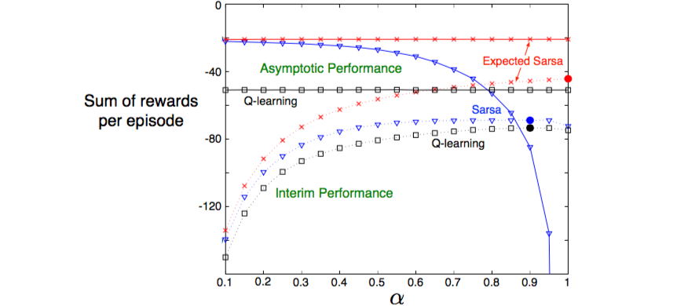

在各个$\alpha$值上期望Sarsa都出类拔萃。漫步悬崖所有状态转移都是确定性的，因此随机性只来自策略。这时就能放心地设置$\alpha=1$；而Sarsa在却$\alpha$接近1时表现得断崖式下跌。除一些额外计算，期望Sarsa全方面优于其他两者。


##### 6.7 最大化偏差与对偶学习(Double learning)

目前的算法都隐含将估计的最大值作为最大值的估计，这会导致很大的正偏差——最大化偏差。

> **例6.7 最大化偏差**：下图展示了最大化偏差对TD控制算法性能的影响。起点为A，向右行动会立刻转到终止状态激励和回报都为0；向左到B激励也为0，在B则有很多激励服从$\mathcal N(-0.1,1.0)$的行动，期望回报是-0.1；因此从A开始向左的轨迹都是错误。
>
> 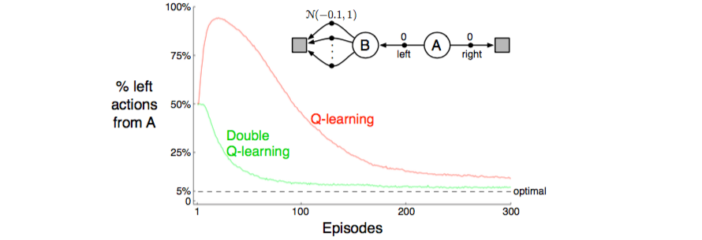
>
> 但最大化偏差会使B似乎拥有正的价值，因此控制算法会偏好向左。上图展示了$\varepsilon$-贪心选择行动的Q-学习，初始时对向左有着极强的偏好。

产生这个问题的**原因是使用了同样的样本来确定最大行动和估计其价值**。可以将样本分成两份，对$\forall a\in\mathcal A$独立学习$Q_1(a)$和$Q_2(a)$两个真实价值都是$q(a)$的估计，一个用于确定最大行动，另一个估计这个行动价值，即$Q_2\left(A^*\right)=Q_2\left(\arg\max_aQ_1(a)\right)$；因 $\mathbb E\left[Q_2\left(A^*\right)\right]=q\left(A^*\right)$这个估计是无偏的。也可以交换两者角色重复此过程产生另一个无偏估计$Q_1\left(\arg\max_aQ_2(a)\right)$，这就是对偶学习的思想。注意虽然学习了两个估计，但每部只更新一个；加倍了存储需求，但并未增加每步的计算量。

对偶Q-学习将时间分成两份，在一份中的时间步更新可能是：
$$
Q_1(S_t,A_t) \leftarrow Q_1(S_t,A_t) + \alpha\left[ R_{t+1}+\gamma Q_2\left( S_{t+1},\arg\max_aQ_1(S_{t+1},a) \right) -Q_1(S_t,A_t) \right]
$$
在另一份则交换$Q_1,Q_2$，两者完全对称；行为策略两者都使用，如求和或平均；产生上图结果的具体算法如下：

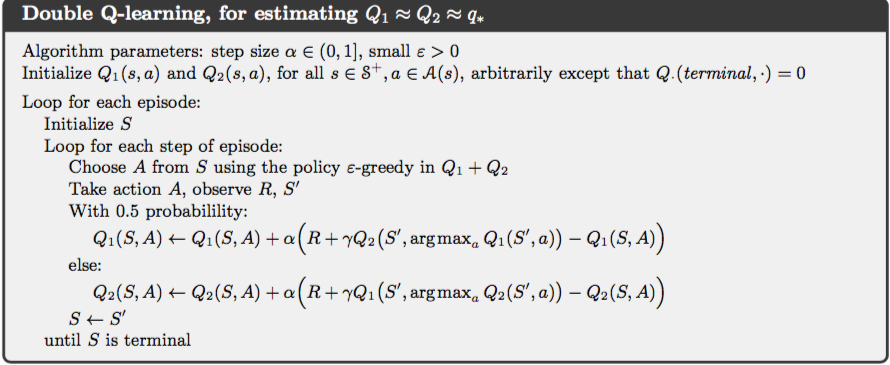

同样也有对偶Sarsa和对偶期望Sarsa。其中对偶期望Sarsa的更新公式为：
$$
\begin{eqnarray}
Q_1(S_t,A_t) &\leftarrow& Q_1(S_t,A_t) + \alpha\left[ R_{t+1}+\gamma\mathbb E[Q(S_{t+1},A_{t+1})\mid S_{t+1}] -Q_1(S_t,A_t) \right]\\
&\leftarrow& Q_1(S_t,A_t) + \alpha\left[ R_{t+1}+\gamma\sum_a\pi(a\mid S_{t+1})Q(S_{t+1},a) -Q_1(S_t,A_t) \right]
\end{eqnarray}
$$

##### 6.8 博弈、后状态和其他特例

这里试图展现大量任务的统一方法，但总有特例需特殊对待。比如棋类游戏使用的状态价值函数在代理执行移动后评估棋盘位置，这被称为后状态，价值函数也被称为后状态价值函数，适用于只有环境部分初始动态而无完整知识的任务。比如对弈时虽然知道每个移动的效果，但无法获知对手的应对。而许多位置-移动对会产生同样的位置：


行动价值函数需要分别这两队，而后状态则从左边学到的知识能立刻迁移到右边，非适于利用这种知识产生更有效的方法，在许多任务中都有应用，如排队。


##### 附录：

1. $V$在一节中变化时，比如TD(0)更新：
   $$
   V_{t+1}(S_t) \leftarrow V_t(S_t) + \alpha\Bigl[ R_{t+1}+\gamma V_t{(S_{t+1})} -V_t(S_t) \Bigr]
   $$
   因需在$t+1$步时才获得$R_{t+1}$和$S_{t+1}$，此时$S_{t+1}$价值还未更新，TD误差为：
   $$
   \delta_t \dot= R_{t+1} + \gamma V_t(S_{t+1}) - V_t(S_t)
   $$
   因$\delta_t$为在$t+1$计算时间$t$的误差，因此$V(S_{t+1})$和$V(S_t)$的时间下标与$\delta$相同，因此MC误差为：
   $$
   \begin{eqnarray}
   &&G_t - V_t(S_t)\\
   &=& R_{t+1} + \gamma G_{t+1} - V_t(S_t) +\gamma V_t(S_{t+1}) - \gamma V_t(S_{t+1})\\
   &=& \delta_t +\gamma\bigl(G_{t+1}-V_t(S_{t+1})\bigr)\\
   &=& \delta_t + \gamma\bigl(R_{t+2}+\gamma G_{t+2} - V_t(S_{t+1})+\gamma V_{t+1}(S_{t+2})-\gamma V_{t+1}(S_{t+2})\bigr)\\
   &=& \delta_t + \gamma\Bigl[\bigl( R_{t+2}+\gamma V_{t+1}(S_{t+2})-V_{t+1}(S_{t+1})\bigr) + \gamma\bigl(G_{t+2}-V_{t+1}(S_{t+2})\bigr) +\bigl(V_{t+1}(S_{t+1})-V_t(S_{t+1})\bigr) \Bigr]\\
   &=& \delta_t + \gamma\delta_{t+1} + \gamma^2\bigl[G_{t+2}-V_{t+1}(S_{t+2})\bigr] + \gamma\alpha\delta_t\\
   &=& \delta_t+\gamma\delta_{t+1} + \gamma^2\delta_{t+2} +\gamma^3\bigl[G_{t+3}-V_{t+2}(S_{t+3})\bigr] +\gamma\alpha\delta_t +\gamma^2\alpha\delta_{t+1}\\
   &=& \sum_{k=t}^{T-1}\gamma^{k-t}\delta_k + \alpha\sum_{k=t+1}^T\gamma^{k-t}\delta_{k-1}
   \end{eqnarray}
   $$
   因此当$\alpha$很小时(6.6)也近似成立。

   

2. TD更新$V(S_t)=V(S_t)+\alpha\bigl[R_{t+1}+\gamma V(S_{t+1})-V(S_t)\bigr]$目标为$v_\pi(s)=\mathbb E_\pi\bigl[R_{t+1}+\gamma v_\pi(S_{t+1})\mid S_t=s\bigr]$，令$V_n(S_t)$为$n$次更新状态后$S_t$的价值：
   $$
   \begin{eqnarray}
   &&V_{n+1}(S_{t})\\
   &=& \frac1{n+1}\left[\sum_{k=1}^{n+1}\Bigl(R_{k}(S_{t+1})+\gamma V_{k-1}(S_{t+1})\Bigr)\right]\\
   &=& \frac1{n+1}\left[\Bigl(R_{n+1}(S_{t+1})+\gamma V_n(S_{t+1})\Bigr) + \sum_{k=1}^n\Bigl(R_{k}(S_{t+1})+\gamma V_{k-1}(S_{t+1})\Bigr)\right]\\
   &=& \frac1{n+1}\left[\Bigl(R_{n+1}(S_{t+1})+\gamma V_n(S_{t+1})\Bigr) + \left(\frac{n+1}{n}- \frac1n\right)\sum_{k=1}^n\Bigl(R_{k}(S_{t+1})+\gamma V_{k-1}(S_{t+1})\Bigr) \right]\\
   &=& \frac1n\sum_{k=1}^n\Bigl(R_{k}(S_{t+1})+\gamma V_{k-1}(S_{t+1})\Bigr)+\frac1{n+1}\Bigl[R_{n+1}(S_{t+1})+\gamma V_n(S_{t+1})-V_n(S_t)\Bigr]\\
   &=& V_n(S_t) + \alpha(n)\Bigl[R_{n+1}(S_{t+1})+\gamma V_n(S_{t+1})-V_n(S_t)\Bigr]
   \end{eqnarray}
   $$
   注意这里$\sum_{k=1}^nf(S_t)$中，$S_t$其实更准确地表示为$S_{t_k}$，表示第$k$次访问$S_t$，因此每个$k$对应的$S_{t_k}$相同，而$S_{t_k+1}$不一定相同，因同一个状态出发以不同的概率条道不同的下个状态。

   

3. Off-policy的平凡采样TD更新：
   $$
   \begin{eqnarray}
   V_{n+1}\left(S_{t_{n+1}}\right) &=& \frac1{n+1}\sum_{k=1}^{n+1}\left[ \frac{ \pi \left(S_{t_k+1}\mid S_{t_k}\right) }{ b \left(S_{t_k+1} \mid S_{t_k}\right) } \Bigl( R_{k}(S_{t_k+1})+\gamma V_{k-1}(S_{t_k+1}) \Bigr) \right]\\
   &=& \frac1{n+1}\sum_{k=1}^{n+1} \rho_{t_k:t_k} \Bigl[ R_{k}(S_{t_k+1})+\gamma V_{k-1}(S_{t_k+1}) \Bigr]\\
   &=& \frac1{n+1}\left[\rho_{t_{n+1}:t_{n+1}}\Bigl(R_{n+1}(S_{t_{n+1}+1})+\gamma V_{n}(S_{t_{n+1}+1})\Bigr) \\
   \qquad\quad+\left(\frac{n+1}{n}-\frac1n\right)\sum_{k=1}^{n} \rho_{t_k:t_k} \Bigl( R_{k}(S_{t_k+1})+\gamma V_{k-1}(S_{t_k+1}) \Bigr)\right]\\
   &=& V_n\left(S_{t_{n+1}}\right) + \frac1{n+1}\left[\rho_{t_{n+1}:t_{n+1}}\Bigl(R_{n+1}(S_{t_{n+1}+1})+\gamma V_{n}(S_{t_{n+1}+1})\Bigr)-V_n\left(S_{t_{n+1}}\right)\right]
   \end{eqnarray}
   $$
   即是：
   $$
   \begin{eqnarray}
   V_{n+1}(S_t) &=& V_n(S_{t}) + \frac1{n+1}\left[\rho_{t:t}\Bigl(R_{n+1}(S_{t+1})+\gamma V_{n}(S_{t+1})\Bigr)-V_n\left(S_{t}\right)\right]\\
   &=& V_n(S_{t}) + \alpha(n)\left[\rho_{t:t}\Bigl(R_{n+1}(S_{t+1})+\gamma V_{n}(S_{t+1})\Bigr)-V_n\left(S_{t}\right)\right]
   \end{eqnarray}
   $$
   同样可得加权采样TD更新：
   $$
   \begin{eqnarray}
   V_{n+1}\left(S_{t_{n+1}}\right) &=& \frac{1}{\sum_{k=1}^{n+1}\rho_{t_k:t_k}}\sum_{k=1}^{n+1} \rho_{t_k:t_k} \Bigl[ R_{k}(S_{t_k+1})+\gamma V_{k-1}(S_{t_k+1}) \Bigr]\\
   &=& \frac{1}{\sum_{k=1}^{n+1}\rho_{t_k:t_k}}\left[\rho_{t_{n+1}:t_{n+1}}\Bigl(R_{n+1}(S_{t_{n+1}+1})+\gamma V_{n}(S_{t_{n+1}+1})\Bigr) \\
   \qquad\quad+\left(\frac{\sum_{k=1}^{n+1}\rho_{t_k:t_k}}{\sum_{k=1}^{n}\rho_{t_k:t_k}}-\frac{\rho_{t_{n+1}:t_{n+1}}}{\sum_{k=1}^{n}\rho_{t_k:t_k}}\right)\sum_{k=1}^{n} \rho_{t_k:t_k} \Bigl( R_{k}(S_{t_k+1})+\gamma V_{k-1}(S_{t_k+1}) \Bigr)\right]\\
   &=& V_n\left(S_{t_{n+1}}\right) + \frac{1}{\sum_{k=1}^{n+1}\rho_{t_k:t_k}}\left[\rho_{t_{n+1}:t_{n+1}}\Bigl(R_{n+1}(S_{t_{n+1}+1})+\gamma V_{n}(S_{t_{n+1}+1})\Bigr)-\rho_{t_{n+1}:t_{n+1}}V_n\left(S_{t_{n+1}}\right)\right]\\
   &=& V_n\left(S_{t_{n+1}}\right) + \frac{\rho_{t_{n+1}:t_{n+1}}}{\sum_{k=1}^{n+1}\rho_{t_k:t_k}}\Bigl[R_{n+1}(S_{t_{n+1}+1})+\gamma V_{n}(S_{t_{n+1}+1})-V_n\left(S_{t_{n+1}}\right)\Bigr]\\
   \end{eqnarray}
   $$
   即是：
   $$
   \begin{eqnarray}
   V_{n+1}(S_t) &=&V_n\left(S_{t}\right) + \frac{\rho_{t:t}}{\sum_{k=1}^{n+1}\rho_{t:t}}\Bigl[R_{n+1}(S_{t_{n+1}+1})+\gamma V_{n}(S_{t_{n+1}+1})-V_n\left(S_{t_{n+1}}\right)\Bigr]\\
   &=& V_n(S_{t}) + \alpha(\rho_{t:t})\Bigl[R_{n+1}(S_{t+1})+\gamma V_{n}(S_{t+1})-V_n\left(S_{t}\right)\Bigr]
   \end{eqnarray}
   $$
   上式中每个$k$对应的$\rho_{t:t}$都不相同，因此不能合并。从上面两个公式可见加权重要性采样得到的公式更简洁。

   

4. 若使用贪婪的行为策略，则两者是一样的算法。Sarsa选择的行为和所做的更新为：
   $$
   \begin{eqnarray}
   A' &\leftarrow& \arg\max_aQ(S',a)\\
   Q(S,A) &\leftarrow& Q(S,A) + \alpha\bigl[R+\gamma Q(S',A')-Q(S,A)\bigr]
   \end{eqnarray}
   $$
   而Q-学习所执行的步骤是：
   $$
   \begin{eqnarray}
   Q(S,A) &\leftarrow& Q(S,A) + \alpha\bigl[ R+\gamma\max_aQ(S',a)-Q(S,A) \bigr]\\
   A' &\leftarrow& \arg\max_a Q(S',a)
   \end{eqnarray}
   $$
   因此，因为若初始值都相同，则在每个状态$S$，两者选择的行动和执行的步骤都一样；即便状态$S'$有多个最大的行动价值$Q(S',A')$、而随机贪心行为策略选择了不同的$A'$，也只是相当于同样的算法在相同的条件下执行了两次，并没有本质的区别，最后都收敛到贪心策略；因此两者是相同的。


**习题6.1**  $V$在一节中变化时，比如TD(0)更新：
$$
V_{t+1}(S_t) \leftarrow V_t(S_t) + \alpha\Bigl[ R_{t+1}+\gamma V_t{(S_{t+1})} -V_t(S_t) \Bigr]
$$
因需在$t+1$步时才获得$R_{t+1}$和$S_{t+1}$，此时$S_{t+1}$价值还未更新，TD误差为：
$$
\delta_t \dot= R_{t+1} + \gamma V_t(S_{t+1}) - V_t(S_t)
$$
同理MC误差为：
$$
\begin{eqnarray}
G_t - V_t(S_t)
&=& R_{t+1} + \gamma G_{t+1} - V_t(S_t) +\gamma V_t(S_{t+1}) - \gamma V_t(S_{t+1})\\
&=& \delta_t +\gamma\bigl(G_{t+1}-V_t(S_{t+1})\bigr)\\
&=& \delta_t + \gamma\bigl(R_{t+2}+\gamma G_{t+2} - V_t(S_{t+1})+\gamma V_{t+1}(S_{t+2})-\gamma V_{t+1}(S_{t+2})\bigr)\\
&=& \delta_t + \gamma\Bigl[\bigl( R_{t+2}+\gamma V_{t+1}(S_{t+2})-V_{t+1}(S_{t+1})\bigr) + \gamma\bigl(G_{t+2}-V_{t+1}(S_{t+2})\bigr) +\bigl(V_{t+1}(S_{t+1})-V_t(S_{t+1})\bigr) \Bigr]\\
&=& \delta_t + \gamma\delta_{t+1} + \gamma^2\bigl[G_{t+2}-V_{t+1}(S_{t+2})\bigr] + \gamma\alpha\delta_t\\
&=& \delta_t+\gamma\delta_{t+1} + \gamma^2\delta_{t+2} +\gamma^3\bigl[G_{t+3}-V_{t+2}(S_{t+3})\bigr] +\gamma\alpha\delta_t +\gamma^2\alpha\delta_{t+1}\\
&=& \sum_{k=t}^{T-1}\gamma^{k-t}\delta_k + \alpha\sum_{k=t+1}^T\gamma^{k-t}\delta_{k-1}
\end{eqnarray}
$$
因此当$\alpha$很小时(6.6)也近似成立。


**习题6.2** 


**习题6.3**：从$\mathtt A$直接到了0最左变的终结状态。


Exp6_WindyGW

```python
import random as rd


alpha = 0.5
epsilon = 0.1
EP_NUM = 8000
W = 10
H = 7
O = (3, 0)
G = (0, 7)
A = ('up', 'down', 'left', 'right')


def init():
    Q = [[{a:rd.random() for a in A} for i in range(H)] for j in range(W)]
    for key in Q[G[0]][G[1]].keys():
        Q[G[0]][G[1]][key] = 0.0


def keymax(d):
    from numpy import argmax
    keys = d.keys()
    values = d.values()
    return keys[argmax(values)]


def choose_action(S):
    if rd.random() < epsilon:
        return rd.sample(A)
    else:
        return keymax(Q[S[0]][S[1]])


def take_action(S, A):
    if A=='up':
        S[0] += 1
    elif A == 'down':
        S[0] -= 1
    elif A == 'left':
        S[1] -= 1
    else:
        S[1] += 1
    if S[1] in [3,4,5,8]:
        S[0] += 1
    elif S[1] in [6, 7]:
        S[0] += 2
    if S == G:
        return 0, S
    else:
        return -1, S


init()
for eps in range(EPS_NUM):
    S = O
    while S != G:
        A = choose_action(S)
        R, S_ = take_action(A)
        A_ = choose_action(S_)
        Q[S[0]][S[1]][A] += alpha * (R+Q[S_[0]][S_[1]][A_]-Q[S[0]][S[1]][A])
        S = S_
        A = A_
```

