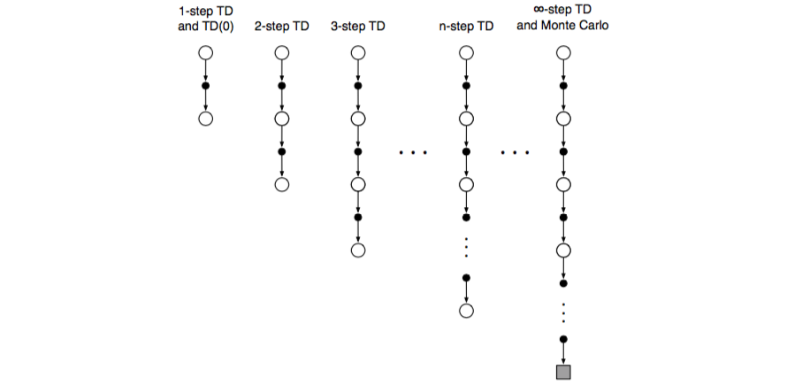
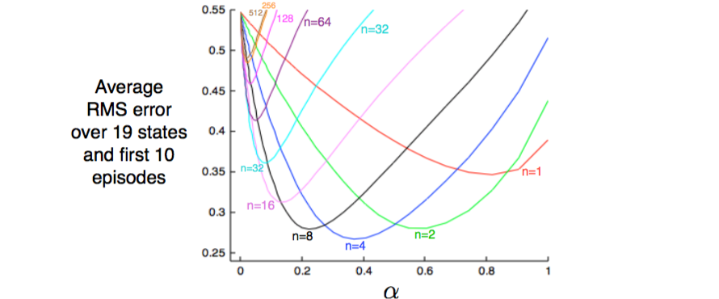
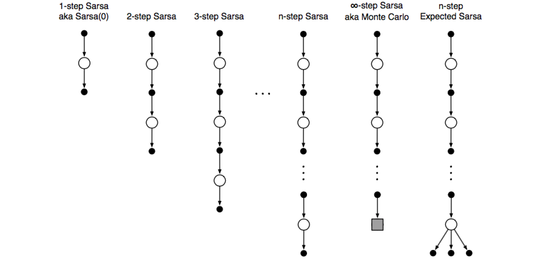
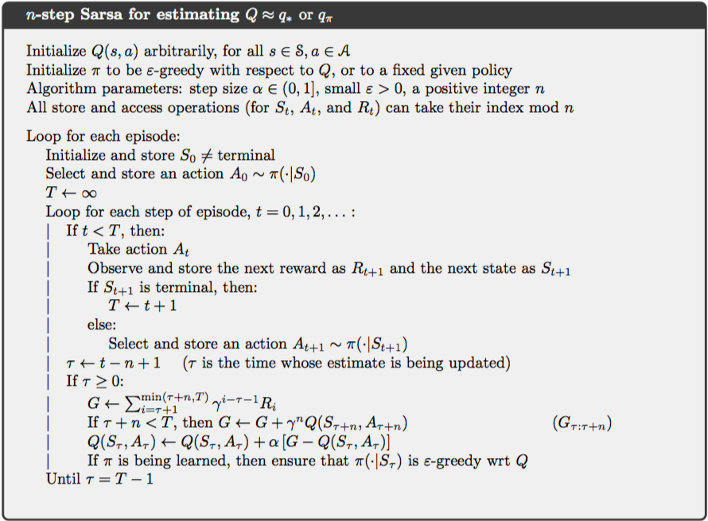
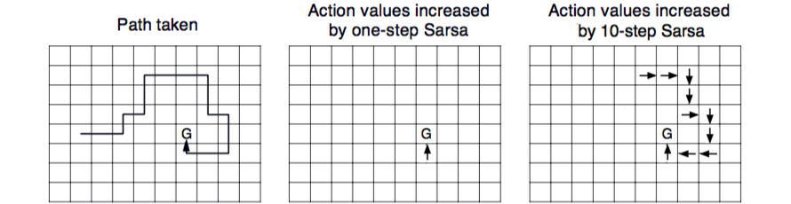
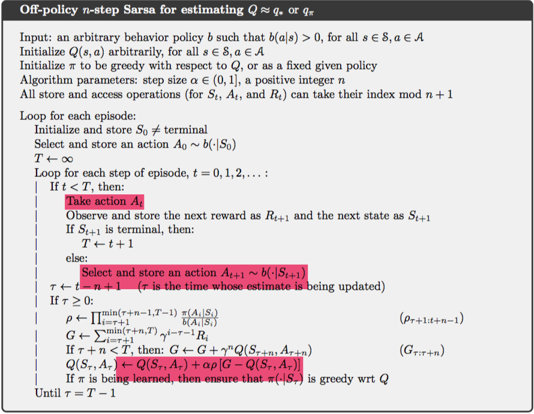
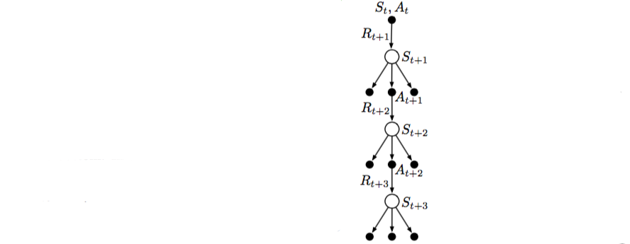
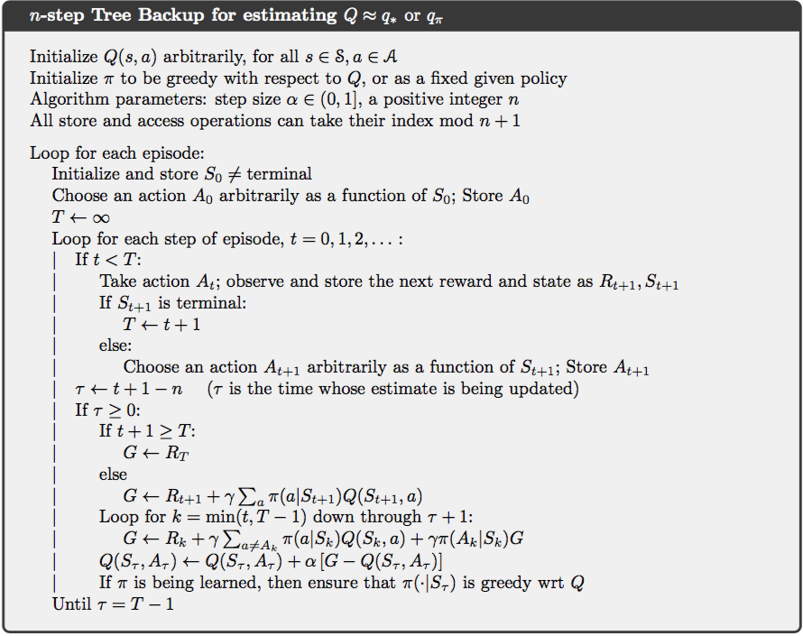
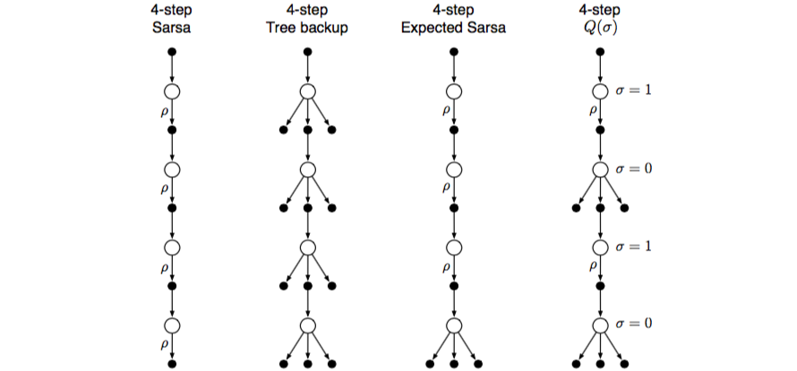
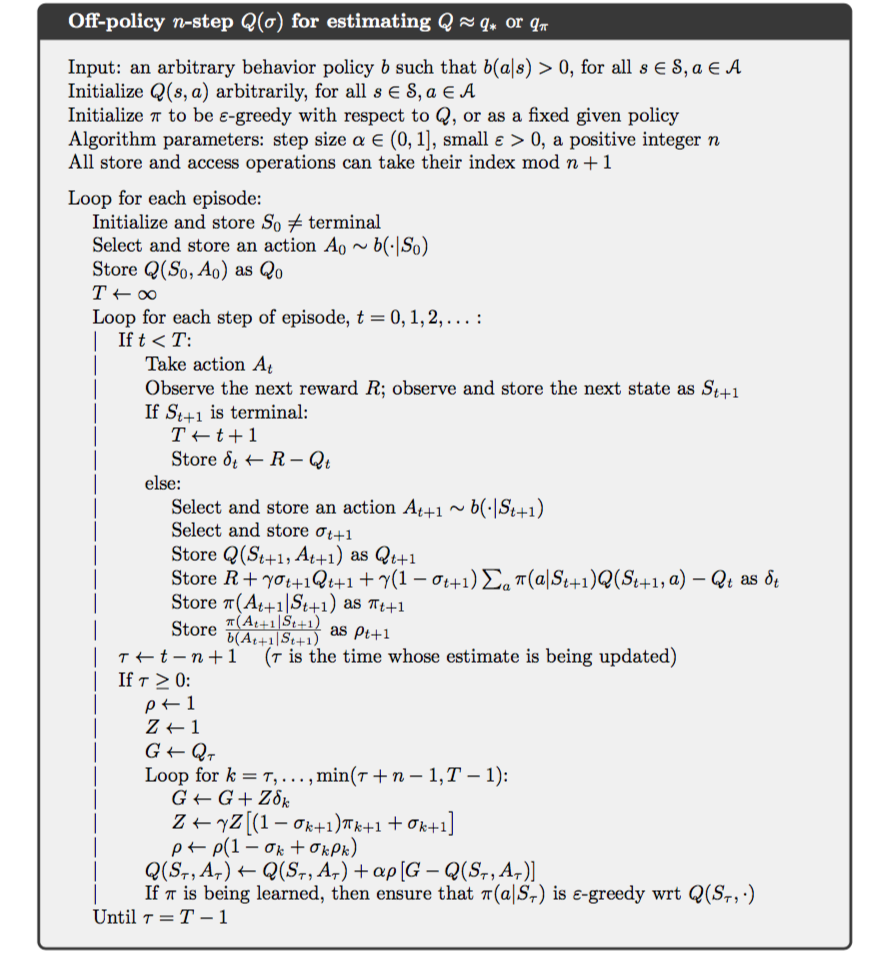

#### 第7章 多步引导

本章用n-步TD方法统一MC和单步TD，它支持多步引导，是两者的推广，根据引导步数的不同张成了一端单步TD、另一端MC的谱系，这样就能平滑地从一个方法转移到另一个。


##### 7.1 n-步TD预测

从样本节估计$v_\pi$时，MC方法基于状态到终点的激励序列更新；而单步TD仅基于下个激励，引导下个状态价值为剩余激励的代表；而两者之间的方法空间就是使用中间数目激励进行更新的n-步TD，下图为此谱系更新的备份图：



使用n-步更新的方法依然是TD，因为依然基于与后面估计的差异来改变前面的估计。n-步更新的目标是n-步回报，其定义为对任意满足$n\ge1$且$0\le t < T-n$的$n,t$：
$$
G_{t:t+n} \dot= R_{t+1} + \gamma R_{t+2} + \cdots + \gamma^{n-1}R_{t+n} + \gamma^n V_{t+n-1}(S_{t+n}) \tag{7.1}
$$
所有n-步回报都是完整回报的$n$步后截断然后用$V_{t+n-1}(S_{t+n})$修正的近似。直到$t+n$时才能获得$R_{t+n}$和算得的$V_{t+n-1}$，因此使用n-步回报的状态价值学习算法就是当$1\le t<T$时：
$$
V_{t+n}(S_t) \dot= V_{t+n-1}(S_t) + \alpha\bigl[ G_{t:t+n}-V_{t+n-1}(S_t) \bigr] \tag{7.2}
$$
此间所有其他状态的价值保持不变，即$\forall s\neq S_t, V_{t+n}(s)=V_{t+n-1}(s)$，这就是n-步TD。注意每节的前$n-1$步没有任何变化，而作为弥补在此节终结后到下节开始前，会有同样数量的额外更新。完整的算法为：


另外$V_t(s)$在$n$步内不变时，即$V_t(s)=V_{t+1}(s)=\cdots=V_{t+n}(s)$时，n-步误差也满足公式(6.6)，即$G_{t:t+n}-V_{t+n-1}(S_t)=\sum_{k=1}^n \gamma^{k-1}\delta_{t+k}$证明见附录1。

在最糟的情况下，n-步回报的期望都保证是比$V_{t+n-1}$更好的估计；即对任意$n\ge1$，都有：
$$
\max_s \Bigl\vert \mathbb E_\pi[G_{t:t+n}\mid S_t=s] - v_\pi(s) \Bigr\vert \le \gamma^n\max_s\Bigl\vert V_{t+n-1}(s) - v_\pi(s) \Bigr\vert \tag{7.3}
$$
这就是n-步回报的误差约减特性，因此所有n-步TD在合适的条件下都收敛于正确的预测。

> **例7.1 随机游走上的n-步TD方法**：考虑在例6.2上执行n-步TD，所有状态初始为$V(s)=0.5$。若第一节从$\mathtt C$径直向右至终结，回报为1，对于这个经验，单步方法仅改变最后状态的估计$V(\mathtt E)$，使其向1，观察到的回报增加；两步方法改变终结前两个状态价值；任何大于两步的方法会将访问的三个状态都向1增加相同的量。
>
> 
>
> 上图展示了在不同$n$和$\alpha$上19个状态随机游走（左侧结果为-1，所有初始为0）经验测试结果，垂直坐标为状态价值10节重复100次的均方差。可以看到适中的$n$表现最好。


##### 7.2 n-步Sarsa

将n-步与Sarsa就获得了on-policy的控制方法n-步Sarsa，主要思想是使用行动价值和$\varepsilon$-贪心策略，其备份图为：



先定义行动价值的n-步回报，对所有满足$n\ge1,0\le t\lt T-n$的$n,t$：
$$
G_{t:t+n} \dot= R_{t+1} + \gamma R_{t+2} + \cdots + \gamma^{n-1}R_{t+n} + \gamma^nQ_{t+n-1}(S_{t+n},A_{t+n}) \tag{7.4}
$$
而当$t+n\ge T$时$G_{t:t+n}=G_t$。因此算法的更新就是当$0\le t\lt T$时：
$$
Q_{t+n}(S_t,A_t) \dot= Q_{t+n-1}(S_t,A_t) + \alpha\bigl[ G_{t:t+n}-Q_{t+n-1}(S_t,A_t) \bigr] \tag{7.5}
$$
此间所有其他行动价值保持不变。此即n-步Sarsa，完整的算法为：



> 下图展示了基于n-步方法对网格世界的加速，价值都初始为0，除在$\mathtt G$所有激励都为0。左侧展示了单节代理的路径，其余图中箭头表示作为n-步方法加强这个路径结果的行动价值。单步方法仅加强了最后一个行动；n-步方法则加强了最后$n$个行动，因此从单节学到了更多。
>
> 

n-步期望Sarsa和n-步Sarsa一样按(7.5)更新，但n-步回报重定义为：对所有满足$n\ge1,0\le t\lt T-n$的$n,t$有
$$
G_{t:t+n} \dot= R_{t+1} + \cdots + \gamma^{n-1}R_{t+n} + \gamma^n\sum_a\pi(a\mid S_{t+n})Q_{t+n-1}(S_{t+n}, a) \tag{7.6}
$$


##### 7.3 基于重要性采样的n-步off-policy学习

在n-步方法中，需考虑行为策略和目标策略采取行动的相对概率，因此时间$0\le t\lt T$的更新就是：
$$
V_{t+n}(S_t) \dot= V_{t+n-1}(S_t) + \alpha\rho_{t:t+n-1}\bigl[ G_{t:t+n}-V_{t+n-1}(S_t) \bigr] \tag{7.7}
$$
其中重要性采样率为：
$$
\rho_{t:t+n} \dot= \prod_{k=t}^n \frac{\pi(A_k\mid S_k)}{b(A_k\mid S_k)} \tag{7.8}
$$
而基于行动价值的更新为，对$0\le t\lt T$：
$$
Q_{t+n}(S_t, A_t) \dot=Q_{t+n-1}(S_t, A_t) + \alpha\rho_{t+1:t+n-1}\bigl[ G_{t:t+n}-Q_{t+n-1}(S_t,A_t) \bigr] \tag{7.9}
$$
注意这里的重要性采样比前面晚一步开始，从下面算法执行行动$A_t$和更新$Q(S_t,A_t)$的相对位置可以看出，行动$A_t$在$t$时刻选中并执行，在$t+1$时刻得到执行的结果$R_{t+1}$和$S_{t+1}$，而$\rho_t=\frac{\pi(A_t\mid S_t)}{b(A_t\mid S_t)}$表示在$\pi$和$b$在状态$S_t$选择行动$A_t$的相对概率，但实际已经执行$A_t$，因此就无需关心了。



而off-policy版的n-步期望Sarsa使用和上面一样的更新，但在最后的状态会考虑所有可能的行动，实际采取的并无影响也就无需修正，因此重要性采样率为$\rho_{t+1:t+n-2}$，并且使用(7.6)定义的$G_{t:t+n}$。


##### 7.4 带控制变量的每决策off-policy方法

前面多步off-policy方法虽然简明但效率并非最高，更精巧的方法是使用每决策重要性采样。先将n-步回报递归写成$G_{t:h}=R_{t+1}+\gamma G_{t+1:h}$，$t$时刻重要性采样率为$\rho_t=\frac{\pi(A_t\mid S_t)}{b(A_t\mid S_t)}$，若$t$时刻的行动永远不会被$\pi$选，则$\rho_t=0$，这就会使n-步回报为0，从而使其方差很大。因此定义off-policy的n-步回报为，当$t\lt h \le T$时：
$$
G_{t:h} \dot= \rho_t(R_{t+1}+\gamma G_{t+1:h}) + (1-\rho_t)V_{h-1}(S_t) \tag{7.10}
$$
其中$G_{t:t}\dot=V_{t-1}(S_t)$。这时若$\rho_t=0$，就表示忽略这个样本，因此估计保持不变。(7.10)中的第二项为控制变量(control variate)，它并未改变期望更新。重要性采样率期望为1且与估计无关，因此控制变量期望值为0。

在行动价值的n-步回报中，因首个行动已经采取，故在重要性采样中没有作用，带控制变量的行动价值n-步回报的off-policy递归定义就是，当$t+1\lt h \le T$ 时：
$$
G_{t:h} \dot= R_{t+1} + \gamma \bigl( \rho_{t+1}G_{t+1:h} + \bar Q_{t+1} -\rho_{t+1}Q_t(S_{t+1},A_{t+1}) \bigr) \tag{7.11}
$$
其中：
$$
\bar Q_{t+1} \dot= \sum_a \pi(a\mid S_{t+1})Q_t(S_{t+1},a) \tag{7.12}
$$
$h=T$时(7.11)的递归项以$G_{T-1:T}\dot=R_T$结束；$t \lt T$时为$G_{h-1:h}\dot=R_h+\gamma\bar Q_h$；最终预测算法十分类似期望Sarsa。


##### 7.5 无重要性采样的off-policy学习：n-步树备份算法

Q-学习和off-policy版期望Sarsa是单步的无重要性采样off-policy学习，而树备份则是多步的方法。下图是3步树备份的备份图，中间向下的是三个样本状态和激励，以及两个样本行动，是初始行动-状态对$S_t,A_t$后发生事件的随机变量。两侧悬空的是未被选择的行动（包括底层三个）。这里没有未选择行动的样本，因此延伸备份图的思想，引导并使用它们价值的估计来形成更新目标，因此包含了图上所有层次的所有事物。这就是树备份，来自整棵树行动价值估计的更新。



更精确地说更新来自所有叶节点的行动估计，内部实际采取行动的估计并未参与；每个叶节点以自身在策略$\pi$下发生的概率为权值构成目标；每个非叶节点的概率则递归地用于加权其下方的子树；因此树备份n-步更新的回报有点量类似期望Sarsa，具体为当$t\lt T-1,n>1$时：
$$
\begin{eqnarray}
G_{t:t+1} &\dot=& R_{t+1} + \gamma\sum_a \pi(a\mid S_{t+1})Q_t(S_{t+1}, a) \tag{7.13}\\
G_{t:t+n} &\dot=& R_{t+1} + \gamma\sum_{a\neq A_{t+1}}\pi(a\mid S_{t+1})Q_{t+n-1}(S_{t+1}, a) + \gamma\pi(A_{t+1}\mid S_{t+1})G_{t+1:t+n} \tag{7.14}
\end{eqnarray}
$$
然后就可以像n-步Sarsa一样的行动价值更新即当$0\le t \lt T$时：
$$
Q_{t+n} \dot= Q_{t+n-1}(S_t,A_t) + \alpha\big[ G_{t:t+n} - Q_{t+n-1}(S_t,A_t) \bigr]
$$
此间所有其他行动价值保持不变。具体伪代码为：



若行动价值的估计不变，则树备份回报可以写为基于期望TD误差的和：
$$
G_{t:t+n} = Q(S_t,A_t) + \sum_{k=t}^{\min(t+n,T)-1} \delta_k\prod_{i=t+1}^k \gamma\pi(A_i\mid S_i)
$$
其中$\delta_t \dot= R_{t+1}+\gamma\bar Q_{t+1}-Q(S_t,A_t)$（证明见附录）。


##### 7.6 统一算法：n-步$Q(\sigma)$

目前为止描述的三种n-步行动价值算法对应下图前三个备份图，一种统一三者的思想为第四个备份图，即逐步决定是像Sarsa一样取行动抽样，还是像树备份那样取所有行动期望。令$\sigma_t \in [0,1]$表示在$t$步抽样的程度，$\sigma=1$表示全抽样而$\sigma=0$表示纯期望。可设置$\sigma_t$为$t$时刻状态或行动的函数，这个算法就是n-步$Q(\sigma)$。



注意Sarsa的n-步回报(7.4)可以写成基于其自身纯抽样TD误差的形式：
$$
\begin{eqnarray}
G_{t:t+n} &=& Q_{t-1}(S_t,A_t) + \sum_{k=t}^{\min(t+n,T)-1} \gamma^{k-t}\bigl[ R_{k+1}+\gamma Q_k(S_{k+1}, A_{k+1})-Q_{k-1}(S_k, A_k) \bigr] \tag{7.15}
\end{eqnarray}
$$
用$\sigma_t$将TD误差从抽样推广成期望形式，就可以包含两者：
$$
\begin{eqnarray}
\delta_t &\dot=& R_{t+1} + \gamma\bigl[ \sigma_{t+1}Q_t(S_{t+1},A_{t+1}) + (1-\sigma_t)\bar Q_{t+1} \bigr] - Q_{t-1}(S_t,A_t) \tag{7.16}
\end{eqnarray}
$$
使用这些就能定义$Q(\sigma)$的n-步期望为：
$$
\begin{eqnarray}
G_{t:t+n} &\dot=& Q_{t-1}(S_t,A_t) + \sum_{k=t}^{\min(t+n,T)-1}\delta_k\prod_{i=t+1}^k\gamma\bigl[ (1-\sigma_i)\pi(A_i\mid S_i)+\sigma_i \bigr] \tag{7.17}
\end{eqnarray}
$$
在on-policy训练中，回报就可以用在(7.5)的n-步Sarsa更新中；而off-policy的情况中，需要在重要性采样中考虑$\sigma$，因此重定义为：
$$
\rho_{t:h} \dot= \prod_{k=t}^{\min(h,T-1)} \left( \sigma_k\frac{\pi(A_k\mid S_k)}{b(A_k\mid S_k)} + 1 -\delta_k \right)
$$
之后就可以用在(7.9)的n-步Sarsa的off-policy更新中。完整的算法如下：




##### 7.7 总结


##### 附录

1. n-步误差就是$t+n-1$时刻的误差，在$t+n$时刻获得；并且有$V_t(s)=V_{t+1}(s)=\cdots=V_{t+n}(s)$，因此：
   $$
   \begin{eqnarray}
   &&G_{t:t+n} - V_{t+n-1}(S_t)\\
   &=& R_{t+1} + \gamma G_{t+1:t+n} - V_{t+n-1}(S_t)\\
   &=& R_{t+1} + \gamma V_t(S_{t+1}) - V_{t+n-1}(S_t) - \gamma V_t(S_{t+1}) + \gamma G_{t+1:t+n}\\
   &=& R_{t+1} + \gamma V_t(S_{t+1}) - V_t(S_t) - \gamma V_t(S_{t+1}) + \gamma G_{t+1:t+n}\\
   &=& \delta_t  + \gamma[R_{t+2} + \gamma V_{t+1}(S_{t+2}) - V_t(S_{t+1})] + \gamma^2G_{t+2:t+n} - \gamma^2V_{t+1}(S_{t+2})\\
   &=& \delta_t + \gamma[R_{t+2} + \gamma V_{t+1}(S_{t+2}) - V_{t+1}(S_{t+1})] + \gamma^2G_{t+2:t+n} - \gamma^2V_{t+1}(S_{t+2})\\
   &=& \delta_t + \gamma\delta_{t+1} + \gamma^2[R_{t+3} + \gamma V_{t+2}(S_{t+3})-V_{t+1}(S_{t+2})] + \gamma^3G_{t+3:t+n} - \gamma^3V_{t+2}(S_{t+3})\\
   &=& \delta_t + \gamma\delta_{t+1} + \cdots + \gamma^{n-1}\delta_{t+n-1} + \gamma^nG_{t+n:t+n} - \gamma^nV_{t+n-1}(S_{t+n})\\
   &=& \sum_{k=0}^{n-1} \gamma^k\delta_{t+k+1}
   \end{eqnarray}
   $$
   因此也满足公示(6.6)。

   

2. **各种误差**的理解：都是最新估计与原估计的差值。各种估计最原始的公式是
   $$
   \begin{eqnarray}
   v_\pi(s)
   &=& \mathbb E_\pi[G_t \mid S_t=s] \tag{6.3}\\
   &=& \mathbb E_\pi[R_{t+1}+\gamma G_{t+1} \mid S_t=s]\\
   &=& \mathbb E_\pi[R_{t+1}+\gamma v_\pi(S_{t+1}) \mid S_t=s] \tag{6.4}
   \end{eqnarray}
   $$
   由(6.3)获得MC估计，MC的目标是$G_t$，MC误差为$G_t-V_t(S_t)$；

   由(6.4)获得单步TD估计，单步TD目标是$G_{t:t+1}=R_{t+1}+\gamma V_t(S_{t+1})$，单步TD误差是$\delta_t=G_{t:t+1}-V_t(S_t)$；

   将单步推广到多步TD的目标就是$G_{t:t+n}=R_{t+1}+\gamma R_{t+2}+\cdots+\gamma^{n-1}R_{t+n}+\gamma^nV_{t+n-1}(S_{t+n})$，多步TD误差是$G_{t:t+1}-V_{t+n-1}(S_t)$；

   

3. 本章介绍的所预测算法，都可以使用5种n-步状态价值回报和两种更新公式相互组合形成。

   其中5种行动价值回报为：
   $$
   \begin{eqnarray}
   n\text{-step} &:& G_{t:t+n} \dot= R_{t+1} + \gamma R_{t+2} + \cdots + \gamma^{n-1}R_{t+n} + \gamma^nQ_{t+n-1}(S_{t+n},A_{t+n})\\
   n\text{-step expection} &:& G_{t:t+n} \dot= R_{t+1} + \gamma R_{t+2} + \cdots + \gamma^{n-1}R_{t+n} + \gamma^n\sum_a\pi(a\mid S_{t+n})Q_{t+n-1}(S_{t+n},a)\\
   \text{per-decision} &:& G_{t:t+n} \dot= R_{t+1} + \gamma\left( \rho_{t+1}G_{t+1:t+n} + \sum_a\pi(a\mid S_{t+1})Q_t(S_{t+1}, A_{t+1}) \right)\\
   \text{tree-backup} &:& G_{t:t+n} \dot= R_{t+1} + \gamma\sum_{a\neq A_t}\pi(a\mid S_{t+1})Q_{t+n-1}(S_{t+1},a) + \gamma\pi(A_{t+1}\mid S_{t+1})G_{t+1:t+n}\\
   Q(\sigma) &:& G_{t:t+n} \dot= Q_{t-1}(S_t,A_t) + \sum_{k=t}^{\min(t+n,T)-1} \delta_k \prod_{i=t+1}^k \gamma\bigl[ (1-\sigma_i)\pi(A_i\mid S_i) +\sigma_i\bigr]
   \end{eqnarray}
   $$
   2种行动价值更新公式为：
   $$
   \begin{eqnarray}
   \text{on-policy} &:& Q_{t+n}(S_t,A_t) \dot= Q_{t+n-1}(S_t,A_t) + \alpha\bigl[ G_{t:t+n}-Q_{t+n-1}(S_t,A_t) \bigr]\\
   \text{off-policy} &:& Q_{t+n}(S_t,A_t) \dot= Q_{t+n-1}(S_t,A_t) + \alpha\rho_{t+1:t+n-1}\bigl[ G_{t:t+n}-Q_{t+n-1}(S_t,A_t) \bigr]\\
   \end{eqnarray}
   $$
   预测算法同样如此。其中的2种状态价值回报为：
   $$
   \begin{eqnarray}
   n\text{-step} &:& G_{t:t+n} \dot= R_{t+1} + \gamma R_{t+2} + \cdots + \gamma^{n-1}R_{t+n} + \gamma^nV_{t+n-1}(S_{t+n})\\
   \text{per-decision} &:& G_{t:t+n} \dot= \rho_t\bigl( R_{t+1}+\gamma G_{t+1:t+n} \bigr) + (1-\rho_t)V_{t+n-1}(S_t)
   \end{eqnarray}
   $$
   2种状态价值更新公式为：
   $$
   \begin{eqnarray}
   \text{on-policy} &:& V_{t+n}(S_t) \dot= V_{t+n-1}(S_t) + \alpha\bigl[ G_{t:t+n}-V_{t+n-1}(S_t) \bigr] \\
   \text{off-policy} &:& V_{t+n}(S_t) \dot= V_{t+n-1}(S_t) + \alpha\rho_{t:t+n-1}\bigl[ G_{t:t+n}-V_{t+n-1}(S_t) \bigr]
   \end{eqnarray}
   $$
   


##### 习题

**习题7.1**：n-步误差就是$t+n-1$时刻的误差，在$t+n$时刻获得；并且有$V_t(s)=V_{t+1}(s)=\cdots=V_{t+n}(s)$，因此：
$$
\begin{eqnarray}
&&G_{t:t+n} - V_{t+n-1}(S_t)\\
&=& R_{t+1} + \gamma G_{t+1:t+n} - V_{t+n-1}(S_t)\\
&=& R_{t+1} + \gamma V_t(S_{t+1}) - V_{t+n-1}(S_t) - \gamma V_t(S_{t+1}) + \gamma G_{t+1:t+n}\\
&=& R_{t+1} + \gamma V_t(S_{t+1}) - V_t(S_t) - \gamma V_t(S_{t+1}) + \gamma G_{t+1:t+n}\\
&=& \delta_t  + \gamma[R_{t+2} + \gamma V_{t+1}(S_{t+2}) - V_t(S_{t+1})] + \gamma^2G_{t+2:t+n} - \gamma^2V_{t+1}(S_{t+2})\\
&=& \delta_t + \gamma[R_{t+2} + \gamma V_{t+1}(S_{t+2}) - V_{t+1}(S_{t+1})] + \gamma^2G_{t+2:t+n} - \gamma^2V_{t+1}(S_{t+2})\\
&=& \delta_t + \gamma\delta_{t+1} + \gamma^2[R_{t+3} + \gamma V_{t+2}(S_{t+3})-V_{t+1}(S_{t+2})] + \gamma^3G_{t+3:t+n} - \gamma^3V_{t+2}(S_{t+3})\\
&=& \delta_t + \gamma\delta_{t+1} + \cdots + \gamma^{n-1}\delta_{t+n-1} + \gamma^nG_{t+n:t+n} - \gamma^nV_{t+n-1}(S_{t+n})\\
&=& \sum_{k=0}^{n-1} \gamma^k\delta_{t+k+1}
\end{eqnarray}
$$
因此也满足公示(6.6)。


**习题7.2**：价值逐步变化的n-步方法，此时的n-步误差就是：
$$
\begin{eqnarray}
&&G_{t:t+n} - V_{t+n-1}(S_t)\\
&=& R_{t+1} + \gamma G_{t+1:t+n} - V_{t+n-1}(S_t)\\
&=& R_{t+1} + \gamma V_t(S_{t+1}) -V_t(S_t) + \gamma G_{t+1:t+n} - \gamma V_t(S_{t+1}) + V_t(S_t) - V_{t+n-1}(S_t)\\
&=& \delta_t + \gamma G_{t+1:t+n} - \gamma V_t(S_{t+1}) + V_t(S_t) - V_{t+n-1}(S_t)\\
&=& \delta_t + \gamma\bigl[R_{t+2}+\gamma V_{t+1}(S_{t+2})-V_{t+1}(S_{t+1})\bigr] +\gamma^2G_{t+2:t+n} - \gamma^2V_{t+1}(S_{t+2}) \\
&&\qquad+ \bigl[\gamma V_{t+1}(S_{t+1}) - \gamma V_t(S_{t+1})\bigr] + V_t(S_t) - V_{t+n-1}(S_t)\\
&=& \delta_t + \gamma\delta_{t+1} +\gamma^2G_{t+2:t+n} - \gamma^2V_{t+1}(S_{t+2}) +\gamma\delta'_t + V_t(S_t) - V_{t+n-1}(S_t)\\
&=& \delta_t + \gamma\delta_{t+1} +\gamma^2G_{t+2:t+n} - \gamma^2V_{t+1}(S_{t+2}) +\gamma\delta'_t + V_t(S_t) - V_{t+n-1}(S_t)\\
\end{eqnarray}
$$
使用TD误差和来代替(7.2)中的误差，于是新算法的更新为：
$$
V_{t+n}(S_t) = V_{t+n-1}(S_t) + \alpha\left[\sum_{k=1}^n \gamma^{k-1}\delta_{t+k}\right]
$$


**习题7.3**


**习题7.4**：这个算法具体的步骤为：
$$
\bbox[5px,border:2px solid]
{\begin{aligned}
  &\underline{\mathbf{Per\text-Decision\ n\text-step\ TD\ for\ estimating\ }V\approx v_\pi}\\
  \\
  &\text{Input: a policy }\pi\\
  &\text{Initialize }V(s)\text{ arbitrarily },s\in\mathcal S\\
  &\text{Parameters: step size }\alpha\in(0,1],\text{ a positive integer n}\\
  &\text{All store and access operations (for }S_t\text{ and }R_t\text{) can take their index mod }n+1\\
  \\
  &\text{Loop for each episode:}\\
  &\qquad \text{Initialize and store }S_0\neq \text{terminal}\\
  &\qquad T \leftarrow \infty\\
  &\qquad \text{For }t=0,1,2,\dots\text{:}\\
  &\qquad|\qquad\text{if }t < T,\text{ then:}\\
  &\qquad|\qquad\qquad \text{Take an action according to }b(\bullet\mid S_t)\\
  &\qquad|\qquad\qquad \text{Observe and store next reward as }R_{t+1}\text{ and the next state as }S_{t+1}\\
  &\qquad|\qquad\qquad \text{If }S_{t+1}\text{ is terminal, then }T \leftarrow t+1\\
  &\qquad|\qquad \tau \leftarrow t-n+1\quad(\tau\text{ is the time whose states's estimate is being updated})\\
  &\qquad|\qquad\text{if }\tau\ge0\text{:}\\
  &\qquad|\qquad\qquad G\leftarrow\sum_{i=\tau+1}^{\min(\tau+n, T)}\gamma^{i-\tau-1}R_i\\
  &\qquad|\qquad\qquad \text{If }\tau+n < T, \text{then: }G\leftarrow G+\gamma^nV(S_{\tau+n})\qquad\qquad\qquad(G_{\tau:\tau+n})\\
  &\qquad|\qquad\qquad V(S_\tau) \leftarrow V(S_\tau) + \alpha[G - V(S_\tau)]\\
  &\qquad \text{Until }\tau=T-1
\end{aligned}}
$$


nstep_bootstrap.py

```python
import random as rd
import math

INFINITY = 1000000

def nstep_TDestimate(pi, SA, n, ter_s, alpha=0.1, gamma=1, ini_s=None):
    """
    Use n-step TD to estimate the state values of a policy
    parameters:
        pi: a policy function to be estimated
        SA: a dict of state:actions
        n: step number to look ahead
        ter_s = a list of terminal states
        alpha: step size
        ini_s: a list of start states
        gamma: the discount
    """

    S = SA.keys()

    def init():
        V = {s:rd.random() for s in SA.keys()}
        if ini_s == None:
            st = rd.sample(SA.keys)
            while st in ters:
                st = rd.sample(SA.keys)
        else:
            st = rd.sample(ini_s)
        St = []
        Rt = []

    while True:
        St.append(st)
        T = INFINITY
        t = 0
        while st not in ter_s:
            if t < T:
                rt_, st_ = pi(st)
                Rt.append(rt_)
                St.append(st_)
                if st_ in ter_s:
                    T = t+1
            tau = t-n+1
            if tau >= 0:
                G = sum([mt.pow(gamma, i-tau-1) for i in min(tau+n, T)])
                if tau+n < T:
                    G += mt.pow(gamma, n)*V[St[tau+n]]
                    V[St[tau]] += alpha * (G-V[St[tau]])

def nstep_sarsa()

```

