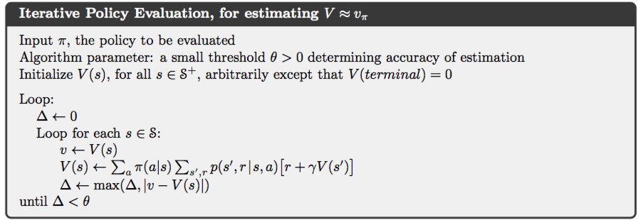
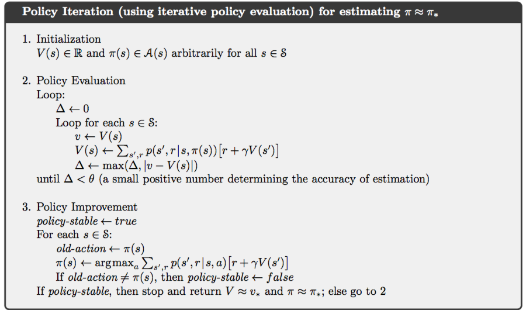
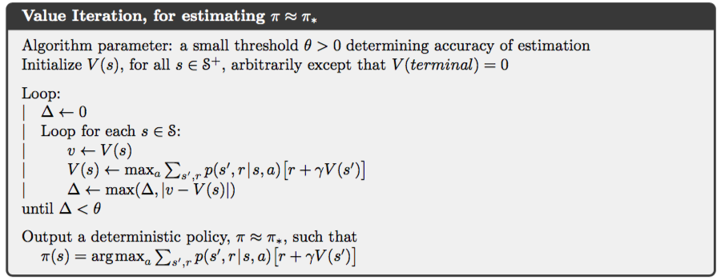
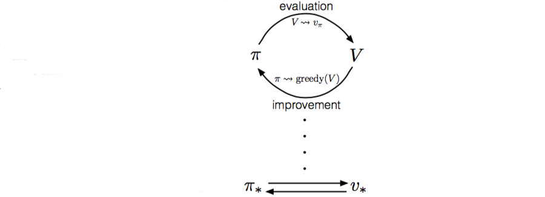

在已知MDP环境模型时（即$p(s',r\mid s,a),r(s'\mid s,a)$已知），可使用DP来计算最优策略。受模型已知和海量计算要求所限，经典DP算法在RL中作用有限。但在理论上依然十分重要，是理解其他算法的基础，也可以认为其他的算法是在减小两个限制条件下尝试获得与DP同样的效果。

DP乃至RL的关键思想，就是使用价值函数来组织并构造最优策略的搜索。$v_*$的最优贝尔曼方程为，$\forall s\in \mathcal S,a\in\mathcal A(s)$和$s'\in\mathcal S^+(\mathcal S+\{\text{a terminal state}\})$：
$$
\begin{eqnarray}
v_*(s)
&=& \max_a \mathbb E[R_{t+1}+\gamma v_*(S_{t+1}) | S_t=s,A_t=a] \\
&=& \max_a \sum_{s',r}p(s',r \mid s,a)\bigl[ r+\gamma v_*(s') \bigr] \tag{4.1}
\end{eqnarray}
$$
$q_*$的贝尔曼最优方程为：
$$
\begin{eqnarray}
q_*(s,a)
&=& \mathbb E \left[ R_{t+1} + \gamma\max_{a'}q_*(S_{t+1},a') \middle| S_t=s,A_t=a \right]\\
&=& \sum_{s',r} p(s',r\mid s,a)\left[ r+\gamma\max_{a'}q_*(s',a') \right] \tag{4.2}
\end{eqnarray}
$$
DP是**将贝尔曼方程转化为赋值**，即改善目标价值函数近似的更新规则而得。

##### 1.策略评估（预测）

策略评估是计算任意策略的状态价值函数，又称为预测问题。由贝尔曼方程，$\forall s \in \mathcal S$：
$$
\begin{eqnarray}
v_\pi(s)
&=& \mathbb E_\pi[R_{t+1}+\gamma G_{t+1} \mid S_t=s]\\
&=& \mathbb E_\pi[R_{t+1}+\gamma v_\pi(S_{t+1}) \mid S_t=s] \tag{4.3}\\
&=& \sum_a\pi(a\mid s)\sum_{s',r}p(s',r\mid s,a)\bigl[ r+\gamma v_\pi(s') \bigr] \tag{4.4}
\end{eqnarray}
$$
只要$\gamma<1$或任务保证终止，就能确保$v_\pi$的存在和唯一。使用迭代方法，假定一个近似价值函数的序列$v_0,v_1,\cdots$，每个都将$\mathcal S^+$映射为$\mathbb R$，初始近似$v_0$除终止状态必须为0其余价值可任意选择，每个后继按如下更新，$\forall s \in \mathcal S$：
$$
\begin{eqnarray}
v_{k+1}
&\dot=& \mathbb E_\pi[R_{t+1}+\gamma v_k(S_{t+1}) \mid S_t=s]\\
&=& \sum_a \pi(a \mid s)\sum_{s',r}p(s',r \mid s,a)\bigl[ r+\gamma v_k(s') \bigr] \tag{4.5}
\end{eqnarray}
$$

显然$v_k=v_\pi$是这个更新的不动点（更新后$v_k$不再变化），因$v_\pi$的贝尔曼方程确保了这种情况的相等。在保证$v_\pi$存在相同的条件下，随着$k\to\infty$序列$\{v_k\}$收敛到$v_\pi$。这就是迭代策略评估算法。由$v_k$得到$v_{k+1}$的操作为**期望更新**，DP中所有的更新都是期望的因其基于所有可能下个状态的期望，而非某个样本。有两种代码实现形式：

- 一种使用两个数组，一个存储旧价值$v_k(s)$，一种存储新的$v_{k+1}(s)$；
- 另一种使用一个数组就地更新，旧值立即被覆盖，新值一旦获得就被使用；这种方法会更快地收敛到$v_\pi$。

这样完成一次所有状态的更新就是状态空间的一次扫描，在DP中通常使用就地方法，在扫描中状态更新价值的顺序对收敛速度影响很大。完整的算法如下：

##### 2.策略改善

在确定某个策略$\pi$的价值函数后$v_\pi$后，若希望知道在状态$s$选择行动$a \neq \pi(s)$的影响，可以考虑在$s$选择$a$后遵循策略$\pi$的价值：
$$
\begin{eqnarray}
q_\pi(s,a)
&\dot=& \mathbb E[R_{t+1}+\gamma v_\pi(S_{t+1}) \mid S+t=s,A_t=a] \tag{4.6}\\
&=& \sum_{s',r} p(s',r \mid s,a)\bigl[ r+\gamma v_\pi(s') \bigr]
\end{eqnarray}
$$
若$q_\pi(s,a) > v_\pi(s)$，则每次遇到$s$选择$a$都比遵循$\pi$收获更多，新策略就是一个比$\pi$更好的策略。这是**策略改善定理**的一个特例，令$\pi$和$\pi'$是任意两个确定性策略并且有$\forall s \in \mathcal S$：
$$
q_\pi(s,\pi'(s)) \ge v_\pi(s) \tag{4.7}
$$
则$\pi'$必优于或等优于$\pi$，即
$$
v_{\pi'}(s) \ge v_\pi(s) \tag{4.8}
$$
另外，若(4.7)在任一状态严格不等，则(4.8)中至少有一个状态严格不等（比如上面的特例）。现在很自然就想到在每个状态$s$基于$q_\pi(s,a)$选择最好行动，即**贪心策略**$\pi'$：
$$
\begin{eqnarray}
\pi'(s)
&\dot=& \arg\max_a q_\pi(s,a)\\
&=& \arg\max_a \mathbb E[R_{t+1}+\gamma v_\pi(S_{t+1}) \mid S_t=s,A_t=a] \tag{4.9}\\
&=& \arg\max_a \sum_{s',r} p(s',r \mid s,a)\bigl[ r+\gamma v_\pi(s') \bigr]
\end{eqnarray}
$$
贪心策略采取了短期看最优的行动，但满足策略改善定理的条件，因此它优于或等优于原策略。这样通过对价值函数贪心来改善原策略的过程就是**策略改善**。假定新贪心策略$\pi'$等优于但不更优于原策略，则有$v_\pi=v_{\pi'}$，而由(4.9)贪心策略的定义它满足，$\forall s\in\mathcal S$：
$$
\begin{eqnarray}
v_{\pi'}(s)
&=& \max_a\mathbb E[R_{t+1}+\gamma v_{\pi'}(S_{t+1}) \mid S_t=s,A_t=a]\\
&=& \max_a \sum_{s',r} p(s',r \mid s,a)\bigl[ r+\gamma v_\pi(s') \bigr]
\end{eqnarray}
$$
即贝尔曼最优性方程(4.1)，因此$v_{\pi'}$必然是$v_*$，而$\pi$和$\pi'$必然都是最优策略。策略改善定理必给出严格更优策略除非原策略已是最优。

目前为止讨论了确定策略，而**随机策略$\pi$在每个状态指定概率$\pi(a\mid s)$来采取每个行动$a$**。但这一节所有的思想都能推广到随机策略，策略改善定理的陈述也成立，若某个状态有多个最大化行动，则分配给每个一部分概率。

##### 3.策略迭代

现在对一个策略$\pi$就可以按照1)用策略评估计算$v_\pi$，2)用策略改善产生更优策略来不断迭代直至获得最优策略。因有限MDP仅有有限个策略，这个过程必然能在有限次迭代后手链到最优策略。这就是策略迭代，完整算法如下，注意每次策略评估开始用的是前一个策略的价值函数，这通常能大大提高收敛速度：

##### 4.价值迭代

策略迭代的一个缺陷是每次迭代中的策略评估本身就是拖沓的迭代，仅在极限情况下才恰好收敛到$v_\pi$。其实策略评估步可以在不损失策略迭代收敛保证的情况下截断，一种情况就是仅在一次扫描（每个状态一次更新）后就停止，这就是价值迭代算法，其更新可以写为，$\forall s \in \mathcal S$：
$$
\begin{eqnarray}
v_{k+1}(s)
&\dot=& \max_a \mathbb E[R_{t+1} + \gamma v_k(S_{t+1}) \mid S_t=s, A_t=a]\\
&=& \max_a \sum_{s',r} p(s',r \mid s,a)\bigl[ r+\gamma v_k(s') \bigr] \tag{4.10}
\end{eqnarray}
$$
对任意$v_0$序列$v_k$都在确保$v_*$存在相同的条件下收敛到$v_*$。完整的算法如下：

价值迭代在每次扫描中有效结合了一侧策略评估扫描和一次策略改善扫描。在策略改善扫描之间插入多个策略评估扫描会加快收敛。通常整个截断策略改善算法类可视为扫描序列，其中一些使用策略评估更新而有些使用策略改善更新。(4.10)中的最大化操作是这些更新的唯一区别，仅意味着最大化操作添加到了一些策略评估的扫描中。对折扣有限MDP所有这些算法都收敛到最优策略。

##### 5.异步DP

DP的一个主要缺陷是要求在状态集上的扫描，当状态集很大时单次扫描的代价就过于高昂。异步DP是不按照状态集系统扫描的就地迭代DP，以任意顺序、任意其他状态恰有的值来更新状态价值，有些状态的价值可能在其他状态更新之前已经更新了若干次。它提供了选择状态来更新的巨大弹性。

但为保证收敛异步DP必须持续更新所有状态价值，在某个时间后不能忽略任何状态。避免扫描未必意味着计算量更少，只表示算法无需在改善策略上取得进展前锁在冗长的扫描中。我们可以选择要更新的状态来改善算法进展的速度，排列更新顺序以在状态间高效传递价值信息，有些状态可能无需像其他一样频繁更新，若与最优行为无关可以跳过。

异步算法也使得与计算的实时交互更容易。要解决一个给定MDP，我们可以在代理实际经历MDP的同时运行迭代DP算法。可以使用代理的经验来确定要更新的状态，同时来自DP算法的最新价值和策略信息也能引导代理的决策。例如可以在代理访问状态的时候更新它们，这样就能使DP算法聚焦在状态集中与代理最相关的部分。这种聚焦是强化学习中经久不衰的主题。

##### 6.广义策略迭代(GPI)

策略迭代由两个同时、交互的进程组成，策略评估使价值函数与当前策略保持一致，策略改善则使策略对当前价值函数贪婪。但两者不必一个开始前另一个结束结束这样交替进行，价值迭代在策略改善间仅进行一次策略评估迭代，异步DP中评估和迭代粒度更加纤细。只要两个进程都持续更新所有状态，最终结果都会收敛到最优价值和最优策略。

我们用GPI来表示与粒度和其他细节无关的策略评估与策略改善的的交互。几乎所有RL方法都能用GPI描述，即：

- 都有可辨识的策略和价值函数；
- 策略总是对当前价值函数贪心来获得改善，价值函数总是趋向当前策略的价值函数，如上图所示；
- 仅当与当前策略一致时价值函数才稳定，仅当策略对当前价值函数贪婪时才稳定；
- 当两者都稳定时，表示策略对自身的价值函数是贪婪的，此时贝尔曼最优性方程成立，价值函数和策略就都是最优的。

评估和改善既竞争又合作：改善使策略对价值函数贪婪通常使价值函数与变化的策略不一致，而评估使价值函数与当前策略一致又会使策略不再贪婪；但长期来看两者最终交互到一个结合点——最优策略和最优价值函数。以限制或目标的角度来看待这种交互，如下图二维空间中表示目标解决方法的两条**非平行或正交**的直线，每个进程驱使价值函数或策略移向一条线。直接向某个目标（垂直于目标直线）靠近会偏移另一个目标，最终不可避免地向趋向整体的最优性。图中箭头表示是系统完全实现某个目标行为，在GPI中可采取更小、不完整的步骤。尽管都不尝试直接实现，但最终两个进程共同达到整体最优性目标。

##### 7.DP的效率

DP可能在非常大型问题中并不实用，但与其他方法相比在解决MDP上其实效率很高。它的最坏情况是状态和行动数的多项式，即DP能保证用少于$n$（状态数）和$k$（行动数）多项式的操作找到最优策略，即便（确定性）策略数目是$k^n$，因此DP指数快于直接在策略空间的搜索。线性规划(LP)也能用于MDP且有时最坏情况的收敛优于DP，但在相对DP而言少得多的状态数目（因子大约是100）时就变得不实用，对最大型的问题，可能仅DP可行。

因为维数灾难，DP被认为可用性有限，但实际这是大型问题的内在难题而非DP算法的问题。实际中DP能用于解决几百万状态的MDP，策略迭代和价值迭代都有广泛应用。它们通常比理论最糟情况收敛得快得多，尤其是很好得初始化价值函数与策略后。

对于大型状态空间问题人们通常更偏好异步DP，对于一次同步扫描的存储和计算要求都不切实际的问题，异步方法是潜在方法，因为最优方案的轨迹中出现的状态相对很少。

##### 8.总结

因为与解决有限MDP相关，本章介绍了动态规划的基本思想和算法：

- 策略评估表示策略价值函数的迭代计算，策略改善表示改善已知价值函数策略的计算，结合两者就获得了策略迭代和价值迭代，在已知完整MDP知识时两者都是计算最优策略和最优价值函数的可靠方法；
- 经典DP方法在状态集的扫描上操作，在每个状态执行期望更新，将贝尔曼方程转化为赋值语句得到期望更新，当价值不再随更新变化时收敛到对应贝尔曼方程，对应于4种价值函数有4种贝尔曼方程和4种期望更新，备份图直观展现了DP更新操作；
- 几乎所有RL方法都可以认为是GPI，基本思想是两个进程围绕一个近似策略和近似价值函数演化，尽管每个都改变另一个的基础，但当两者都静止时，就合作找到结合点最优策略和价值函数；
- 异步DP就地以任意顺序更新状态，这些方法被认为是细粒度形式的GPI；DP方法都在其他估计的基础上更新估计，属于引导(bootstrapping)方法。

##### 附录

1.类比于(4.3)、(4.4)、(4.5)的行动价值函数 $q_\pi$的方程为：

2.策略改善定理的证明：

3.行动价值函数的策略迭代为：