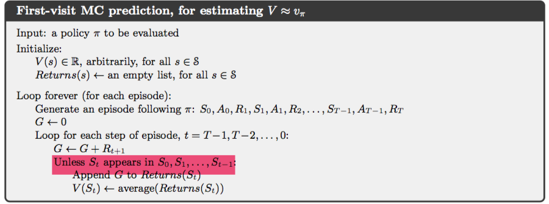
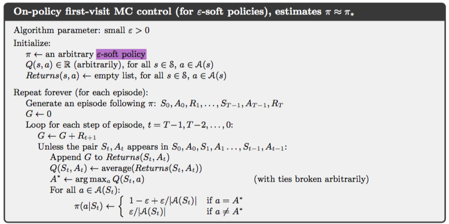

本章讨论首个评估价值函数和寻找最优策略的**学习**（DP不是学习方法）方法。蒙特卡洛(MC)方法仅需经验——来自与环境实际或模拟交互状态、行动、激励序列的样本。从实际经验中学习无需任何环境动态的先验知识，而依然能获得最优行为；从模拟经验中学习虽然需要模型，但仅用来产生样本转移，而非所有转移完整的概率分布。

MC是基于平均样本回报的方法，为确保定义良好的回报，这里仅为分节任务定义MC方法，仅在节完成后价值评估和策略才改变，因此是逐节递增的方法。MC中在状态$s$采取行动$a$的回报也依赖于同一节中后继状态采取的行动，从这一点看是非平稳的。为解决非平稳性，采取GPI的思想，只是这里是从抽样回报中**学习**，而非DP中的从环境知识中计算价值函数，价值函数与策略依然像GPI一样交互获得最优性。


##### 1.MC预测

先讨论学习给定策略价值函数的MC方法。给定一些遵循策略$\pi$经过状态$s$的节来评估$v_\pi(s)$，在节中$s$的每次出现称为到$s$的一次访问，第一次出现为到$s$的首次访问。首访(FV)MC方法将$v_\pi(s)$评估为首访$s$回报的均值，而每访(EV)MC平均所有到$s$访问的均值。两者十分相似但理论特性略有不同。下面是具体的FVMC算法：



当到$s$的访问/首访次数趋于无穷时，两种MC方法都收敛到$v_\pi(s)$。在FVMC中，每个回报都是$v_\pi(s)$方差有限的独立同分布估计，由大数定律，这些均值序列收敛到它们的期望；每个均值本身是无偏估计，其误差的标准差$\sim 1/\sqrt{n}$。EVMC也可以证明二次收敛到$v_\pi(s)$。下图是MC算法的备份图。


备份图的普遍思想是在顶部展示要更新的根节点，在下面展示所有激励和估计价值促成更新的转移和叶子。在MC中，根是状态节点，下面是节的整个转移轨迹，以终止状态结束。MC备份图与DP的区别在于：

- DP展示所有可能转移，MC仅展示单节中的样本；
- DP仅包含单步转移，MC则直到节结束。

MC方法对每个状态的是独立的，不想DP一样建立于任何其他状态之上，即MC是非引导的。并且单个状态价值评估的计算代价与状态数目无关，这在仅需要部分状态价值时特别有用，可以产生以需要计算状态开始的样本节，并仅平均这些状态的回报。这是MC相对于DP的第三个优势。


##### 2.行动价值的蒙特卡洛估计

当无法获得模型时，无法通过模型来获得模拟经验，只能通过真实试验来获得实际经验。这样评估行动价值就很有用，因为这时要确定一个策略，单单状态价值就不再充分，但使用行动价值就很直接。

评估$q_\pi(s,a)$的MC方法与$v_\pi(s)$类似。若**在一节中**访问到$s$且采取行动$a$，则称到状态-行动对$s,a$的一次访问，也分每访MC方法和首访MC。随着到状态-行动对访问/首访次数趋于无穷，这些方法都二次收敛到真实期望值。

但这时会出现的状况是很多状态-行动对可能永远不会被访问。若$\pi$是确定性的则遵循$\pi$在每个状态仅能观测到一个行动，这样其他行动的MC估计就无法用经验改善，这就与学习行动价值以帮助从中选择的用意相悖。为比较不同选择需要评估每个状态的所有行动价值。

这是普遍的**维护探索**难题。要使策略评估对行动价值有效，必须确保持续的探索。一种方法是指定节以一个行动-状态对开始。这就能保证所有状态-行动对能无限次被访问，这个假设被称为**探索启动(exploring starts)**。

探索启动假设固然有效，但并不能依赖，尤其是直接从与环境实际交互中学习。确保能遇到所有状态-行动对最普遍的选择是考虑在每个状态选择所有行动概率都非0的随机策略。


##### 3.蒙特卡洛控制

依照GPI思想，可将MC估计用于控制，即近似最优策略。基于行动价值的策略迭代的过程为：
$$
\begin{CD}
\pi_0 @>\text E>> q_{\pi_0} @>\text I>> \pi_1 @>\text E>> q_{\pi_1} @>\text I>> \pi_2 @>\text E>> \cdots @>\text I>> \pi_* @>\text E>> q_*
\end{CD}
$$
其中 $\begin{CD} @>\text E>> \end{CD}$表示策略评估，其过程类似前面的描述；$\begin{CD} @>\text I>> \end{CD}$表示策略改善，通过对行动价值函数贪婪实现。假定可以观测到无数的节，并且以探索启动生成。这样MC方法就能正确计算$q_{\pi_k}$，因此对任意$q$构造贪心策略也十分直接：$\pi(s) = \arg\max_aq(s,a)$。这样就很容易有，$\forall s \in \mathcal S$:
$$
\begin{eqnarray}
q_{\pi_k}(s, \pi_{k+1}(s))
&=& q_{\pi_k}\left( s, \mathop{\text{argmax}}_a q_{\pi_k}(s,a) \right)\\
&=& \max_a q_{\pi_k}(s,a)\\
&\ge& q_{\pi_k}(s, \pi_k(s))\\
&\ge& v_{\pi_k}(s)
\end{eqnarray}
$$
前面章节已经论述，策略改善定理确保了$\pi_{k+1}$一致优于或等优于$\pi_k$；这反过来也保证了整个过程收敛到最优策略。这样MC就能仅通过样本来找到最优策略而无需环境动态信息。

前面做了两个不太现实的假设，一个是探索启动，另一个就是策略评估时有无数的节。在经典DP中也有类似的问题，也仅渐近趋于真实价值函数。有两个方法来解决：

- 其一是坚持在每个策略评估中近似$q_{\pi_k}$的原则，设定度量和假设来获得评估误差大小和概率的范围；然后在策略评估中采取充分的步骤来使这个范围足够小。这个方法能确保到某种程度近似的正确收敛，但可能要求太多的节；
- 另一个是在回到策略改善钱放弃完整策略评估，每个评估步将价值函数向$q_{\pi_k}$移动，但无需通过很多步来靠近，这种思想的一个极端是价值迭代。在MC中则逐节交替评估和改善，每节之后观测到的回报被用于策略评估，然后策略在此节中所有被访问的的状态上改善。完整的MCES算法如下：


在MCES中，每个状态-行动对的所有回报都被累积并平均，而无论观测到它们时的有效策略。MCES不会收敛点到次优策略，如若不然价值函数会逐渐收敛到那个策略，这反过来会改变此策略，最终不可避免地收敛到不动点，即最优策略和价值函数。


##### 4.无探索启动的蒙特卡洛控制

要避免探索启动，有两种方法能保证代理无限地选择所有行动，分别产生了on-policy和off-policy的方法。前者尝试评估或改善用于决策的策略，而后者则评估或改善不同于产生数据的策略。

On-policy控制方法中策略是广义松弛的，即表示$\forall s \in \mathcal S, a \in \mathcal A(s)$，都有$\pi(a \mid s)>0$（比如$\varepsilon$-松弛策略中每个状态$s$的每个行动被选择概率都至少为$\varepsilon / \left\vert \mathcal A(s) \right\vert$），但逐渐向一个确定性策略偏移。本节采用的是$\varepsilon$-贪心策略，表示代理以$\frac{\varepsilon}{\left\vert \mathcal A(s) \right\vert}$的概率选择非贪心行动，以$1-\varepsilon+\frac{\varepsilon}{\left\vert \mathcal A(s) \right\vert}$的概率选择贪心行动。$\varepsilon$-贪心为定义为$\pi(a \mid s) \ge \frac{\varepsilon}{\left\vert \mathcal A(s) \right\vert}$的$\varepsilon$-松弛策略，也是某种意义上最接近贪心的。$\varepsilon$-松弛策略与$\varepsilon$-贪心策略的关系类似于策略与贪心策略的关系，$\varepsilon$-松弛仅保证所有行动被选择的概率都不小于$\frac\varepsilon{\left\vert \mathcal A(s) \right\vert}$，但并未规定贪心行动被选到的概率为最大。

on-policy的MC控制整体依然是GPI的思想，先评估当前策略的行动价值函数，但没有探索启动的假设就不能简单地对当前价值函数贪心来改善策略，这样会妨碍对非贪心行动的更深探索。幸运的是GPI并不要求一直采取贪心策略，只需向一个贪心策略移动即可。我们的on-policy方法仅会移向一个$\varepsilon$-贪心策略，最终获得的策略也是近似最优。由策略改善定理，任意关于$q_\pi$为$\varepsilon$-贪心的策略都是$\varepsilon$-松弛策略$\pi$的改善，即任何对$q_\pi$为$\varepsilon$-贪心的策略都优于或等优于任意$\varepsilon$-松弛策略。



通过$\varepsilon$-松弛的贪心策略，我们能够保证每一步的改善，除非已在所有$\varepsilon$-松弛策略中找到最优的。虽然仅是$\varepsilon$-松弛中的最优，但另一方面清除了探索启动的假设。


##### 5.基于重要性采样的off-policy(off)控制

为从$b$产生的节估算$\pi$的价值，要求满足覆盖假设$\pi(a\mid s)>0\Rightarrow b(a\mid s)>0$。重要性采样是一种广泛用于从其他分布样本估计某个分布的期望的技巧，可以通过重要性采样率，即目标和行为策略下轨迹发生的相对概率应用在off-policy学习中。轨迹$S_t,A_t,S_{t+1},A_{t+1},\dots,S_T$在任意策略$\pi$下发生的概率为：
$$
\begin{eqnarray}
&&\text{Pr}(A_t,S_{t+1}, A_{t+1},\dots,S_T\mid S_t,A_{t:T-1}\sim\pi)\\
&=& \pi(A_t\mid S_t)p(S_{t+1}\mid S_t,A_t)\pi(A_{t+1}\mid S_{t+1})\cdots p(S_T\mid S_{T-1},A_{T-1})\\
&=& \prod_{k=t}^{T-1}\pi(A_k\mid S_k)p(S_{k+1}\mid S_k,A_k)
\end{eqnarray}
$$
因此重要性重要性采样率就是：
$$
\begin{eqnarray}
\rho_{t:T-1} &\dot=& \frac{\prod_{k=t}^{T-1}\pi(A_k\mid S_k)p(S_{k+1}\mid S_k,A_k)}{\prod_{k=t}^{T-1}b(A_k\mid S_k)p(S_{k+1}\mid S_k,A_k)}\\
&=& \prod_{k=t}^{T-1} \frac{\pi(A_k\mid S_k)}{b(A_k\mid S_k)}
\end{eqnarray}
$$
将时间在节间以递增方式计数，定义所有/每节第一次访问状态$s$的时间集为$\mathcal T(s)$，令$T(t)$表示时间$t$后首次终止的时间，$G_t$为$t$后到$T(t)$的回报，就可以用比率$\rho_{t:T-1}$将$b$产生的回报转换为$\pi$的状态价值：
$$
\begin{eqnarray}
v_\pi(s) &=& \mathbb E[\rho_{t:T-1}G_t \mid s]\\
V(s) &\dot=& \frac{\sum_{t\in\mathcal T(s)}\rho_{t:T(t)-1}G_t}{\vert\mathcal T(s)\vert} \tag{ordinary}\\
V(s) &\dot=& \frac{\sum_{t\in\mathcal T(s)}\rho_{t:T(t)-1}G_t}{\sum_{t\in\mathcal T(s)}\rho_{t:T(t)-1}} \tag{weighted}
\end{eqnarray}
$$
或0若分母为0。定义所有/每节第一次访问状态-行动对$(s,a)$的时间集为$\mathcal T(s,a)$，因此行动价值的转换为：
$$
\begin{eqnarray}
q_\pi(s,a) &=& \mathbb E[\rho_{t:T-1}G_t \mid s,a]\\
Q(s,a) &\dot=& \frac{\sum_{t\in\mathcal T(s,a)}\rho_{t:T(t)-1}G_t}{\vert\mathcal T(s,a)\vert} \tag{ordinary}\\
Q(s,a) &\dot=& \frac{\sum_{t\in\mathcal T(s,a)}\rho_{t:T(t)-1}G_t}{\sum_{t\in\mathcal T(s,a)}\rho_{t:T(t)-1}} \tag{weighted}
\end{eqnarray}
$$
常规重要性采样率估计是无偏的，但其方差通常无界；加权重要性采样估计通常是有偏的，但偏差渐近收敛到0，且方差收敛为0即便比率本身无限。加权重要性采样的方差很小，因此实践中通常被采用。令$W_k=\rho_{t:T(t)-1}$，对于回报序列$G_1,\dots,G_{t-1}$，状态估计：
$$
\begin{eqnarray}
V_n &\dot=& \frac{\sum_{k=1}^{n-1}W_kG_k}{\sum_{k=1}^{n-1}W_k}
\end{eqnarray}
$$
求此项差分为：
$$
\begin{eqnarray}
V_{n+1} - V_n &=& \frac{\sum_{k=1}^{n}W_kG_k}{\sum_{k=1}^{n}W_k} - \frac{\sum_{k=1}^{n-1}W_kG_k}{\sum_{k=1}^{n-1}W_k}\\
\\
&=& \frac{\left(\sum_{k=1}^{n}W_kG_k\right)\left(\sum_{k=1}^{n-1}W_k\right)-\left(\sum_{k=1}^{n-1}W_kG_k\right)\left(\sum_{k=1}^{n}W_k\right)}{\left(\sum_{k=1}^{n}W_k\right)\left(\sum_{k=1}^{n-1}W_k\right)}\\
\\
&=& \frac{\left(W_nG_n+\sum_{k=1}^{n-1}W_kG_k\right)\left(\sum_{k=1}^{n-1}W_k\right)-\left(\sum_{k=1}^{n-1}W_kG_k\right)\left(W_n+\sum_{k=1}^{n-1}W_k\right)}{\left(\sum_{k=1}^{n}W_k\right)\left(\sum_{k=1}^{n-1}W_k\right)}\\
\\
&=& \frac{W_nG_n\left(\sum_{k=1}^{n-1}W_k\right)-W_n\left(\sum_{k=1}^{n-1}W_kG_k\right)}{\left(\sum_{k=1}^{n}W_k\right)\left(\sum_{k=1}^{n-1}W_k\right)}\\
\\
&=& \frac{W_nG_n-W_n\left(\frac{\sum_{k=1}^{n-1}W_kG_k}{\sum_{k=1}^{n-1}W_k}\right)}{\sum_{k=1}^{n}W_k}\\
\\
&=& \frac{W_nG_n-W_nV_n}{\sum_{k=1}^{n}W_k}\\
\end{eqnarray}
$$
令$C_n=\sum_{k=1}^nW_k$，于是就有：
$$
\begin{eqnarray}
V_{n+1} &\dot=& V_n + \frac{W_n}{C_n}\Bigl[G_n-V_n\Bigr] \qquad n\ge1\\
C_{n+1} &\dot=& C_n + W_{n+1}
\end{eqnarray}
$$
这样，就能以递增的方式实现off-policy的MC预测。同样也能获得行动价值的的递增形式：
$$
\begin{eqnarray}
Q_{n+1} &\dot=& Q_n + \frac{W_n}{C_n}\Bigl[G_n-Q_n\Bigr]\qquad n\ge 1\\
C_{n+1} &\dot=& C_n + W_{n+1}
\end{eqnarray}
$$


##### 附录

**1.MC预测的增量实现**：
$$
\begin{eqnarray}
V_{n+1}&=& \frac1{n+1}\left( \sum_{k=1}^{n+1}G_k \right)\\
&=& \frac1{n+1} \left(G_{n+1}+n\frac1n\sum_{k=1}^nG_k\right)\\
&=& \frac1{n+1} \left(G_{k+1}+\frac{n+1}n\sum_{t=1}^nG_k-\frac1n\sum_{k=1}^nG_k\right)\\
&=& V_n + \frac1{n+1}\bigl(G_{n+1}-V_n\bigr)
\end{eqnarray}
$$
注意这里的$G_k$的下标$k$并不表示时间，而是访问一个固定状态的次数；$n$同样如此。具体的首访预测算法为：
$$
\bbox[5px,border:2px solid]
{\begin{aligned}
 &\underline{\text{Incremental FVMC prediction estimating }V\approx v_\pi}\\
 \\
 &\text{Input: a policy }\pi\text{ to be evaluated}\\
&\text{Initialize:}\\
&\qquad V(s)\in\mathbb R \text{ arbitrarily}, \text{ for } \forall s\in\mathcal S\\
&\qquad N(s)=0  \text{ for } \forall s\in\mathcal S\\
\\
&\text{Loop forever(for each episode):}\\
&\qquad \text{Generate an episode following }\pi:S_0, A_0, R_1,\cdots, S_{T-1},A_{T-1},R_T\\
&\qquad\ G \leftarrow 0\\
&\qquad \text{Loop for each step episode, }t=T-1,\dots,0\\
&\qquad\qquad G \leftarrow G + R_{t+1}\\
&\qquad\qquad \text{Unless }S_t\text{ appears in }S_0,\dots,S_{t-1}*:\\
&\qquad\qquad\qquad N(S_t) \leftarrow N(S_t) + 1\\
&\qquad\qquad\qquad V(S_t) \leftarrow V(S_t) + \frac1{N(S_t)}\bigl(G-V(S_t)\bigr)
\end{aligned}}
$$
上面打$*$的那一步用于查证当前访问的$S_t$是否在前面的步骤中出现过，若否则表明是本节第一次访问此状态，因此需对此状态的价值进行更新；若是则表明这并非本节第一次访问此状态，还不是更新这个状态价值的时候。若要实现对应的每访算法，只需将这一步去掉，接其上一步运行其后的步骤即可。


**2.证明策略改善定理同样适用于$\varepsilon$-松弛**。即任意关于$q_\pi$为$\varepsilon$-贪心的策略都是$\varepsilon$-松弛策略$\pi$的改善。

令$\pi'$为$\varepsilon$-贪心策略，之所以能应用策略改善定理的条件是因为对任意$s\in\mathcal S$有：
$$
\begin{eqnarray}
q_\pi(s,\pi'(s))
&=& \sum_a\pi'(a\mid s)q_\pi(s,a)\\
&=& \frac{\varepsilon}{\left\vert \mathcal A(s) \right\vert}\sum_aq_\pi(s,a) + (1-\varepsilon)\max_aq_\pi(s,a)\\
&\ge& \frac{\varepsilon}{\left\vert \mathcal A(s) \right\vert}\sum_aq_\pi(s,a) + (1-\varepsilon)\sum_a \frac{\pi(a\mid s)-\frac{\varepsilon}{\left\vert \mathcal A(s) \right\vert}}{1-\varepsilon}q_\pi(s,a)\\
&=& \frac{\varepsilon}{\left\vert \mathcal A(s) \right\vert}\sum_aq_\pi(s,a) - \frac{\varepsilon}{\left\vert \mathcal A(s) \right\vert}\sum_aq_\pi(s,a) + \sum_a\pi(a\mid s)q_\pi(s,a)\\
&=& v_\pi(s)
\end{eqnarray}
$$
这样，根据策略改善定理，$\pi' \ge \pi$。


3.具体算法实现为：

```python
# off-policy MC prediction for estiamting action values under pi
def offMCP(target, stactions, gamma=.1):
    """
    Input: target is a policy to be evaluated
           stactions is a dict of states and responding actions
           gamma is the discount
    Output: its action values
    """
    
    # Initialization
    Q = {s:{a:random() for a in stactions[s]} for s in states}
    C = {s:{a:0 for a in stactions[s]} for s in states}
    def behavior(s, mode='a'):
        if mode=='a':
        	return sample(stactions[s])
        else:
            return 1. / len(stactions[s])
    
    # Evaluation
    while True:
        S, A, R = gen_episodes(behavior)
        G = 0
        W = 1
        for t in reverse(range(len(S))):
            G = gamma*G + R[t]
            C[S[t]][A[t]] += W
            Q[S[t]][A[t]] += W/C[S[t]][A[t]] * (G-Q[S[t]][A[t]])
            W *= target(S[t],A[t],'p')/behavior(S[t],A[t],'p')
            if W == 0:
                break
```

Off-policy的控制算法为：

```python
# off-policy MC control for estimating optimal policy
def offMCC(SA, gamma=.1):
    """
    Input: SA is a dict of states and responding actions
           gamma is the discount
    Output: an estimate of optimal policy
    """
    
    # initialization
    states = SA.keys()
    Q = {s:{a:random() for a in SA[s]} for s in states}
    C = {s:{a:0 for a in SA[s]} for s in states}
    target = {s:ST[s][argmax([Q[s][a]
    		  for a in ST[s][a]])] for a in ST[s] for s in states}
    behavior = {s:(lambda m:
                sample(SA[s]) if m=='a' else 1./len(SA[s])) for s in states}
    
    # improvement
    while True:
        S, A, R = gen_episodes(behavior)
        G = 0
        W = 1
        for t in reverse(range(len(S))):
            G = gamma*G + R[t]
            C[S[t]][A[t]] += W
            Q[S[t]][A[t]] += W/C[S[t]][A[t]] * (G-Q[S[t]][A[t]])
            target[S[t]] = lambda :ST[S[t]][argmax([Q[S[t]][a] for a in ST[S[t]]])]
            if A[t] != target[S[t]]:
                break
            W *= 1./behavior[S[t]]('p')
```

上面的控制算法中使用了$\frac1{b(A_t\mid S_t)}$而非$\frac{\pi(A_t\mid S_t)}{b(A_t\mid S_t)}$是因为策略$\pi$是贪心策略，以1的概率选择当前价值最大的行动。