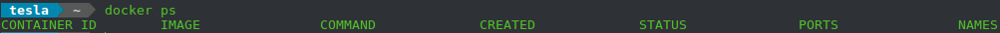

##### 1.OpenAI Gym


##### 2.OpenAI Universe

[Universe](https://blog.openai.com/universe/)一个通过现实游戏、网站和其他应用来衡量和测试通用智能的软件平台，使任何现有程序都可能成为OpenAI Gym环境，而无需任何到程序内部、源码或API的入口。为实现这些，它将程序打包进一个Docker容器，并将AI以与人类同样使用方式的接口展现：发送键盘和鼠标事件，并接受屏幕像素。初始的发行版包含了超过1000个AI代理能在其中采取行动并搜集观测的环境。另外，一些环境包含发送给代理的激励信号来指导强化学习，现已包含几百个有激励信号的环境。下面这些任务打包进了一个公开可得的Docker容器，无需额外工作就能运行：

- 基于VNC的Atari和CartPole环境：`gym-core.Pong-v3`、`gym-core.CartPole-v0`等；
- 基于VNC的flash游戏：`flashgames.DuskDrive-v0`等；
- 基于VNC的浏览器任务（“比特世界”）：`wob.mini.TicTacToe-v0`等。

**安装**：目前支持运行Python2.7和3.5的Linux和MacOS。在开始前建议设定一个[conda环境](https://conda.io/docs/user-guide/tasks/manage-environments.html)来使所有与universe相关的包保持在同样的地点。安装可以分为3步：

1. **安装universe**：先安装一些依赖包，在ubuntu16.04下运行：

   ```bash
   pip install numpy
   sudo apt-get install golang libjpeg-turbo8-dev make
   ```

   在MacOS下运行

   ```bash
   xcode-select --install
   # 或者
   pip install numpy incremental
   brew install golang libjpeg-turbo
   ```

   然后执行：

   ```bash
   git clone https://github.com/openai/universe.git
   cd universe
   pip install -e .
   ```

2. **安装docker**：Universe的环境大多在Docker容器内运行，Ubuntu看[这里](https://docs.docker.com/install/linux/docker-ce/ubuntu/)安装Docker，先删除旧版本：

   ```bash
   sudo apt-get remove docker docker-engine docker.io
   ```

   `/var/lib/docker/`下的内容，包含镜像、容器、卷和网络是受保护的。依照不同的需求有不同的安装方法：

   - 为便于安装和升级，推介设置Docker仓库并从此安装；在宿主机首次安装Docker时，需设定Docker仓库，之后可以从仓库中安装并升级Docker。

     **设定仓库**：

     1. 更新`apt`包索引：

        ```bash
        sudo apt-get update
        ```

     2. 安装包以使`apt`能通过HTTPS使用仓库：

        ```bash
        sudo apt-get install \
            apt-transport-https \
            ca-certificates \
            curl \
            software-properties-common
        ```

     3. 添加Docker官方GPG密钥：

        ```bash
        curl -fsSL https://download.docker.com/linux/ubuntu/gpg | sudo apt-key add -
        ```

        通过搜索最后8个字符，验证获得带`9DC8 5822 9FC7 DD38 854A E2D8 8D81 803C 0EBF CD88`指纹的密钥：

        ```bash
        sudo apt-key fingerprint 0EBFCD88
        ```

     4. 设定**stable**仓库；若需增加**edge**或**test**仓库，在"stable"或添加"edge"或/和"test"即可：

        ```bash
        sudo add-apt-repository \
           "deb [arch=amd64] https://download.docker.com/linux/ubuntu \
           $(lsb_release -cs) \
           stable"
        ```

     **安装Docker**：

     1. 更新`apt`包索引：

        ```bash
        sudo apt-get update
        ```

     2. 安装最新/指定版的Docker CE：

        ```bash
        # 安装最新版本
        sudo apt-get install docker-ce
        # 或安装指定版本
        sudo apt-get install docker-ce=<VERSION>
        ```

        要获得可得的docker版本，运行

        ```bash
        apt-cache madison docker-ce
        ```

     3. 通过`hello-world`镜像验证正确安装了Docker：

        ```bash
        sudo docker run hello-world
        ```

        创建了`docker`组但未添加任何成员，因此需要用`sudo`来运行docker。

     **升级Docker**：

     先运行`sudo apt-get update`，然后再重复上面的过程，选择想要的版本。

   - 在无法上网的机器上可下载DEB包并手动安装和升级；

   - 在测试和开发环境中可选择自动化脚本来安装；

   安装之后，还有一些

   Mac看[这里](https://docs.docker.com/docker-for-mac/)安装，必须能运行`docker ps`并得到类似这样的结果：

   

3. **在Docker中运行代理**：