#### 第8章 基于表格方法的规划和学习

本章统一强化学习中DP、HS(heuristic search)这类要求环境模型和MC、TD这类无需环境模型的方法。前者**基于模型(model-based)**，主要依赖**规划(planning)**；后者**无模型(model-free)**，主要依赖**学习(learning)**。两者核心都是价值函数的计算，都基于向前观察未来事件、计算备份值、将备份作为价值函数近似的更新目标。

##### 8.1 模型与规划

环境模型指任何能被代理用于预测环境会怎样回应其行动的事物。由一个状态-行动对，**分布模型(distribution model)**能产生所有可能后继状态和激励以及相应概率，**抽样模型(sample model)**则只产生按照这些可能性的概率分布的一个抽样。分布模型强于抽样模型，总能用于产生样本，但并不总能在应用中获得。

模型能用来仿真经验。给出起始状态和行动，抽样模型能产生一个可能转移，分布模型则能产生所有可能转移及相应概率，这个称为**模拟(simulate)**环境。给出起始状态和策略，抽样模型会产生一个完整节，而分布模型能产生所有可能节以及相应概率，这个称为**模拟经验(simulated experience)**。

规划表示任何以模型为输入而后产生或改善与环境交互策略的计算过程。在AI中有两种规划方法：**1)状态空间规划(state-place planning)**，在状态空间上最优策略或路径的搜索，行动引发状态之间的转移，价值函数定义在状态空间上，是本书讨论的内容；**2)规划空间规划(plan-state planning)**，在规划空间上的搜索，操作将一个规划转换为另一个，若有价值函数则定义在规划空间之上，包含进化方法(evolutionary methods)和偏序规划(partial-order planning)，但很难有效用于RL所关注的随机序列决策(stochastic sequential decision)问题。

所有状态空间规划方法共享一个通用结构，其基本思想是所有这些方法：**1)**都计算价值函数作为改善策略的关键中间步骤，**2)**通过应用在模拟经验上的更新或备份操作来计算价值函数。这些方法的不同仅在于：**1)**更新的类型、**2)**更新的顺序、**3)**获取备份信息的间隔。

这种看待规划的视角强调与学习的关系，两者核心都是基于备份更新的价值函数估计，区别在于规划使用模型生成的模拟经验，而学习使用环境产生的真实经验。而共同的结构则表示许多思想和算法能在两者之间迁移，尤其是学习方法仅要求经验（许多时候模拟经验也适用），因此许多时候**学习算法能替代规划的关键更新步骤**。

下是**随机采样单步表格Q-规划(random-sample one-step tabular Q-planning, RsOsTQP)**方法，一个基于单步表格Q-学习和抽样模型的规划方法示例，收敛的条件同样为：**1)**每个状态-行动对被无限次选择；**2)**$\alpha$随时间减小：

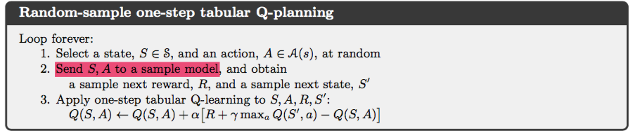

上面算法中第二步用模型而非策略产生后继状态和激励，这是与学习的不同之处；第三步则用了Q学习方法作为规划的更新步骤。下图归纳了这节提到概念的关系：

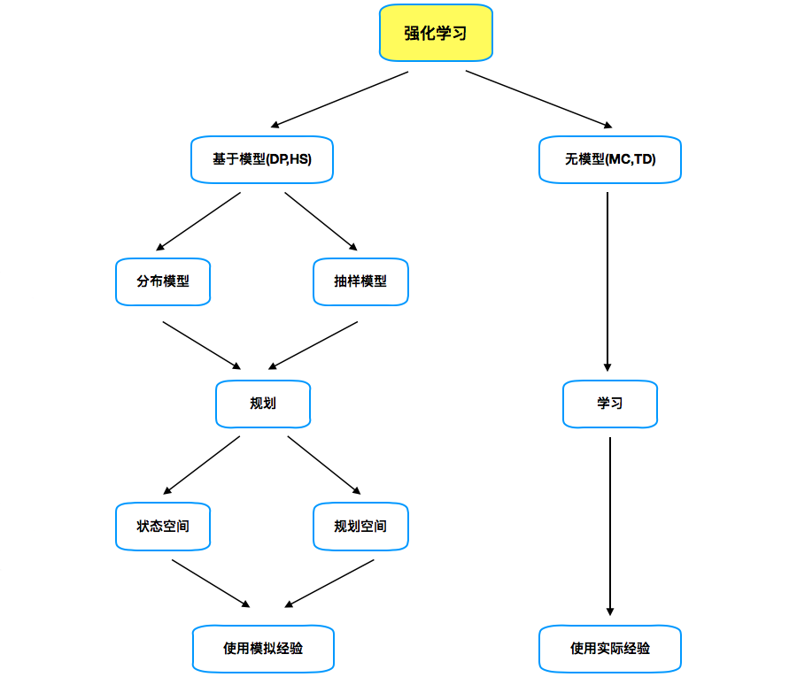

除此之外，本章另一主题在规划中使用小而递增步幅的益处，它使规划能在任何时候以很小的代价中断或重定向，是将规划与作用和模型学习有效结合的关键要求，即便纯规划中在问题太大无法精确求解时也是最有效方法。

##### 8.2 Dyna：集成规划、作用(acting)和学习

当在线(online)执行规划时，与环境互动获得的新信息可能改变模型，从而也改变与规划的互动。因此希望定制当前或即将考虑状态和决策的规划过程；若决策制定和模型学习都是计算密集型过程，还需要在它们之间分配计算资源。Dyna-Q是一个集成了在线规划代理所需主要函数的简单结构。

实际经验在规划代理中有两个作用：**1)**改善模型（使其更精准匹配实际环境）和**2)**用RL方法直接改善价值函数和策略。前者为**模型学习(model-learning)**，后者为**直接强化学习(direct RL)**。经验、模型、价值和策略间的可能关系总结为下图，注意经验能通过模型间接改善价值和策略，这称为**间接强化学习(indirect RL)**，为规划所涉及。

直接和间接方法各有优劣，间接方法通常更充分地使用经验因此能通过与环境较少的互动获得更好的策略；而直接方法则更加简洁且不受模型设计偏差的影响。承认两者的共性而非将两者对立能获得更多的洞见。

Dyna-Q包含了上图所有过程，规划、作用（上图中价值或策略发挥作用产生经验）、模型学习和直接RL都连续发生；规划方法是RsOsTQP，直接RL为单步表格Q-学习(OsTQL)，模型学习也基于表格并假定环境的确定性。

模型学习过程为：每个转移$S_t,A_t\to R_{t+1},S_{t+1}$发生后，在其表格中记录条目$S_t,A_t$的预测确定性为$R_{t+1},S_{t+1}$。当被咨询已经历状态-行动对时，模型简单返回上次观测结果。在规划期间，Q-规划算法从已经历状态-行动对中随机抽样，因此不会查询模型没有信息的对。

Dyna代理总体结构如下图，Dyna-Q算法为其中一例。中间栏是代理与环境的基本互动，产生实际经验轨迹。左侧是直接RL；右侧则是基于模型的过程，从真实经验学得模型并使其产生模拟经验，**搜索控制(search control)**选择模拟经验的初始状态和行动，最后在模拟经验上应用RL方法来实现规划。

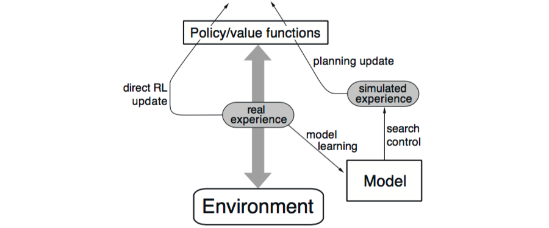

理论上，作用、模型学习、直接RL和规划在Dyna代理内同时并行发生，但为正确实现会指定它们在一个时间步内发生的顺序；前三者所需计算很少，因此可假设每个时间步内它们执行结束之后还有时间完成Q-规划算法的n次迭代（1-3步）。下面Dyna-Q算法的伪代码中，$model(s,a)$表示对$(s,a)$下个状态和激励的预测。直接RL、模型学习和规划分别对应(d)、(e)、(f)；若省略(e)和(f)，剩余算法就是单步表格Q-学习。

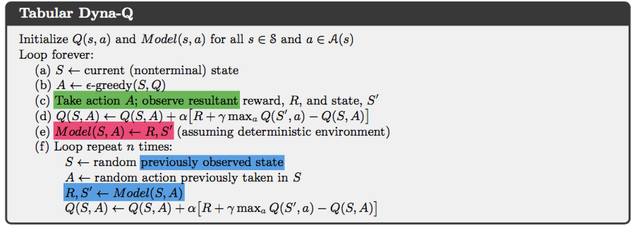

> **例8.1 Dyna迷宫**：下图迷宫每个状态的行动上下左右分别移动到相应位置，除非碰到障碍或边缘留在原地。转移激励都为0除非到达$\mathtt G$为+1，之后代理回到$\mathtt S$开始新一节，折扣$\gamma=0.95$。令步长$\alpha=0.1$，初始行动价值为0，探索参数$\varepsilon=0.1$，图下部为应用每步执行规划步数$n$不同的Dyna-Q代理的平均学习曲线，对每个$n$曲线表示重复30次每节的平均步数；每次重复的随机数种子相同，因此所有$n$的第一节都相同（约1700步，未在图上展示）；第一节后所有代理都改善了性能，但$n$越大提高越快。$n=0$为非规划代理，仅使用直接RL（单步表格Q-学习），提高最慢需25节达到($\varepsilon$-)最优性能，而$n=5$仅用5节，$n=50$为3节。
>
> 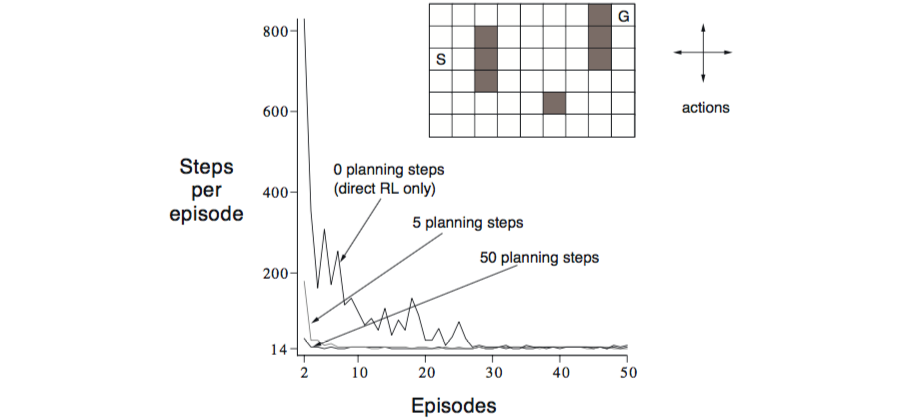
>
> 因为执行模型学习，模型在每次转移中都会学到一些环境的信息，转移次数越多模型关于环境的信息也越完善，因此在规划时的步数越多，对这些信息的使用就越充分。下图为第二节$n=0$代理和$n=50$发现的策略。没有规划每节仅添加一步到策略；而有规划虽然第一节也仅学了一步，但第二节代理还在起点附近游荡时，规划过程就探索几乎从节尾到开始的广泛策略（因为第一节后模型已经有了一些从起点到终点环境的信息），第三节结束时就已经找到了完整的最优策略获得了最佳性能。
>
> 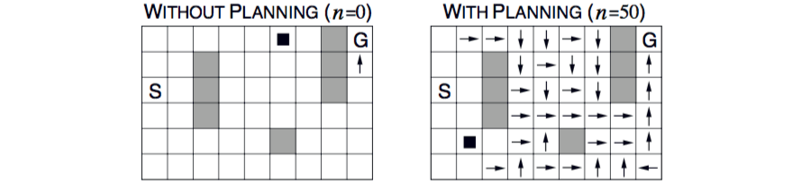

在Dyna-Q中，学习和规划使用同样的RL算法，在实际经验上学习，在模拟经验上规划，是两者的“最终共同路径”，两者共享几乎同样机制因此是紧密集成的，只是经验的来源不同。而规划递增进行，混杂规划和作用就无关紧要，两者都竭力尽快进行。代理总是即刻应对新信息并在幕后规划和学习模型。当获得新信息时，模型被更新以更好匹配实际，规划也会相应改变。

*练习8.1：上例的单步非规划方法十分弱鸡，多步引导方法会表现更好，那么第七章中是否存在与Dyna相匹敌的方法，试解释原因*。

##### 8.3 当模型错误时

规划代理的模型可能会错误因为：环境可能随机而仅观测到有限样本，或学习模型的函数近似泛化很差，或环境发生变化但还未观测到新行为。这时，规划很可能计算一个欠优策略；当模型最优于预测比实际可能性更大激励或更优转移时，规划策略会试图挖掘这些机会却发现不存在，因此这些欠优策略就趋使错误快速被发现和纠正。

> **示例8.2 阻塞迷宫**：下图的迷宫在1000步时发生了变化；而Dyna-Q和加强的Dyna-Q+代理的平均累计激励显示：两者在1000步内都找到了通道；环境变化后曲线都变平坦表明被障碍阻拦未获得激励；一段时间后又都发现了新的通路及最优行为。
>
> 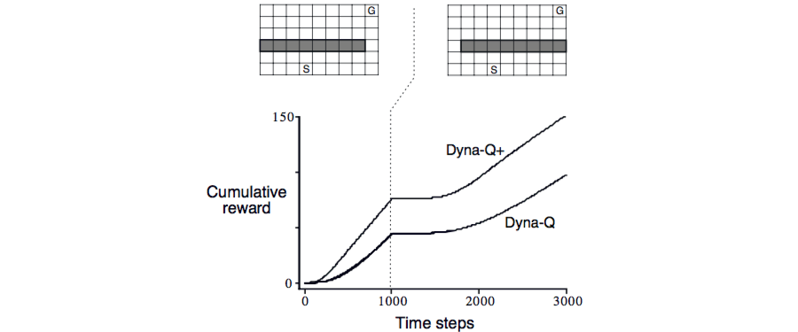

当环境变好时问题则会难得多，因为先前的正确策略并不会揭示这种变化，这时就很难检测到模型的错误。

> **示例8.3 捷径迷宫**：下图迷宫在3000步时出现了一条更短通路，但Dyna-Q代理从未转向过它，模型也未曾意识到其存在，这时规划做得越多越不可能发现；即便使用$\varepsilon$-策略也不大可能因发现这条捷径需很多步探索。
>
> 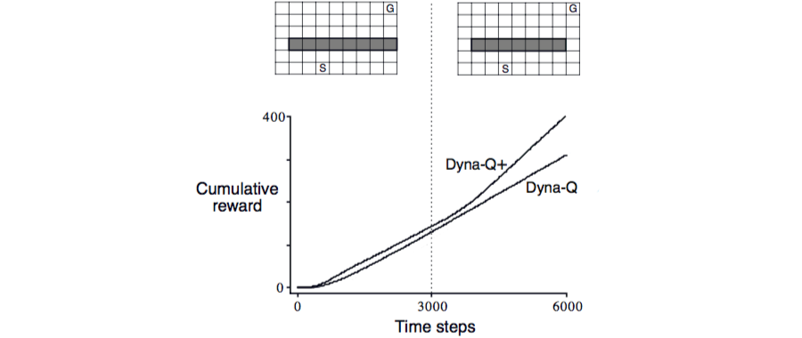

这是另一种探索和开发的冲突。在规划中，探索表示尝试改善模型的行动，开发表示在当前模型下表现最优。这里希望代理探索环境变化而又不严重减弱性能，启发法通常有效。Dyna-Q+代理追踪每个状态-行动对距上次在环境中真实被访的时长，越大则其动态改变故模型错误的可能越大；若一个转移的建模激励是$r$，已有$\tau$时间步未访，则在规划更新中的激励增加探索红利为$r+\kappa\sqrt\tau$；另外Dyna-Q+在规划步中允许考虑某个状态未尝试过的行动，这种行动的初始模型是以0激励引其回到原状态。这就使代理持续测试所有可得状态转移甚至发现长序列的行动。

*练习8.2: 为何Dyna-Q+在阻塞和捷径试验中第一阶段的表现也更好*。

*练习8.3 捷径试验中第一阶段Dyna-Q+和Dyna-Q的差距在缩小，解释其原因*。

*练习8.4 编程：探索红利实际改变了状态和行动的估计价值，是否必要这样；若红利$\kappa\sqrt\tau$仅用来选择行动不要来更新，执行网格世界试验测试并展示真正方法的优缺点*。

##### 8.4 优先级扫描(Prioritized Sweeping)

若转移和更新关注某些特定状态-行动对，规划会高效很多。例如前面迷宫中，仅沿到目标前状态、或从中出发的转移的更新会改变价值，这表示聚焦从目标状态反向作用的搜索才有作用。推广到一般情况就是希望从任何价值发生变化的状态开始工作。若模型的价值初始时正确，代理发现环境变化并改变了一个状态的估计价值，则使代理直接进入这个状态行动的价值也需更新，然后这些行动的前驱状态价值也需改变。这样代理就能从任意价值发生变化的状态反向传播有效更新，这就是规划计算的反向聚焦。

反向传播的前沿通常会产生很多状态-行动对，但那些已经发生巨大变化的状态-行动对的前驱对更有可能变化显著。在随机环境中，转移概率估计的变化也是决定变化大小和紧迫性原因，因此应依照紧迫性区分优先级，并按优先顺序执行，此即优先级扫描的思想。维护一个按变化大小确定状态-行动价值更新优先级的队列。当队列顶端对更新后，计算对其前驱对的影响，若大于某个阈值则以新的优先级插入到队列中。这样变化的影响就能高效反向传播直至静止。确定性环境中完整的算法如下：

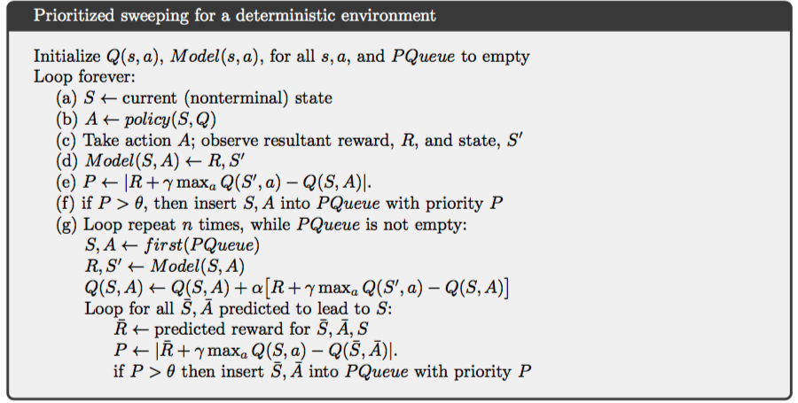

> **示例8.4 迷宫的优先级扫描**：优先级扫描通常能以5到10倍提高迷宫中找到最优方法的速度，下图数据来自与示例8.1同样结构但分辨率不同的迷宫序列，优先级扫描维持了对Dyna-Q的决定性优势。两个系统在每次环境互动中最多做$n=5$的更新。
>
> 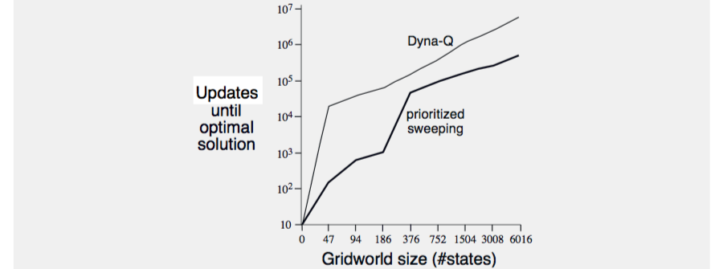

> **示例8.5 木杆调遣**：任务目标是在有限四边形空间内操纵木杆绕过障碍以最少步数到达目标。杆能沿长轴或垂直方向平移空间1/20并定量在$20\times20$的一个位置，也能绕其中心旋转10度，下图为优先级扫描发现的最短方案。问题有4个行为和1440个状态（某些因障碍无法到达），可能太大而无法用非优先级方法解决。
>
> 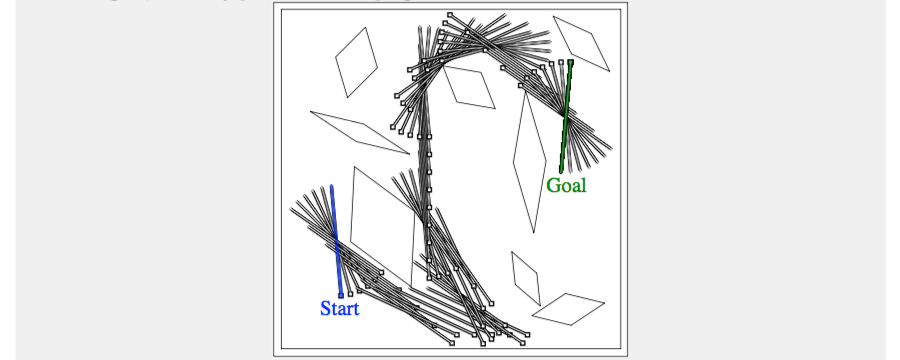

持续统计每个状态-行动对被经历的次数及下个状态来维护模型，更新每个对时使用考虑所有可能下个状态及相应概率的期望，这样就能将优先级扫描扩展到随机环境（行动-状态对的转移随机）。

优先级扫描只是一种散布计算来提高规划效率的方法，其局限是使用期望更新，这在随机环境中会在大量低概率转移上浪费很多计算；尽管引入方差，但抽样更新在很多时候都能以更少的计算接近真实价值函数，它能胜出是因为它将全部备份计算分解为更小的片—对应到单个转移—这使其能更窄地聚焦在影响最大的片。这个思想被带到了“小备份”，这些更新类似抽样沿单个转移，但类似期望基于转移概率。通过选择完成小备份的顺序可能极大地改善规划效率。

所有的状态空间规划可视为价值更新序列，区别仅在于更新类型—期望还是抽样、大还是小—和更新完成的顺序。反向聚焦只是一种策略，还有其他比如**前向聚焦(forward focusing)**，按照从当前策略下经常被访问状态到达的难以程度来聚焦状态。

##### 8.5 期望更新vs.抽样更新

本书大部分都是关于价值函数更新，当前单步更新主要在三个维度趋异，分别是：更新状态价值抑或行动价值、估计最优策略的价值抑或给定策略的价值、以及使用期望更新抑或抽样更新。这样有8种组合，如下图所示，其中7种对应特定的算法，而任一这些单步更新都能用在规划方法中。

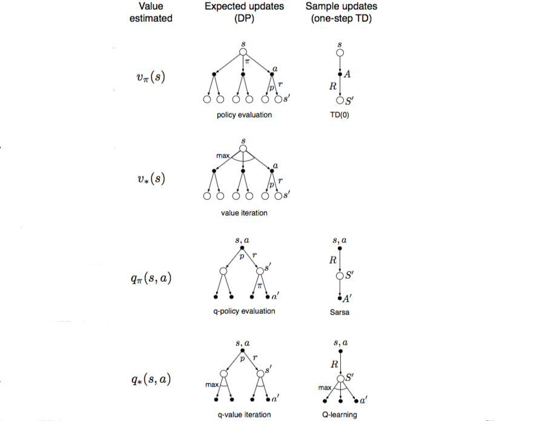

虽然期望更新确实会产生更好的估计，但也需要更多的计算，而这种资源在规划中通常有限。