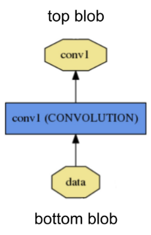
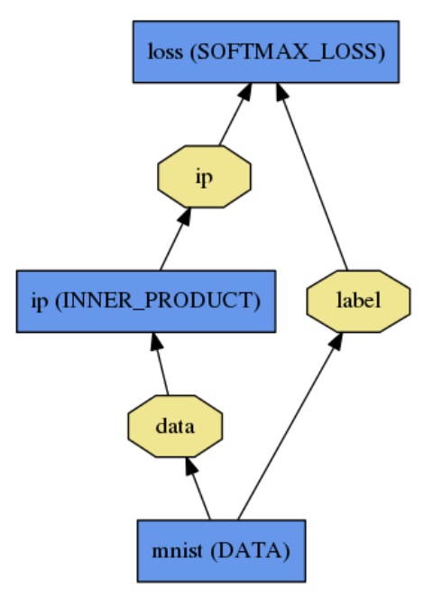

#### 1.安装

##### 1.1ubuntu16.04

**1.11依赖**：

```bash
sudo apt-get install libprotobuf-dev libleveldb-dev libsnappy-dev libopencv-dev libhdf5-serial-dev protobuf-compiler
sudo apt-get install --no-install-recommends libboost-all-dev
```

通过`apt-get`或nvidia`.run`包。用nvidia包安装的话需要需要分别安装最新的库和驱动。

之后，安装BLAS和python的依赖：

```bash
sudo apt-get install libatlas-base-dev
sudo apt-get install python-dev
```

**1.12编译**：Caffe既可以用Make、也可以用CMake编译。前者受官方支持，而后者则由社区支持。

用make编译：

通过复制和修改`Makefile.config`示例文件来配置自己的构建，默认的会有效，但若使用`Anaconda`的话取消相应行的注释：

```bash
cp Makefile.config.example Makefile.config
# Adjust Makefile.config (for example, if using Anaconda Python, or if cuDNN is desired)
make all
make test
make runtest
```

- 对CPU&GPU加速的caffe，无需做任何改动；
- 使用CuDNN加速的，取消`USE_CUDNN := 1`的注释；
- 对仅用CPU的caffe，取消`CPU_ONLY := 1`的注释；

若需要编译Python和Matlab封装做`pucaffe`和`matcaffe`，确保Python和Matlab路径在`Makefile.config`内。

分发：运行`make distribute`以创建`distribute`目录，包含了分发到其他机器所需的所有Caffe头文件、编译库、二进制文件等。

加速：运行`make all -j8`以并行编译，其中8是并行的线程数（比较好的选择是机器的核心数）。

用CMake构建：

为代替手工编辑`Makefile.config`配置构建，caffe提供了非官方的CMake。基本步骤为：

```bash
mkdir build
cd build
cmake ..
# 如果遇到opencv_dep_cudart的问题，改执行
# cmake .. -DCUDA_USE_STATIC_CUDA_RUNTIME=false
make all
make install
make runtest
```


#### 2.教程

##### 2.1哲学：

- 表达：模型和优化都定义为文字而非代码；
- 速度：对学术和类工业速度对最先进模型和海量数据而言都至关重要；
- 开放：科学和应用过程都调用共同的代码、参考模型和复现性；
- 社区：学术研究、创业原型和工业应用都共享BSD项目共同讨论和发展的优势。

##### 2.2剖析Caffe模型

Caffe以自己的模型模式一层层定义网络。网络自底向上定义从输入到损失定义整个模型。当数据和导数在前向和反向传递中流经网络时，Caffe以`bolbs`存储、传达和操作这些信息。`Bolb`是框架的标准数组和统一存储接口。之后是层，为模型和计算的基础。网络像层的聚集和连接一样流动。`Bolb`的细节描述了信息在层、网内以及之间的存储和传达方式。`Solving`单独配置来用于解耦建模和优化。

**2.2.1`Bolb`存储与传播**

`Bolb`是被处理和传输的实际数据的caffe封装，同时在后台提供CPU和GPU间的同步能力。数学上，它是以C连续存储的N维数组。`Bolb`提供了一种保持数据——比如图像批次、模型参数、优化的导数等——的统一存储接口。它通过从GPU宿主到所需GPU设备的同步，隐藏了CPU/GPU混合操作的计算和脑力开销。

批图像数据的`bolb`维度惯例是个数$N\times$通道$K\times$高$H\times$宽$W$。`Bolb`存储在布局上以行为主，因此最后/最右的维度变化最快。比如在4维`bolb`中，索引值$(n,k,h,w)$物理上位于索引$((n\times K + k)\times H + h)\times W + w$。

参数的`bolb`维数依照层类型和配置改变。对一96核$11\times11$空间3输入的卷积层，其`bolb`是$96\times3\times11\times11$。对1000个输出通道和1024个输入通道的内积/全卷积层，参数`bolb`就是$1000\times1024$。

对定制数据需要完成自己的输入准备工具或数据层，但一旦完成后，层的模块性就会完成剩余的工作。

`Bolb`会存储两块记忆，`data`和`diff`。前者是普通的数据，后者是网络计算的梯度。另外，因为实际值既可以存储在CPU也可以存储在GPU中，因此有两种不同的方法来获得：固定方法，不会改变值；以及不定方法，会改变值：

```cpp
const Dtype* cpu_data() const;
Dtype* mutable_cpu_data();
```

GPU和`diff`也同样。这样设计的原因是，`bolb`使用`SyncedMem`类来同步CPU和GPU之间的值以隐藏同步细节和最小化数据迁移。一个原则是，若不希望改变值则总是使用固定调用，并且永远不在实例中存储指针值。每次使用`bolb`时，调用函数来获得指针，因`SyncedMem`会需要这来确定何时复制数据。

实践中，当显示GPU时，使用CPU代码来将数据从硬盘加载到bolb中，调用一个设备核来做GPU计算，并将bolb传送到下一层，在保持高层性能的同时忽略低层细节。只要所有层都有GPU实现，所有中间数据和梯度都会保持在GPU中。若希望验证bolb何时会复制数据，下面是展示例子：

```cpp
// Assuming that data are on the CPU initially, and we have a blob.
const Dtype* foo;
Dtype* bar;
foo = blob.gpu_data(); // data copied cpu->gpu.
foo = blob.cpu_data(); // no data copied since both have up-to-date contents.
bar = blob.mutable_gpu_data(); // no data copied.
// ... some operations ...
bar = blob.mutable_gpu_data(); // no data copied when we are still on GPU.
foo = blob.cpu_data(); // data copied gpu->cpu, since the gpu side has modified the data
foo = blob.gpu_data(); // no data copied since both have up-to-date contents
bar = blob.mutable_cpu_data(); // still no data copied.
bar = blob.mutable_gpu_data(); // data copied cpu->gpu.
bar = blob.mutable_cpu_data(); // data copied gpu->cpu.
```

**2.2.2层计算和连接**

层是模型的本质和计算的基础单元。层卷积滤波器、池化、取内积、应用非线性、正规化、加载数据，并计算损失，见[类目录](http://caffe.berkeleyvision.org/tutorial/layers.html)。



`Bolb`通过底部连接输入，通过顶部连接输出。每个层类型定义三种临界计算：

- 设置：在模型初始化时初始化层极其连接一次；
- 前向：给定来自底部的输入计算输出并送达顶部；
- 反向：给定对应于顶部输出的梯度计算对应于底部输入的i梯度并送达底部。有参数的层计算其参数的梯度并内部存储。

更具体地说，有两个前向和反向函数的实现，一个是CPU另一个是GPU。若未实现GPU版本，则层就会掉回CPU函数作为备选。这在快速试验的时候会派上用场，尽管会带来额外的迁移开销（输入会从GPU复制到CPU，输出会从CPU复制回GPU）。

为使网络像整体一样操作，层有两个关键功能：提取输入产生输出的前向传递，和提取关于输出梯度计算关于参数和输入梯度并反向传播到前一层的反向传递。这些传递都仅是每层前向和反向的合成。开发定制层仅需网络合成性和代码模块性的最小工作，定义层的设定、前向和反向，就已经能包含在网络内了。

**2.2.3网络定义和操作**

网络通过合成和自动推导同时定义函数及其梯度。每层输出的合成计算完成给定任务的函数，每层反向的合成计算来自学习任务的损失的梯度。Caffe是端到端的机器学习引擎。网络是一系列层连接成一个计算图——一个有向无环图(DAG)，Caffe完成任意DAG层的所有记账来确保前向和反向的正确性。一个典型的网络以从硬盘加载数据的数据层开始，以计算任务目标的损失层结束。网络用文本建模语言定义为一系列层及其连接，一个简单的logistic回归分类器如下：



可以定义为：

```json
name: "LogReg"
layer {
  name: "mnist"
  type: "Data"
  top: "data"
  top: "label"
  data_param {
    source: "input_leveldb"
    batch_size: 64
  }
}
layer {
  name: "ip"
  type: "InnerProduct"
  bottom: "data"
  top: "ip"
  inner_product_param {
    num_output: 2
  }
}
layer {
  name: "loss"
  type: "SoftmaxWithLoss"
  bottom: "ip"
  bottom: "label"
  top: "loss"
}
```

模型通过`Net::Init()`初始化，初始化主要做两件事：通过创建`bolb`和`layer`来搭建整个DAG，并调用层的`Setup()`函数；也会做一些其他的记账工作，比如验证整个网络架构的准确性。同样，在初始化期间网络通过记录到`INFO`解释其初始化：

```bash
I0902 22:52:17.931977 2079114000 net.cpp:39] Initializing net from parameters:
name: "LogReg"
[...model prototxt printout...]
# construct the network layer-by-layer
I0902 22:52:17.932152 2079114000 net.cpp:67] Creating Layer mnist
I0902 22:52:17.932165 2079114000 net.cpp:356] mnist -> data
I0902 22:52:17.932188 2079114000 net.cpp:356] mnist -> label
I0902 22:52:17.932200 2079114000 net.cpp:96] Setting up mnist
I0902 22:52:17.935807 2079114000 data_layer.cpp:135] Opening leveldb input_leveldb
I0902 22:52:17.937155 2079114000 data_layer.cpp:195] output data size: 64,1,28,28
I0902 22:52:17.938570 2079114000 net.cpp:103] Top shape: 64 1 28 28 (50176)
I0902 22:52:17.938593 2079114000 net.cpp:103] Top shape: 64 (64)
I0902 22:52:17.938611 2079114000 net.cpp:67] Creating Layer ip
I0902 22:52:17.938617 2079114000 net.cpp:394] ip <- data
I0902 22:52:17.939177 2079114000 net.cpp:356] ip -> ip
I0902 22:52:17.939196 2079114000 net.cpp:96] Setting up ip
I0902 22:52:17.940289 2079114000 net.cpp:103] Top shape: 64 2 (128)
I0902 22:52:17.941270 2079114000 net.cpp:67] Creating Layer loss
I0902 22:52:17.941305 2079114000 net.cpp:394] loss <- ip
I0902 22:52:17.941314 2079114000 net.cpp:394] loss <- label
I0902 22:52:17.941323 2079114000 net.cpp:356] loss -> loss
# set up the loss and configure the backward pass
I0902 22:52:17.941328 2079114000 net.cpp:96] Setting up loss
I0902 22:52:17.941328 2079114000 net.cpp:103] Top shape: (1)
I0902 22:52:17.941329 2079114000 net.cpp:109]     with loss weight 1
I0902 22:52:17.941779 2079114000 net.cpp:170] loss needs backward computation.
I0902 22:52:17.941787 2079114000 net.cpp:170] ip needs backward computation.
I0902 22:52:17.941794 2079114000 net.cpp:172] mnist does not need backward computation.
# determine outputs
I0902 22:52:17.941800 2079114000 net.cpp:208] This network produces output loss
# finish initialization and report memory usage
I0902 22:52:17.941810 2079114000 net.cpp:467] Collecting Learning Rate and Weight Decay.
I0902 22:52:17.941818 2079114000 net.cpp:219] Network initialization done.
I0902 22:52:17.941824 2079114000 net.cpp:220] Memory required for data: 201476
```

