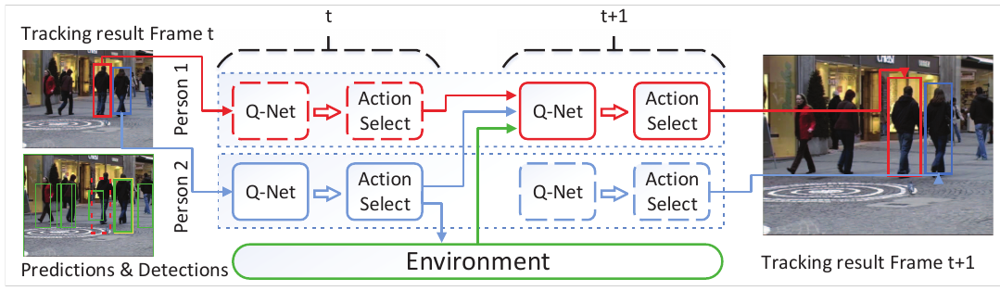

#### 1. Collaborative DRL for MOT

多目标追踪(Multi-Object Tracking, MOT)的目标是估计不同目标的轨迹并在视频中追踪这些目标。当前的MOT方法主要可分为两类：

- 1)离线方法（批或半批）的关键思想是将检测聚类为短轨迹片段（trajectory segments或tracklet），然后使用更可靠的特征来连接这些轨迹片段完满轨迹，代表方法使用最小网络流、能量最小化或广义最小团体(clique)图来处理数据关联问题；
- 在线方法使用当前帧和前一帧的检测评估目标轨迹，传统方法常用Kalman滤波、粒子滤波或马尔科夫决策，但对遮挡和噪声检测十分敏感。

在无限制环境下的多目标追踪依然极具挑战，尤其是在群体场景中。本文提出一个多物体追踪的协同(collaborative)强化学习(C-DRL)方法。其主要思想是：给定视频以及第$t$帧不同目标的检测结果，将每个目标建模为一个代理，并通过历史轨迹和第$t+1$帧的外观信息来预测下面帧的位置。通过发掘每个代理与临近代理以及环境间的协同交互，并用一个最大化共享效用来有效地减轻了我目标和有噪检测间遮挡影响的决策网络，来为每个代理决定更新、追踪或删除目标，在一些基准测试实验上取得了很高的效率。

#### 2. Learning Dynamic Memory Networks for Object Tracking (MemTrack)

当前深度学习在视觉追踪领域的应用主要有两种策略：

- 一个是基于检测追踪模式，它在线训练一个目标外表分类器来从背景中辨别目标，模型先用初始帧学习，然后基于新预测边界框使用后面帧生成的训练样本调优；
- 另一个是模板匹配模式，采用第一帧中的目标块或使用前面帧来构建匹配模型，

因可比性能和快速，模板匹配的视觉追踪方法最近开始变得流行，但是因缺乏在物体外观上调整变化的有效方法，追踪精度依然不甚理想。本文提出一种动态存储网络来在追踪时针对目标外观变化调整模板：

- 使用一个LSTM作为存储控制器，输入为搜索特征映射，输出则是存储块读或写进程的控制信号；
- 因刚开始时目标在搜索特征映射中的位置未知，因此应用注意力机制在潜在目标上拼接LSTM输入；
- 为防止激进的模型调整，应用门限残差模板学习来控制用于与初始模板结合的检索存储量；

另外，本文的追踪器MemTracker：

- 不同于基于检测追踪中目标信息通过神经网络权值维持从而需要大量调优以使其可调整，它完全基于前向(feedforward)运行，并通过更新外部存储来调整到目标外观改变；
- 不同于其他方法模型线下训练后能力就固定了，它能随着任务需求很简单地扩大，这对记忆长期目标信息十分有利。

大量基于VOT和OTB的实验显示MemTracker优于其他方法的同时保持了实时50fps的速度。