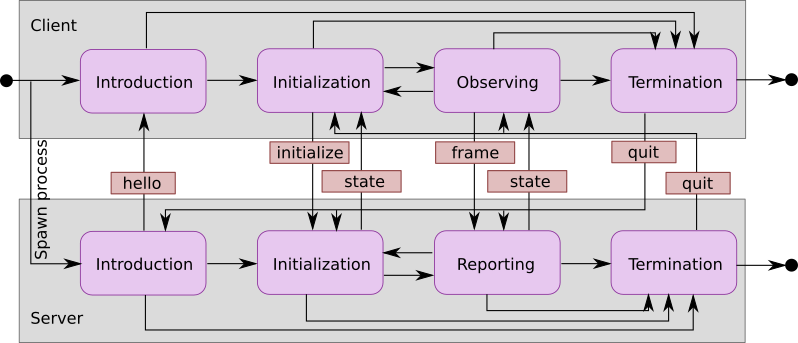
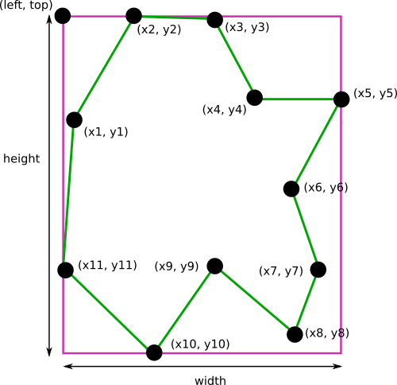

#### TraX协议规格

协议主要基于标准的进程输入和输出流，但也能使用诸如TCP流的其他媒体，主要思想是协议通信被嵌入这些流中的追踪进程和控制进程间通信中，这种通信被划分到基于线的消息，每个消息可以被一个前缀确定，使得能从协议通信中过滤出追踪器输出。

##### 定义

在描述交互时采用标准的客户端-服务器术语，尽管一些方面的定义有些反直觉。协议的基本术语定义为：

- **服务器**：一个向客户端提供追踪信息的追踪进程，客户端向服务器提供需求——图像序列。不同于传统与多个客户端通信的持久进程，这里的服务器被单个客户端启动，并仅与之通信；
- **客户端**：初始化追踪需求及控制这个过程的进程，大多数情况是为性能分析集聚追踪数据的评估软件，但也能提供额外的使用案例；
- **消息**：服务器与客户端使用消息互相通信，每个消息以一新行开始，以一唯一字符串为前缀，以行结尾结束。

##### 消息格式

协议的单个消息是一行，这就表示它被新行(EOL)符号从过去和将来流内容中隔开，所有客户端或服务器的消息都这样。为将嵌入的Trax信息从任意程序输出区分出来，使用了前缀`@@Trax:`，前缀后面立刻（没有空格）是消息名称，后跟空格分开的参数。格式如下图所示：

消息头之后是一些必须强制参数，参数个数依赖于消息类型和运行时配置；强制参数之后是个数不定的可选命名参数，可用于沟通额外数据。

##### 转义序列

所有参数都能包含空格，但必须被放入双引号`"`中，若需要在参数内使用相同符号时就需要以反斜杠`\`为前缀，也就是必须使用转义序列，同样转义序列也用于反斜杠本身`\\`和新行`\n`。

##### 命名参数

命名参数由关键词、后跟`=`字符和任意值字符序列。关键词序列仅能包含字母数字字符、点`.`和下划线`_`，并且最多64个字符。

##### 协议消息和状态

下面列举协议的合法消息以，以及客户端和服务器的状态：

- `hello`（服务器）：消息由服务器发送来介绍自己并列举自己的能力。消息不指定强制参数，但服务器可以使用可选命名参数报告自己的能力。被协议第一版认可的官方参数为：
  - `trax.version`（数字）：指定支持的协议版本，默认时1；
  - `trax.name`（字符串）：指定追踪器名称，能被客户端用来核实执行了正确的算法；
  - `trax.identifier`（字符串）：指定当前实现的标识符，能用于确定追踪器的版本；
  - `trax.image`（字符串）：指定支持的图像格式，默认追踪器接受文件路径为图像源；
  - `trax.region`（字符串）：确定支持的区域格式，默认追踪器接受矩形为区域规格。
- `initialize`（客户端）：由客户端发送来初始化追踪器，消息包含图像数据和物体区域，要求参数的实际格式由服务器指定的图像和区域格式决定。
- `frame`（客户端）：由客户端发送来要求新图像的处理，消息包含图像数据，要求的实际格式由服务器指定的图像格式决定；
- `state`（服务器）：被服务器用来发送新区域到客户端，消息包含任何支持格式的区域数据（最普遍的是服务器在介绍消息中提出的格式）。
- `quit`（客户端，服务器）：两部分都能发送来终结会话，服务进程应在接受或发送消息后退出，消息不指定任意强制参数。

服务器和客户端的状态图表可以用简单的自动机定义，如下图所示，状态基于从对方接接收当的消息改变：

客户端状态自动机由下面的状态组成：

- **Introduction**：客户端等待来自服务器的`hello`消息，在这个消息中服务器描述自身能力，客户端：
  - 接收并通过移动到`initialization`状态来继续会话，
  - 或拒绝并通过发送`quit`消息来终结会话；
- **Initialization**：客户端发送带图像和目标区域数据的`initialize`消息，然后移动到`observing`状态；
- **Observing**：客户端等待来自服务器消息：
  - 若接收的消息是`state`则客户端处理到来的状态数据并移动到`initialization`或`termination`或保持`observing`状态，
  - 若接收消息为`quit`则客户端移到`termination`状态；
- **Termination**：若被内部启动，客户端发送`quit`消息；若服务器在一定时间内为终结，客户端可以终结服务器进程。

服务器状态自动机由下面状态构成：

- **Introduction**：服务器发送介绍性的`hello`消息；
- **Initialization**：服务器等待`initialize`或`quit`消息：
  - 若为`initialize`，则用给定数据初始化一个追踪器，服务器移动到`reporting`状态，新状态用`state`消息报告回客户端，
  - 若为`quit`消息，服务器移动到`termination`状态；
- **Reporting**：服务器等待`frame`、`initializer`或`quit`消息：
  - 若为`frame`，用新图像信息更新追踪器，并将新状态用`state`消息报告回客户端，
  - 若为`initialize`消息，用给定数据初始化追踪器，并敬爱嗯新状态用`state`消息报告回客户端，
  - 若为`quit`，服务器移动到`termination`状态；
- **Termination**：若被内部启动，服务器发送`quit`消息，然后退出。

##### 区域格式

区域可以用两种基于点的格式编码，两种格式都是逗号分割，如下图所示：

- **Rectangle**(`rectangle`)：最简的区域格式，坐标轴对齐的边界框，使用四个值来描述：用逗号i分隔的`left`、`top`、`width`和`height`；
- **Polygon**(`polygon`)：由至少六个的偶数个数指定的更复杂和灵活的描述，逗号分隔，定义多边形的点。

##### 图像格式

图像能被编码为统一资源标识符(URI)，当前协议指定4种类型资源：

- **FilePath**(`path`)：图像通过一个到文集爱你系统中绝对路径的URL指定，如`file:///home/user/sequences/0000001.jpg`。
- **Memory**(`memory`)：以标识符模式`image:`编码的原始图像，编码头文件包含关于宽度、高度和像素格式的信息，协议指定支持下面的格式：单通道8或16比特灰度图(`gray8`或`gray16`)，和3通道8比特RGB图像(`rgb`)，注意灰度格式也能编码红外或深度信息。头部后跟逐行的Base64编码，比如`image:320;240;rgb;...`。
- **Data**(`data`)：图像编码为使用JPEG或PNG格式的数据URI，使用Base64编码，服务器需要支持从内存缓冲中直接解码图像，这种数据的第一部分的例子如：`data:image/jpeg;base64;...`。
- **URL**(`url`)：通过一个图像资源的通用URL指定，典型如HTTP远程资源如`http://example.com/sequence/0001.jpg`。

