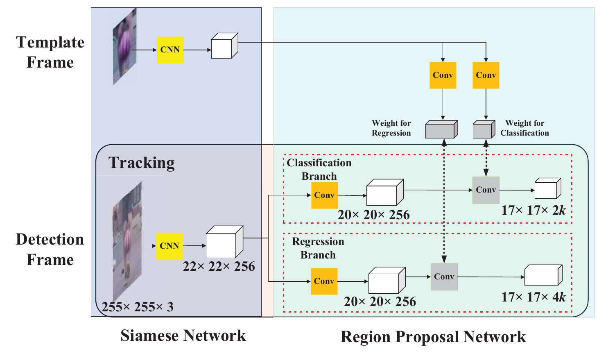
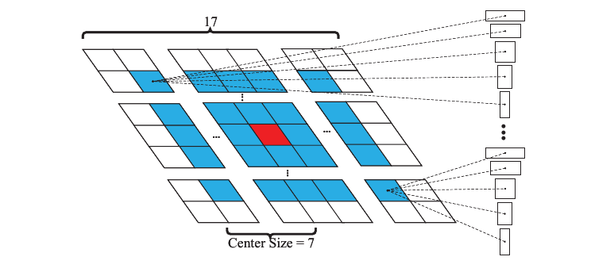
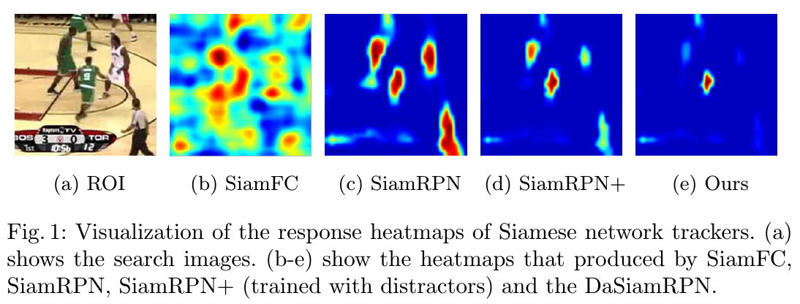
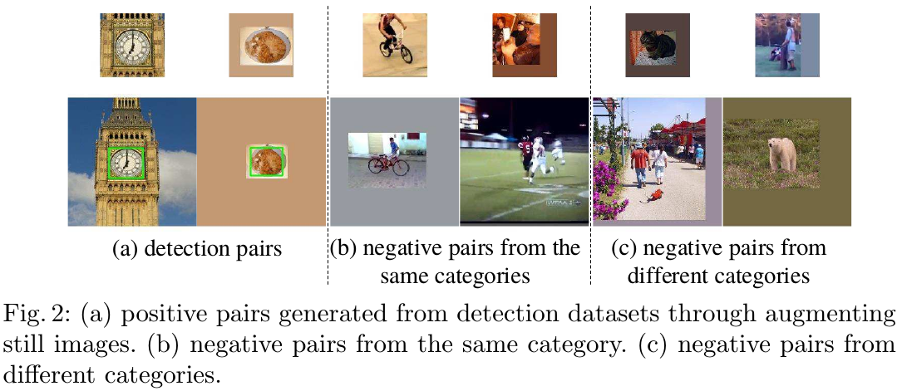
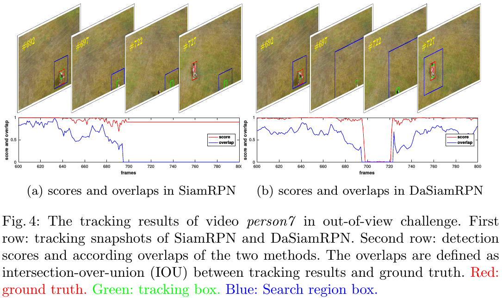

所谓视觉目标追踪，就是在变化的视频中自动定位一个特定目标。它的核心难题是如何在遮挡、超出视线、变形、背景杂乱和其他变化的困难场景中，精确而高效地检测和定位目标。

### 2. Siamese-RPN

#### 2.2 以单射检测来追踪

将单射检测看成是一个判别性任务，其目标是找到使预测器函数$\psi(x; W)$的平均损失$\mathcal L$最小的参数$W$，并基于一个有$n$样本$x_i$及对应标签$\ell_i$的数据集计算：
$$
\min_W \frac1n \sum_{i=1}^n \mathcal L(\psi(x_i;W), \ell_i)
$$
单射学习旨在从兴趣类别的单个模板$z$中学习$W$，判别性单射学习的难题在于找到一个将类别信息包含进学习器的机制，即学习如何学习。为此作者提出一种使用元学习过程来从单个模板$z$中学习预测器参数$W$的方法，也就是一个将$\left(z; W'\right)$映射到$W$的前向函数$\omega$。令$z_i$为batch中的模板样本，则就能将这个问题形式化为：
$$
\min_{W'} \frac1n \sum_{i=1}^n \mathcal L\left( \psi(x_i; \omega(z_i; W')), \ell_i \right)
$$
与上面类似，令$z$表示模板块(patch)，$x$表示检测块，函数$\varphi$为孪生特征提取子网络，函数$\zeta$为区域提议子网络，则单射检测任务就恩那个形式化为：
$$
\min_W\frac1n\sum_{i=1}^n \mathcal L\left( \zeta(\varphi(x_i;W); \varphi(z_i; W)), \ell_i \right)
$$
现在就能将孪生子网络中的模板分支重新解读为训练参数来预测局部检测任务的核(kernel)，而这正是典型的学习如何学习过程。在这种解读中：

- 模板分支被用于将种类(category)嵌入(embed)到核中；
- 而检测分支则使用嵌入的信息执行检测。

在训练阶段，元学习器(meta leaner)仅需逐对(pair-wise)边框监督；在推理阶段，除初始帧外孪生框架被剪为仅剩检测分支一提高速度。第一帧的目标块被送入模板分支来预先计算检测核，这样在后面的帧就能执行单射检测。因为检测任务仅基于初始帧给出的模板信息，因此可以认为是一个单射检测。

##### 推理阶段：执行单射检测

如上所述，将模板分支的输出看成是局部检测的核，无论是特征提取或是区域提议其核都在初始帧上预先计算并在整个追踪阶段保持不变。通过对当前特征映射用预先计算的核进行卷积，检测分支想单射检测一样执行在线推断，如下图所示：

在检测分支上执行前向传播就能获得分类和回归输出，这样就得到了前$M$个提议，这样就可以：

- 将分类特征图记为点集$A_{w\times h\times 2k}^{cls} = \left\{ \left( x_i^{cls}, y_j^{cls}, c_l^{cls} \right) \right\}$，其中$i\in[0,w), j\in[0,h), l\in[0,2k)$；
- 将回归特征图记为点集$A_{w\times h\times 4k}^{reg} = \left\{ \left( x_i^{reg}, y_j^{reg}, dx_p^{reg}, dy_p^{reg}, dw_p^{reg}, dh_p^{reg} \right) \right\}$，其中$i\in[0,w), j\in[0,h), p\in[0,k)$；

因为分类特征图的奇数通道表示正激活，因此收集所有$A_{w\times h\times 2k}^{cls}$中$l$为奇数的前$K$个点，并记这个点集为$CLS^*=\left\{ \left( x_i^{cls}, y_j^{cls}, c_l^{cls} \right)_{i\in I, j\in J, l\in L} \right\}$，其中$I, J, L$为某个索引集合。变量$i$和$j$分别编码对应锚的位置，而$l$则编码对应锚的比例，因此就能由此得到对应的锚集为$ANC^*=\left\{ \left( x_i^{an}, y_j^{an}, w_l^{an}, h_l^{an} \right)_{i\in I, j\in J, l\in L} \right\}$。然后找到$ANC^*$在$A_{w\times h\times 4k}^{cls}$的激活值来获得对应提纯坐标为$REG^*= \left\{ \left( x_i^{reg}, y_j^{reg}, dx_l^{reg}, dy_l^{reg}, dw_l^{reg}, dh_l^{reg} \right)_{i\in I, j\in J, l\in L} \right\}$。之后提炼的前$K$个提议集$PRO^*=\left\{ \left( x_i^{pro}, y_j^{pro}, w_l^{pro}, h_l^{pro} \right) \right\}$可以通过下面的公式获得：
$$
\begin{eqnarray}
x^{pro}_i &=& x_i^{an} + dx_l^{reg} * w_l^{an} \\
y^{pro}_j &=& y_j^{an} + dy_l^{reg} * h_l^{an} \\
w_l^{pro} &=& w_l^{an} * e^{dw_l} \\
h_l^{pro} &=& h_l^{an} * e^{dh_l}
\end{eqnarray}
$$
在获得这前$K$个提议后，就用一些提议选择策略来使其适于追踪任务。

##### 提议选择

为使单射检测框架适用于追踪，作者提出了两种选择提议的策略：

- 第一种是舍弃离中心太远的锚生成的边框，比如仅保留$A_{w\times h\times 2k}^{cls}$分类特征图上中心$g\times g$的子区域，这样就获得了$g\times g\times k$而非$m\times n\times k$个锚。因为临近的帧目标并不会有很大的移动，因此这种方法能有效去除异常值。如下图所示：

  

- 第二种是使用余弦窗和尺度变化惩罚来重排提议的分数从而获得最优。在去除异常值之后，添加一个余弦窗来抑制大偏移，然后添加一个惩罚来抑制尺寸和比率的大改变：
  $$
  penalty = e^{k*max\left(\frac r{r'}, \frac{r'}r\right) * max\left( \frac s{s'}, \frac{s'}s \right)}
  $$
  这里$k$是超参，$r$表示提议的高宽比，$r'$表示上一帧提议的高宽比，$s$和$s'$则表示提议和上一帧的整体尺寸，计算方法如下：
  $$
  (w+p)\times(h+p) = s^2
  $$
  其中$w$和$h$表示目标的宽和高，$p=\frac{w+h}2$表示填充。再用暂时惩罚乘以分类分数后就的到了重排的前$K$个提议，之后执行NMS来获得最终的追踪边框。在选出最终的边框后，通过线性插值更新目标尺寸来维持形状平滑变化。

### 3. DaSiamRPN

在前面基于孪生网络的追踪器中，都存在三个问题：一是大多数方法使用的特征仅能从无语义背景辨别出前景，语义背景总是被认为是干扰项（distractor，即看起来相似的物体），因此当背景十分杂乱的时候就性能就无法保证；二是大多数孪生追踪器都无法更新模型，也就失去了在线更新外观模型的能力，而这对外观剧烈变化追踪场景至关重要；三是最近的孪生追踪器都采用局部搜索策略，这无法解决遮挡和超出的问题。为解决这些问题，本文中探索了学习有干扰项意识(Distractor-Aware)的孪生区域候选网络(DaSiamRPN)来实现长期追踪。

通过对传统孪生网络所使用特征进行分析，作者确认：**训练数据中无语义背景和语义干扰项的不平衡，是表示学习的主要障碍**。因此：1)高质量的训练数据对于端到端学习追踪器的成功就至关重要，为此从现有大规模检测数据集引入正项对；2)而表示网络的质量很大依赖于训练数据的分布，因此在训练过程中明确生成了多种负项对；3)为进一步支持判别性，还开发了为追踪定制的数据增益策略。这样在线下训练后，表示网络就能很好地泛化到大多类目标，这就使得追踪一般目标变得可能。

在推理阶段，经典孪生追踪器仅搜索最近邻来匹配正项模板，当目标经历显著外观变化或背景十分杂乱时，这种策略的表现就很差，尤其是干扰项的存在使追踪任务更加艰难。针对这个问题，周围的环境和时间信息能提供额外的关于目标的线索，有助于最大化判别性能力。为此本文设计了一种新的干扰项意识(distracor-aware)模块，能有效地将普遍嵌入迁移到当前视频领域，并在推断时增量地获得目标外观变化。

此外近来大多数追踪器都针对的是数十秒序列、目标总是存在的短期场景。长期追踪中除了短期的各种问题外，还会遇到超出视野和全部遮挡十分棘手的难题。得益于DaSiamRPN中学习到的干扰项意识特征，作者引入简单而有效的局部-全局区域搜索策略，极大改善了这个追踪器在超出视野和全部遮挡问题上的表现，从而将这个方法扩展到了长期追踪中。

这篇文章的贡献可以总结为：

1. 详细分析了传统孪生追踪器所使用特征，发现训练集中无语义背景和语义干扰项的不平衡是学习的主要障碍；
2. 提出一个新DaSiamRPN框架，在线下训练中学习有干扰项意识的特征，在推理时明确地抑制干扰项；
3. 引入简单有效的局部-全局区域搜索策略，将DaSiamRPN扩展到长期追踪，极大改善了超出视野和全部遮挡问题上的表现。在综合的短期或长期追踪基准测试中，DaSiamRPN框架以远超实时速度获得了最佳效果。

#### 3.1 有干扰项意识的孪生网络

##### 3.1.1 传统网络中的特征和缺陷

孪生网络的核心是度量(metric)学习，目标是学习一个使不同目标之间惯性最大，相同目标惯性最小的嵌入(embedding)空间。下图可视化了SiamFC和SiamRPN的响应图，可以看出那些与目标背景相差很大的物体得分也很高，甚至一些无关物体也得到了高分。

在SiamFC和SiamRPN中，训练数据对来自同一视频的不同帧。对每个搜索区域，无语义背景占据了大多数，语义实体和干扰项的比例相对就很小，这种不平衡分布使得训练模型难以学习实例层次的表示，而仅趋向于学习前景和背景的差异。

在推理时，用最近邻来搜索大多数搜索区域的相似目标，初始帧标注的背景信息则被忽略，但这些追踪序列中的背景信息能有效地用来提升判别能力，如下图e所是。

为消除这些问题本文提出：在线下训练过程中积极地产生更多语义对，而在线追踪时则明确地抑制干扰项。

##### 3.1.2 干扰项意识的训练

高质量的训练数据对追踪中端到端表示学习至关重要，本文引入一些列策略来改善所学特征的普遍性并消除训练数据分布的不平衡。

**多种类正样本对能提升泛化能力**：通过引入大规模ImageNet Detection和COCO Detection数据集，作者极大地扩展了正项对的类别。如下图所示，通过数据增益技术（平移、调整大小、灰度等），检测数据集的静止图片能用于产生图像对用以训练。正项对的多样性能改善追踪的判别能力和回归精度。

**语义负项对能改善判别能力**：作者将SiamFC和SiamRPN的欠判别表示归因于训练数据两层次的不平衡分布：1)是稀少的语义负项对；因为背景占据了训练数据的主要部分，所以大多数负样本是无语义的（非实际物体，仅仅背景），但它们很容易就能被识别，也就是说判别器学习的是前景和背景之间的差异，语义物体间的损失则被大量简单负项完全压倒；2)来自类内干扰项，它们在追踪时通常表现为困难负样本；本文将语义负样本对添加到训练过程，构造的负项对由相同类别和不同类别的目标组成；来自不同类别的负项对有助于追踪器在遇到超出视野和完全遮挡这类情况时，避免飘移到任意物体；而来自相同类别的负项对则使追踪器聚焦在细粒度表示上。如下图所示：

**为视觉追踪定制的有效数据增益**：除通常的平移、放缩变换和光照变化外，作者观察到运动模式能够被网络中的浅层很简单地建模，因此在数据增益中明确引入了动态模糊(motion blur)。

##### 3.1.3 干扰项意识中的增量学习

前面的训练策略虽然能显著改善线下训练过程的判别能力，但依然难以区分有相似特性的两个目标，如下图a。问题主要出在一般表示域与特殊目标域的对偏，为此作者提出一个干扰项意识模块来有效地将一般表示迁移到视频域。孪生网络学习一个相似性度量$f(z, x)$来在嵌入空间$\varphi$比较标本图像$z$和候选图像$x$：
$$
f(z, x) = \varphi(z) \star \varphi(x) + b\bullet \mathbf{1} \tag{1}
$$

其中$\star$表示两个特征图之间的交叉关联，$b\bullet \mathbf 1$表示在每个位置都相等偏置，与标本最相似的物体会被选为目标。为充分利用标记信息，作者将目标上下文的干扰项也集成到了相似性度量中。DaSiamRPN使用NMS在每帧中选择潜在的干扰项$d_i$，然后收集一个干扰项集合$\mathcal D:=\left\{ \forall d_i \in \mathcal D, f(z, d_i)>h \cap d_i \neq z_t \right\}$，其中$h$为一个预先定义的阈值，$z_t$是在帧$t$选择的目标，这个集合的个数为$|\mathcal D|=n$。特别地，开始时每一帧会得到$17\times17\times5$个提议，然后使用NMS来减少冗余候选。得分最高的提议会被选为目标$z_t$，其他得分大于一个阈值的会被选为干扰项。

之后引入一个新的干扰项意识的目标函数来重排有前$k$与标本最相似的提议集$\mathcal P$，最终选择的目标记为$q$：
$$
q = \mathop{argmax}_{p_k\in\mathcal P} f(z, p_k) - \frac{\hat\alpha\sum_{i=1}^n\alpha_if(d_i, p_k)}{\sum_{i=1}^n\alpha_i} \tag{2}
$$
权值因子$\hat\alpha$控制干扰项学习的影响，权值因子$\alpha_i$控制每个干扰项$d_i$的影响，因为(1)中的交叉关联是线性操作，因此可以使用这种特性来加速干扰项意识的目标：
$$
q = \mathop{argmax}_{p_k\in\mathcal P} \left(\varphi(z) - \frac{\hat\alpha\sum_{i=1}^n\alpha_i\varphi(d_i)}{\sum_{i=1}^n\alpha_i}\right) \star \varphi(p_k) \tag{3}
$$
它使追踪器能以与SiamRPN相当的速度运行。这种结合规律也启发作者用学习率$\beta_t$来增量地学习目标模板和干扰项模板：
$$
q = \mathop{argmax}_{p_k\in\mathcal P} \left(\frac{\sum_{t=1}^T\beta_t\varphi(z_t)}{\sum_{t=1}^T\beta_t} - \frac{\sum_{t=1}^T\beta_t\hat\alpha\sum_{i=1}^n\alpha_i\varphi(d_{i,t})}{\sum_{t=1}^T\beta_t\sum_{i=1}^n\alpha_i}\right) \star \varphi(p_k) \tag{4}
$$
这种干扰项意识追踪器能调节已有的相似性函数（一般）到一个新领域的相似性度量（特殊）。权值因子$\alpha_i$可视为带稀疏正则性的双重变量，标本和干扰项可以视为关联滤波中的正负样本。实际上这个框架中建模了一个在线分类器，因此能预料采用的分类器比仅使用一般相似性度量的表现更好。

##### 3.1.4 应用到长期追踪

除了短期追踪的难题，长期追踪中还会遇到严重的超出视野和完全遮挡问题，如下图，当目标重新出现时，短期追踪的搜索区域无法覆盖到目标，因此后面帧的追踪就会失败。为此作者提出一个简单但有效的短期追踪和失败情形间的转换方法。在失败时，使用一个迭代的局部-全局搜索策略来重检测目标。

为执行这种转换，需要确定失败追踪的开始和结束。因干扰项意识的训练和推断能够有高质量得分，因此能用来指示追踪结果的质量。

在失败时，追踪器会用局部-全局策略逐渐扩大搜索区域，具体就是搜索区域的大小会以。