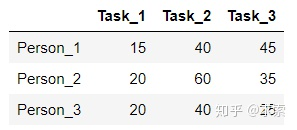

目前主流的目标跟踪算法都是基于**Tracking-by-Detection**策略，即基于目标检测的结果来进行目标跟踪。DeepSORT运用的就是这个策略，这里就有个问题，视频中不同时刻的同一个人，位置发生了变化，那么是如何关联上的呢？答案就是匈牙利算法和卡尔曼滤波。

- 匈牙利算法可以告诉我们当前帧的某个目标，是否与前一帧的某个目标相同。
- 卡尔曼滤波可以基于目标前一时刻的位置，来预测当前时刻的位置，并且可以比传感器（在目标跟踪中即目标检测器，比如Yolo等）更准确的估计目标的位置。


##### 匈牙利算法

匈牙利算法用于解决分配问题：假设有N个人和N个任务，每个任务可以任意分配给不同的人，已知每个人完成每个任务要花费的代价不尽相同，那么如何分配可以使得总的代价最小。例如现在有3个任务，要分别分配给3个人，每个人完成各个任务所需**代价矩阵（cost matrix）**如下所示（这个代价可以是金钱、时间等等）：



怎样才能找到一个最优分配，使得完成所有任务花费的代价最小呢？匈牙利算法（又叫**KM**算法）就是用来解决分配问题的一种方法，它基于定理：

> 如果代价矩阵的某一行或某一列同时加上或减去某个数，则这个新的代价矩阵的最优分配仍然是原代价矩阵的最优分配。

算法步骤（假设矩阵为NxN方阵）为：

1. 对于矩阵的每一行，减去其中最小的元素；
2. 对于矩阵的每一列，减去其中最小的元素；
3. 用最少的水平线或垂直线覆盖矩阵中所有的0；
4. 如果线的数量等于N，则找到了最优分配，算法结束，否则进入步骤5；
5. 找到没有被任何线覆盖的最小元素，每个**没被线覆盖的行**减去这个元素，每个**被线覆盖的列**加上这个元素，返回步骤3。

因此上面问题的解决过程即为：


**sklearn**里的**linear_assignment()**函数以及**scipy**里的**linear_sum_assignment()**函数都实现了匈牙利算法，两者的返回值的形式不同：

```python
import numpy as np 
from sklearn.utils.linear_assignment_ import linear_assignment
from scipy.optimize import linear_sum_assignment
 

cost_matrix = np.array([
    [15,40,45],
    [20,60,35],
    [20,40,25]
])
 
matches = linear_assignment(cost_matrix)
print('sklearn API result:\n', matches)
matches = linear_sum_assignment(cost_matrix)
print('scipy API result:\n', matches)
 

"""Outputs
sklearn API result:
 [[0 1]
  [1 0]
  [2 2]]
scipy API result:
 (array([0, 1, 2], dtype=int64), array([1, 0, 2], dtype=int64))
"""
```

在DeepSORT中，匈牙利算法用来将前一帧中的**跟踪框tracks**与当前帧中的**检测框detections**进行关联，通过**外观信息（appearance information）**和**马氏距离（Mahalanobis distance）**，或者**IOU**来计算代价矩阵。