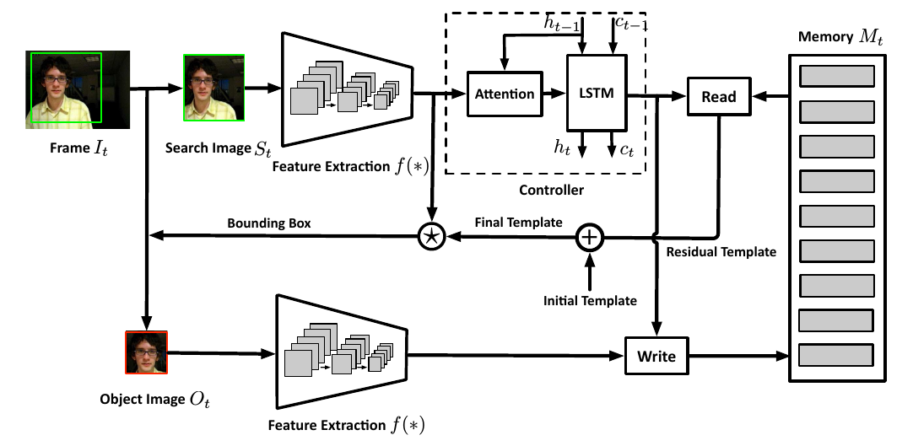
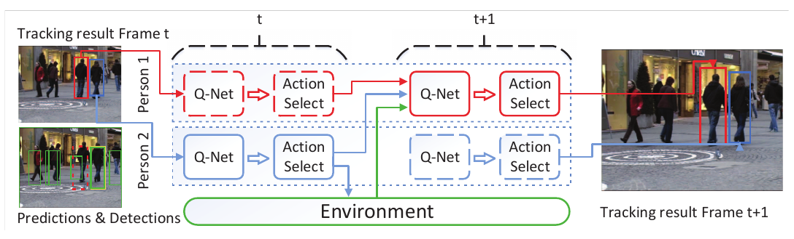
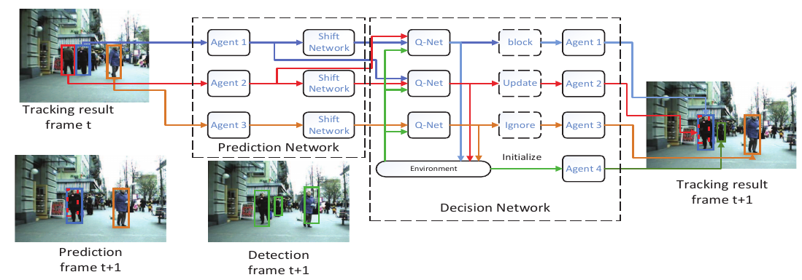
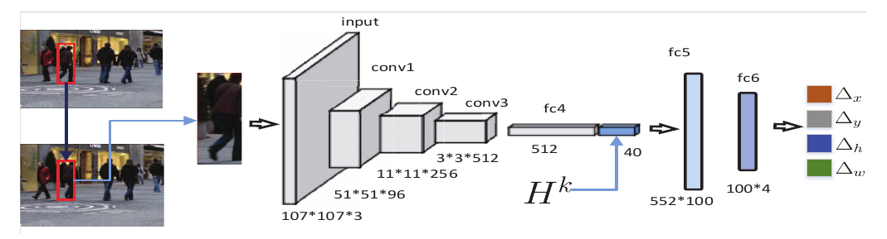
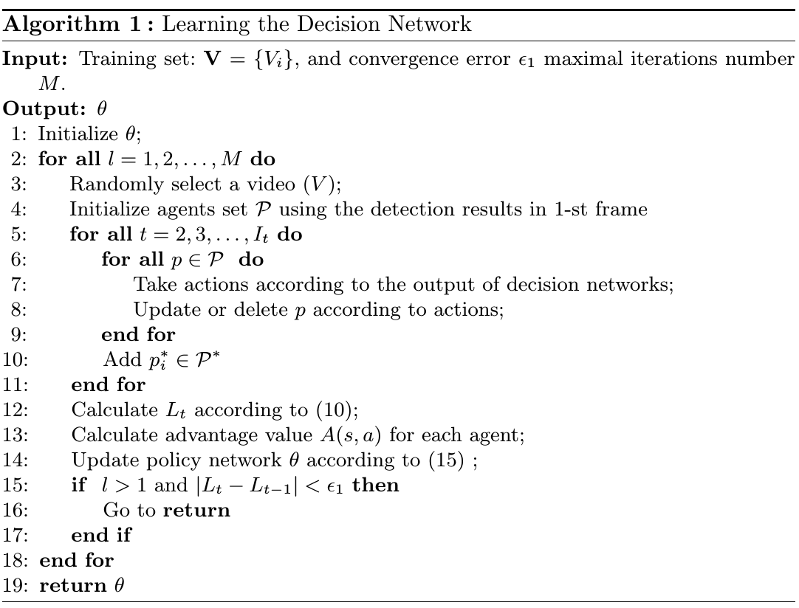

#### MemTracker

MemTracker整个框架如下图所示，它：

1. 先用CNN提取出搜索图像的特征；
2. 将图像特征输入到控制存储读写的注意力LSTM；
3. 从存储中读取一个残差模板，并与从第一帧学得的初始模板结合，形成最终模板；
4. 将最终模板与搜索图像特征卷积活得一个反应图，并预测目标边界框；
5. 使用预测的边界框提取出新目标模板，提取出其特征，然后写入存储以更新模型。

##### 特征提取

给定$t$时刻输入图像$I_t$：

1. 首先用前面预测边界框计算而得的矩形将其裁剪为一个搜索图像块$S_t$；
2. 然后通过全卷积网络（FCNN，本文为SiamFC）将其编码为一个高层次表达$f(S_t)$，即空间特征映射；
3. 在获得预测的边界框之后，使用同样的特征提取器来计算新目标模板以用于写存储。

##### 注意力方案

因需要获得相关模板来匹配搜索图像中的目标信息，但开始时位置未知，因此应用注意力机制来使LSTM的输入更多地关注目标。定义$\mathbf f_{t,i} \in \mathbb R^{n\times n\times c}$为$f(S_t)$上第$i$个滑窗样式的$n\times n\times c$方块。每个方块覆盖某一部分的搜索图像，它们基于注意力

#### CDRL

多目标追踪(MOT)旨在估计不同目标的轨迹，并在视频中追踪这些目标。当前的MOT方法主要分为两类：

- 线下方法：将检测聚类为短轨迹片段，然后将这些片段连接成完整的的轨迹；
- 线上方法：用当前和过去帧的检测结果估计轨迹。

本文提出一种协作深度强化学习来进行多目标追踪的方法，为解决遮挡和噪声检测问题，这个方法使用了预测-决策网络。下图展示了基本思想：

- 给定视频和第$t$帧不同目标的检测结果，将每个目标建模为一个代理，并用历史轨迹和第$t+1$帧的外观信息预测目标的位置；
- 挖掘每个代理与相邻代理以及环境之间的互动，通过一个决策网络并为每个代理做决策以更新、追踪或删除目标物体，前者能通过最大共享功用来减轻物体间的遮挡和有噪检测结果的影响。

这个方法由两部分组成：一个预测网络和一个决策网络，下图展示了其基本框架：

##### 学习预测网络

给定物体初始位置，预测网络旨在学习物体的移动来预测目标物体位置，如下如所示。预测网络的输入为通过下一帧初始边框裁剪的原始图像和历史轨迹；在训练设为学习预测网络时，随机抽取训练视频每一帧中物体$b_{i,t}^*$位置周围边框$b\in B_{i,t}$。预测网络取初始位置$b$裁剪后的$t+1$帧和前$K$帧历史轨迹$H$来预测位置，位置预测可形式化为下面的回归问题：
$$
\mathop {argmax}_\phi J(\phi) = \sum_{i,t}\sum_{b\in B_{i,t}} g\left( b_{i,t+1}^*, b+\phi(I_t, b, H_t) \right)
$$
其中$J$是预测网络顶层的最优化目标函数，$\phi$是网络参数集，$b_{i,t+1}^*$是物体$p_i$在$t+1$帧的真实值，$g(\bullet)$标记两个边框的IoU：
$$
g(b_i, b_j) = \frac{b_i \cap b_j}{b_i \cup b_j}
$$

##### 协作DRL

决策网络是一个包含多代理和环境的协作系统，每个代理用来自本身、临近代理和环境信息采取行动，代理与代理和环境间的互动通过最大化它们共享功效来挖掘，为更好使用上下文信息，将多目标追踪看成是协作最优化问题。

将每个物体视为一个代理，每个代理$p$包含轨迹$\{(x_0,y_0), (x_1,y_1), \dots, (x_t,y_t)\}$、外观特征$f$当前位置$\{x,y,w,h\}$。因此两个物体间$p_i$和$p_j$之间距离可计算为：
$$
d(p_i,p_j) = \alpha(1-g(p_i,p_j)) + \left( 1-\frac{f_i^Tf_j}{\Vert f_i\Vert_2\Vert f_j\Vert_2} \right)
$$
其中$g(p_i,p_j)$为两边界框的IoU，且$\alpha\ge0$。

环境包含目标检测结果：$\mathcal P_t^* = \left\{ p_1^*, p_2^*,\dots,p_{N_t}^* \right\}$，物体$p_i$和检测结果的距离可计算为：
$$
d\left(p_i,p_j^*\right) = \alpha\left(1-g\left(p_i,p_j^*\right)\right) + \left( 1-\frac{f_i^Tf_j}{\left\Vert f_i\right\Vert_2\left\Vert f_j^*\right\Vert_2} \right)
$$
令$I_t$为所选视频的第$t$帧，包含$n_t$个物体：$\mathcal P_t=\{ p_1,p_2,\dots,p_{n_t} \}$，第$t$帧状态$s_t=\left\{ \mathcal P_t, \mathcal P_t^* \right\}$包含当前代理和检测结果。对目标$p_i$：

1. 首先使用预测网络来生成第$t+1$帧的位置；
2. 然后选择最近邻的$p_j \in \mathcal P_t - \{p_i\}$和最临近检测结果$p_k^* \in \mathcal P_{t+1}^*$；
3. 之后，若$d(p_j,p_i)<\tau$且$d(p_k^*, p_i)<\tau$则将这三个图像输入决策网络中，而若$d(p_j,d_i)\ge\tau$或$d(p_k^*, p_i)<\tau$则将其代替为零图像；

每一帧目标有两个不同状态：可见和不可见。

- 若目标可见，则用预测或检测结果更新代理；若检测结果可靠则使用检测结果和预测结果两者更新代理；否则仅使用预测结果更新；
- 若目标不可见，则可能是被遮挡或消失；若被遮挡，则保持外观特征仅使用移动模型来预测物体下个方向位置；若消失，则直接删除目标。

因此，对每个代理，行动集就定义为$\mathcal A=\{update,\ ignore,\ block,\ delete\}$：

- 对行动$update$：使用预测和检测两个结果来更新$p_i$位置和外观特征：$f_i = (1-\rho)f_i + \rho f_i^*$，其中$\rho$是外观特征的学习率；删除用于更新代理特征的检测结果，对环境中余下的检测结果，则为每个初始化一个代理；对错误检测，依然初始化代理，只是其$\{update,\ ignore,\ block\}$行动激励为-1，而行动$delete$激励设为1，这样下一个迭代中这个代理就会被删除。
- 对行动$ignore$：检测结果不可靠或者消失，而预测结果相对更可靠，使用预测结果更新$p_i$位置；
- 对行动$block$：保持$p_i$的特征，并基于预测结果更新位置；
- 对行动$delete$：目标消失，直接删除目标$p_i$。

因此，每个行动的激励$r_{i,t}^*$包含两项：$r_{i,t}$和$r_{j,t+1}$，其中$r_{i,t}$描述自身在下一帧的状态，而$r_{j,t+1}$则指示下一帧中其最近邻状态。最终激励就能计算为：
$$
r_{j,t}^* = r_{i,t} + \beta r_{j,t+1}
$$
其中$\beta \ge 0$是平衡参数。

行动$\{update,\ ignore,\ block\}$的$r_{i,t}$由预测位置和下一帧真实值之间的IoU定义。若IoU的值太小或者目标消失，$r_{i,t}$设为-1：
$$
r_{i,t} = \begin{cases}1\qquad \text{if } IoU \ge 0.7;\\ 0\qquad \text{if } 0.5 \le IoU \le 0.7;\\ -1 \qquad \text{else}\end{cases}
$$
行动$delete$的$r_{i,t}$则由目标状态定义。若目标在下一帧中消失，$r_{i,t}$是1，否则-1：
$$
r_{\text{delete}} = \begin{cases} 1\qquad1\text{ if object disappeared};\\-1\qquad\text{else} \end{cases}
$$
计算$\{s_{i,t}, a_{i,t}\}$的$Q$值为：
$$
Q(s_{i,t}, a_{i,t}) = r_{i,t}^* + \gamma r_{i, t+1}^* + \gamma^2r_{i,t+1}^* + \dots
$$
其中$\gamma$是延迟参数。决策网络的优化问题可形式化为：
$$
\mathop{\text{argmax}}_\theta L(\theta) = \mathbb E_{s,a}\log(\pi(a\mid s,\theta))Q(s,a)
$$
其中$\theta$是决策网络的参数集，策略梯度可以按次计算：
$$
\begin{eqnarray}
\Delta_\theta L(\theta) &=& \mathbb E_{s,a}\log(\pi(a\mid s,\theta))Q(s,a)\\
&=& \mathbb E_{s,a} \frac{Q(s,a)}{\pi(a\mid s,\theta)}\Delta_\theta\pi(a\mid s,\theta)
\end{eqnarray}
$$
梯度显示可以提高有正$Q$值行为的概率，降低负$Q$值行为的概率。但在一些简单场景中，大多数行动的$Q$值是正的，而在一些苦难案例中在训练的初始阶段，几乎所有行动$Q$值都是负的，因此测率额梯度网络很难收敛。因此使用行动的优势值来代替$Q$值，其中先计算状态$s$的价值：
$$
V(s) = \frac{\sum_ap(a\mid s)Qs,a()}\sum{_ap(a\mid s)}
$$
然后计算优势值为：
$$
A(s,a) = Q(s,a) - V(s)
$$
策略梯度的最终形式定义为：
$$
L(\theta) = \mathbb E_{s,a}\log(\pi(a\mid s,\theta))A(s,a)
$$
参数可以按照下面的规则更新：
$$
\begin{eqnarray}
\theta &=& \theta + \rho\frac{L(\theta)}{\partial\theta}\\
&=& \theta + \rho\mathbb E_{s,a}\frac{A(s,a)}{\pi(a\mid s,\theta)}\frac{\partial\pi(a\mid s,\theta)}{\partial \theta}
\end{eqnarray}
$$
下面的算法总结了决策网络的详细的学习过程：

