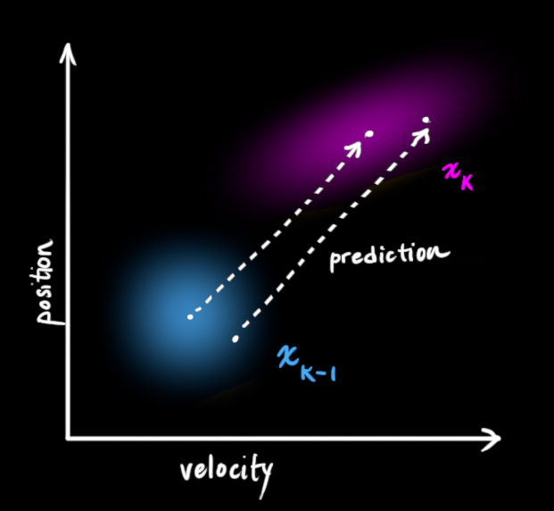
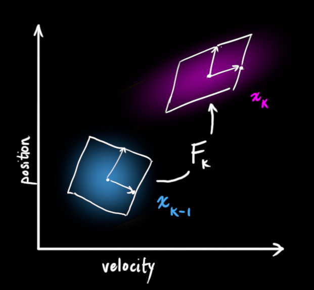
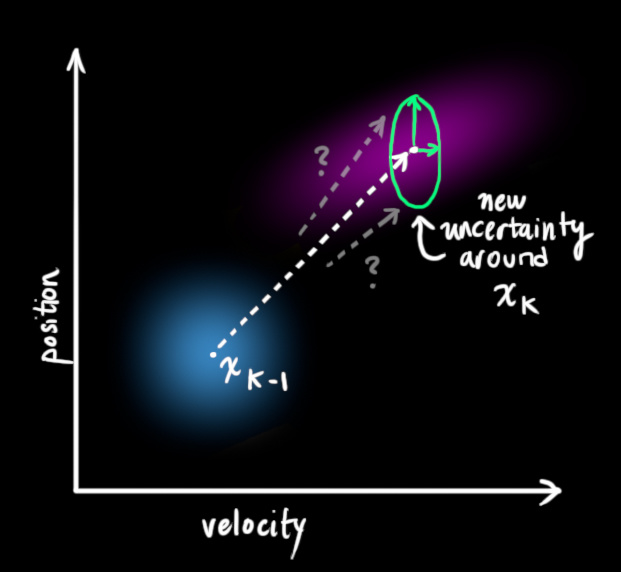
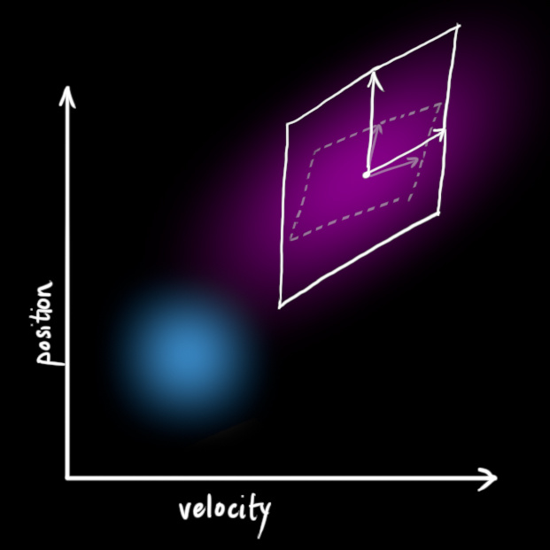
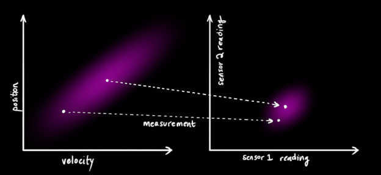
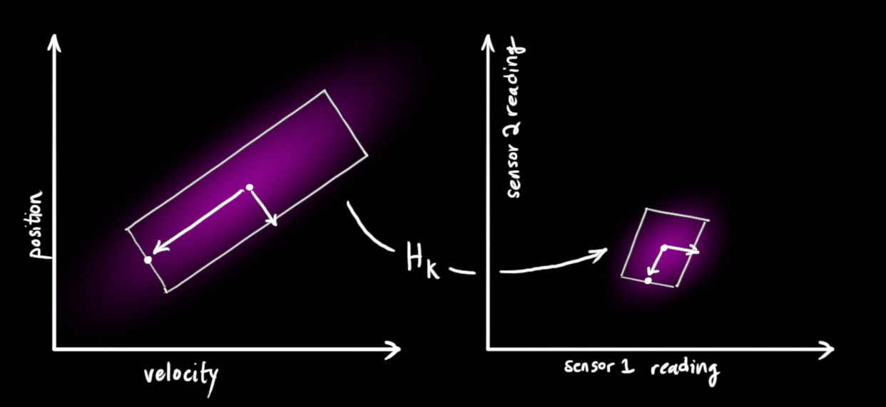
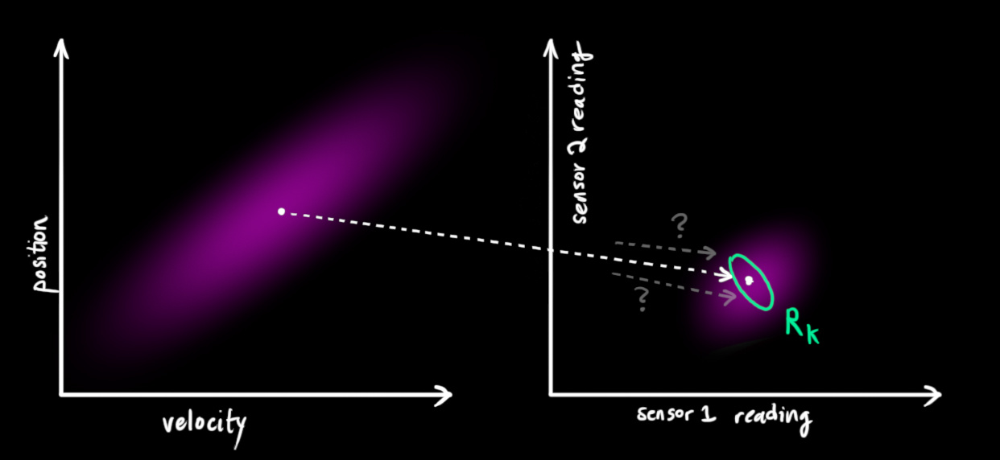
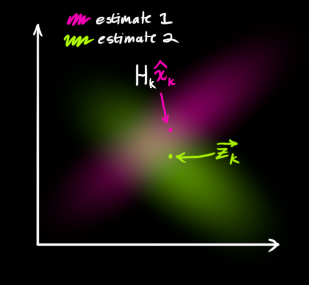
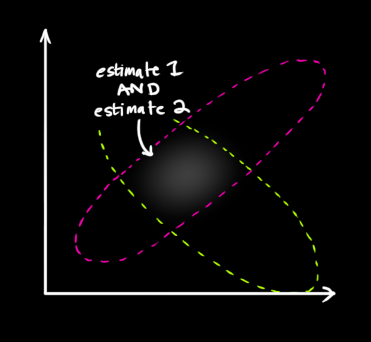
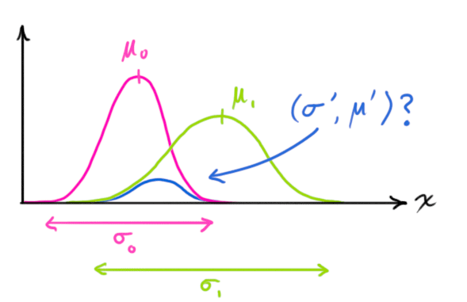

卡尔曼滤波（Kalman filter）是一种高效的自回归滤波器，它能在存在诸多不确定性情况的组合信息中估计动态系统的状态，是一种强大的、通用性极强的工具。只要是存在不确定信息的动态系统，卡尔曼滤波就可以对系统下一步要做什么做出有根据的推测。即便有噪声信息干扰，卡尔曼滤波通常也能很好的弄清楚究竟发生了什么，找出现象间不易察觉的相关性。因此卡尔曼滤波非常适合不断变化的系统，它的优点还有内存占用较小（只需保留前一个状态）、速度快，是实时问题和嵌入式系统的理想选择。

##### 问题建模

假设有一个四处移动的机器人，为了让它实现导航，机器人需要知道自己所处的位置。也就是说，机器人有一个状态$\vec{x}_k$，包含位置信息和速度信息：
$$
\vec{x} = \begin{bmatrix} \vec{p} \\ \vec{v} \end{bmatrix}
$$
卡尔曼滤波假设两个变量是**随机的**，而且符合**高斯分布**。每个变量都有一个**均值**$\mu$ ，它是随机分布的中心；有一个方差$\sigma^2$ ，它衡量组合的不确定性。而位置和速度是相关的，机器人前往特定位置的可能性取决于它拥有的速度。这不难理解，如果基于旧位置估计新位置，我们会产生这两个结论：如果速度很快，机器人可能移动得更远，所以得到的位置会更远；如果速度很慢，机器人就走不了那么远。这种关系对目标跟踪来说非常重要，因为它提供了更多信息：一个可以衡量可能性的标准。这就是卡尔曼滤波的目标：从不确定信息中挤出尽可能多的信息！

为了捕获这种相关性，我们用的是协方差矩阵。简而言之，矩阵的每个值是第$i$个变量和第$j$个变量之间的相关程度（由于矩阵是对称的，$i$和$j$的位置可以随便交换）。我们用$\Sigma$表示协方差矩阵，在这个例子中，就是$\Sigma_{ij}$。

##### 矩阵描述

为了把以上关于状态的信息建模为高斯分布，我们还需要$k$时的两个信息：最佳估计$\hat x_k$（均值，也就是$\mu$），协方差矩阵$P_k$。（虽然还是用了位置和速度两个变量，但只要和问题相关，卡尔曼滤波可以包含任意数量的变量）:
$$
\hat x_k = \begin{bmatrix} p \\ v \end{bmatrix} \\
P_k = \begin{bmatrix} \Sigma_{pp} & \Sigma_{pv} \\ \Sigma_{vp} & \Sigma_{vv} \end{bmatrix}
$$
接下来，我们要通过查看当前状态（$k-1$时）来预测下一个状态（$k$时）。这里我们查看的状态不是真值，但预测函数无视真假，可以给出新分布：

我们可以用矩阵$F_k$表示这个预测步骤：

它从原始预测中取每一点，并将其移动到新的预测位置。如果原始预测是正确的，系统就会移动到新位置。为什么我们可以用矩阵来预测机器人下一刻的位置和速度？下面是个简单公式：
$$
p_k = p_{k-1} + \Delta t v_{k-1} \\
v_k = v_{k-1}
$$
换成矩阵形式：
$$
\hat x_k = \begin{bmatrix} 1 & \Delta t \\ 0 & 1 \end{bmatrix} \hat x_{k-1} \\
= F_k\hat x_{k-1}
$$
这是一个预测矩阵，它能给出机器人的下一个状态，但目前我们还不知道协方差矩阵的更新方法。这也是我们要引出下面这个等式的原因：如果我们将分布中的每个点乘以矩阵A，那么它的协方差矩阵会发生什么变化：
$$
Cov(x) = \Sigma \\
Cov(Ax) = A\Sigma A^T
$$
把这个式子和上面的最佳估计$\hat x_k$结合，可得：
$$
\hat x_k = F_k \hat x_{k-1} \\
P_k = F_k P_{k-1} F_k^T
$$

##### 外部影响

但是，除了速度和位置，外因也会对系统造成影响。比如模拟火车运动，除了列车自驾系统，列车操作员可能会手动调速。在我们的机器人示例中，导航软件也可以发出停止指令。对于这些信息，我们把它作为一个向量$\vec{u}_k$，纳入预测系统作为修正。假设油门设置和控制命令是已知的，我们知道火车的预期加速度$a$。根据运动学基本定理，我们可得：
$$
p_k = p_{k-1} + \Delta tv_{k-1} + \frac12a\Delta t^2 \\
v_k = v_{k-1} + a\Delta t
$$
转换成矩阵形式：
$$
\hat x_k = F_k \hat x_{k-1} + \begin{bmatrix}\frac{\Delta t^2}{2} \\ \Delta t\end{bmatrix}a = F_k \hat x_{k-1}+ B_k\vec u_k
$$
如果存在我们不知道的力量，比如监控无人机时，它可能会受到风的影响；跟踪轮式机器人时，它的轮胎可能会打滑，或者粗糙地面会降低它的移速。这些因素是难以掌握的，如果出现其中的任意一种情况，预测结果就难以保障。这要求我们在每个预测步骤后再加上一些新的不确定性，来模拟和“世界”相关的所有不确定性：

如上图所示，加上外部不确定性后，$\hat x_{k-1}$的每个预测状态都可能会移动到另一点，也就是蓝色的高斯分布会移动到紫色高斯分布的位置，并且具有协方差$Q_k$。换句话说，我们把这些不确定影响视为协方差$Q_k$的噪声。

这个紫色的高斯分布拥有和原分布相同的均值，但协方差不同。

我们在原式上加入$Q_k$：
$$
\hat x_k = F_k \hat x_{k-1}+ B_k\vec u_k \\
P_k = F_kP_{k-1}F_k^T + Q_k
$$
简而言之，这里：

![[公式]](https://www.zhihu.com/equation?tex=%5Ccolor%7Bmagenta%7D%7B%5Ctext%7B%E6%96%B0%E7%9A%84%E6%9C%80%E4%BD%B3%E4%BC%B0%E8%AE%A1%7D%7D%5C) 是基于 ![[公式]](https://www.zhihu.com/equation?tex=%5Ccolor%7Bblue%7D%7B%5Ctext%7B%E5%8E%9F%E6%9C%80%E4%BD%B3%E4%BC%B0%E8%AE%A1%7D%7D%5C) 和 ![[公式]](https://www.zhihu.com/equation?tex=%5Ccolor%7Borange%7D%7B%5Ctext%7B%E5%B7%B2%E7%9F%A5%E5%A4%96%E9%83%A8%E5%BD%B1%E5%93%8D%7D%7D%5C) 校正后得到的预测。

![[公式]](https://www.zhihu.com/equation?tex=%5Ccolor%7Bmagenta%7D%7B%5Ctext%7B%E6%96%B0%E7%9A%84%E4%B8%8D%E7%A1%AE%E5%AE%9A%E6%80%A7%7D%7D%5C) 是基于 ![[公式]](https://www.zhihu.com/equation?tex=%5Ccolor%7Bblue%7D%7B%5Ctext%7B%E5%8E%9F%E4%B8%8D%E7%A1%AE%E5%AE%9A%E6%80%A7%7D%7D%5C) 和 ![[公式]](https://www.zhihu.com/equation?tex=%5Ccolor%7Bturquoise%7D%7B%5Ctext%7B%E5%A4%96%E9%83%A8%E7%8E%AF%E5%A2%83%E7%9A%84%E4%B8%8D%E7%A1%AE%E5%AE%9A%E6%80%A7%7D%7D%5C) 得到的预测。

现在，有了这些概念介绍，我们可以把传感器数据输入其中。

##### 引入测量

我们可能有好几个传感器，它们一起提供有关系统状态的信息，它可以读取位置，可以读取速度，重点是，能告诉我们关于状态的间接信息——它是状态下产生的一组读数。

请注意，读数的规模和状态的规模不一定相同，所以我们把传感器读数矩阵设为$H_k$。

把这些分布转换为一般形式：
$$
\vec \mu_{expected} = H_k\hat x_k \\
\Sigma_{expected} = H_kP_kH_k^T
$$
卡尔曼滤波的一大优点是擅长处理传感器噪声。换句话说，由于种种因素，传感器记录的信息其实是不准的，一个状态事实上可以产生多种读数。

我们将这种不确定性（即传感器噪声）的协方差设为$R_k$，读数的分布均值设为$z_k$。现在我们得到了两块高斯分布，一块围绕预测的均值，另一块围绕传感器读数。

如果要生成靠谱预测，模型必须调和这两个信息。也就是说，对于任何可能的读数$(z_1,z_2)$，这两种方法预测的状态都有可能是准的，也都有可能是不准的。重点是我们怎么找到这两个准确率。最简单的方法是两者相乘：

两块高斯分布相乘后，我们可以得到它们的重叠部分，这也是会出现最佳估计的区域。换个角度看，它看起来也符合高斯分布：

事实证明，当你把两个高斯分布和它们各自的均值和协方差矩阵相乘时，你会得到一个拥有独立均值和协方差矩阵的新高斯分布。最后剩下的问题就不难解决了：我们必须有一个公式来从旧的参数中获取这些新参数！

##### 结合高斯

让我们从一维看起，设方差为$\sigma^2$，均值为$\mu$，一个标准一维高斯钟形曲线方程如下所示：
$$
\mathcal N(x, \mu, \sigma) = \frac1{\sigma\sqrt{2\pi}}e^{-\frac{(x-\mu)^2}{}}
$$
那么两条高斯曲线相乘呢？

把这个式子按照一维方程进行扩展，可得：
$$
\mu' = \mu_0 + \frac{\sigma_0^2(\mu_1-\mu_0)}{\sigma_0^2 + \sigma_1^2} \\
\sigma'^2 = \sigma_0^2 - \frac{\sigma_0^4}{\sigma_0^2 + \sigma_1^2}
$$
用$k=\frac{\sigma_0^2}{\sigma_0^2+\sigma_1^2}$简化一下：
$$
\mu' = \mu_0 + k(\mu_1 - \mu_0) \\
\sigma^2 = \sigma_0^2 - k\sigma_0^2
$$
以上是一维的内容，如果是多维空间，把这个式子转成矩阵格式：
$$
K = \Sigma_0(\Sigma_0+\Sigma_1)^{-1} \\
\vec\mu' = \vec\mu_0 + K\left( \vec\mu_1-\vec\mu_0 \right) \\
\Sigma' = \Sigma_0 - K\Sigma_0
$$
这个矩阵$K$就是我们说的**卡尔曼增益**。

##### 结合起来

