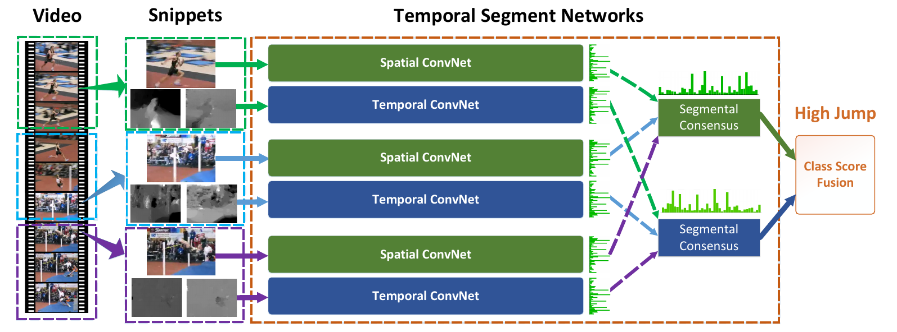

本文旨在发掘为视频行为识别和训练有限数据设计有效的卷积网络结构的原理：

- 第一个贡献时间分割网络(Temporal Segment Networks, TSN)，一个新的视频行为识别框架，它基于长期时间结构建模的思想，结合稀疏时间采样策略和视频层次监督来使用整个视频有效且高效地学习；
- 另一个贡献是一系列利用TSN在视频数据上学习卷积网络良好实践的研究。

本文方法在HMDB51(0.694)和UCF101(0.942)上取得了SOTA效果。

#### 简介

视频行为识别有两个关键并互相补充的方面：外观和动态。

#### 基于TSN的行为识别

本节首先介绍TSN框架中的基本概念，然后研究在TSN框架内学习双流卷积网络的优良实践，最终描述学得的双流网络的测试细节。

##### TSN

当前双流卷积网络的一个明显问题是无力对长期时间结构建模，主要由于其仅能获得有限的时间上下文，因其被设计为仅在单个帧（空间网络）或短时片段的单个帧栈（时间网络）上操作。但如体育活动这样的复杂行为，是由横跨相对长时间的多个阶段组成的。若无法将这些行为的长期时间结构使用到卷及网络训练中，是一个相当的损失。为解决这个问题，本文提出了TSN，一个如图1所示的视频级框架，来使用整个视频的动态。

**图1**

TSN也由一个空间流卷积网络和一个时间流卷积，它在一个从这个视频稀疏采样得到的短片段序列上进行操作。序列中的每个片段都会产生其自身的行为类别的初步预测；然后会在这些片段中获得一个共识作为视频级的预测。在学习过程中，除双流卷积网络中使用的片段级预测损失值，视频级预测损失值也会通过分别更新模型参数来优化。

形式上，将给定的视频$V$分为$K$个时长相等的分块(fragment)$\{S_1, S_2, \cdots,S_K\}$，然后TSN将一个片段(snippet)序列建模为：
$$
\text{TSN}(T_1, T_2, \cdots, T_K) = \mathcal H(\mathcal G(\mathcal F(T_1;\mathbf W),\mathcal F(T_2;\mathbf W),\cdots, \mathcal F(T_K;\mathbf W)))
$$
这里$(T_1,T_2,\cdots,T_K)$是片段序列，每个片段$T_k$都从其对应的分块$S_k$随机采样而得；$\mathcal F(T_k;\mathbf W)$是在短片段$T_k$上操作并为所有类别产生得分的参数为$\mathbf W$卷积网络的函数表达；分割性共识函数$\mathcal G$将多个短片段输出结合起来获得它们之间类别假设的一个共识；基于这个共识，预测函数$\mathcal H$为整个视频预测每个行为的概率，这里采用的是Softmax函数。结合标准分类交叉熵损失，最终考虑分割性共识$\mathbf G=\mathcal G(\mathcal F(T_1;\mathbf W), \mathcal F(T_2, \mathbf W),\cdots,\mathcal F(T_K;\mathbf W))$的损失函数形式为：
$$
\mathcal L(y,\mathbf G) = -\sum_{i=1}^C y_i\left( G_i - \log\sum_{j=1}^C \exp G_j \right)
$$
其中$C$是行为类别数，$y_i$是关于类别$i$的真实标签。在实验中，片段数$K$设置为3，共识函数$\mathcal G$仍然是一个开放问题，本文使用了最简单的形式，其中$G_i=g(\mathcal F_i(T_1), \cdots,\mathcal F_i(T_K))$，这里$G_i$使用一个均匀平均的集聚函数$g$从所有片段相同类别的得分进行推断。

根据$g$的选择这个时间性分割网络可微或至少由子梯度，这使得我们能使用多个片段来同时优化模型参数$\mathbf W$；在方向传播过程中，关于损失值$\mathcal L$的模型参数的梯度$\mathbf W$可以通过下式获得：
$$
\frac{\partial\mathcal L(y,\mathbf G)}{\partial\mathbf W} = \frac{\partial\mathcal L}{\partial\mathbf G} \sum_{k=1}^K\frac{\partial\mathcal G}{\partial\mathcal F(T_k)}\frac{\partial\mathcal F(T_k)}{\partial\mathbf W}
$$
当使用基于梯度的优化方法来学习模型参数时，上式保证了参数更新使用从所有片段级预测获得的分割性共识$\mathbf G$ ，这样TSN就能从整个网络而非短片段来学习模型参数；同时，通过为所有视频调整$K$，就收集了一个稀疏时间采样策略，其中采样的片段仅包含视频的一小部分，这极大地减少了在视频帧上评估卷积网络的计算代价。