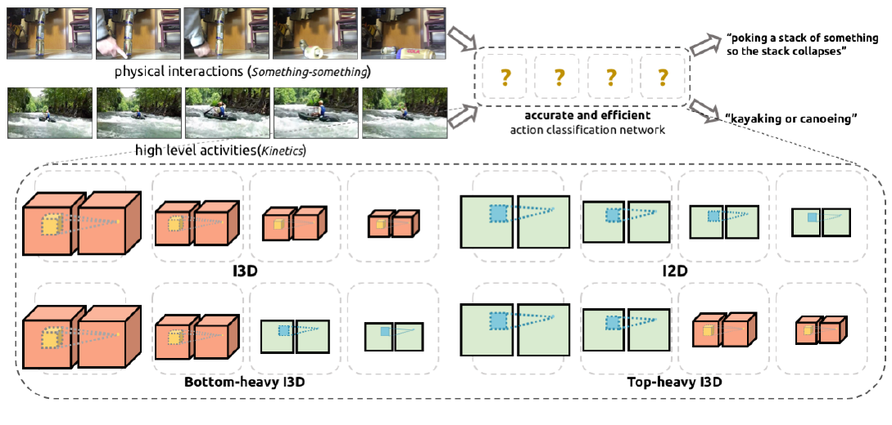

识别行为识别与检测是视频理解中两个比较基础的任务，也是两个具有很大相关性的任务：

- 行为识别/视频分类的目标是识别一段视频的行为，其输入是一段经过剪切的视频，视频的内容只包含一段明确的动作，时间也比较短（几秒钟），比如标记为行人走路的视频就只包含一个行人走路的片段，输出是视频行为类别；
- 行为检测/定位的目标是在一段普通的视频中找到包含预定以行为片段，其输入是一般普通的视频，视频中可能会包含0个或多个目标行为，输出就是这些行为的时间段以及行为类别，比如一段视频中可能包含行人走路、打篮球等，需要把这些行为的时间段和类别。

可见前者是后者的基础，后者是前者在一般场景下的范化，有点类似目标识别/图像分类与目标检测之间的关系。一般行为检测都是都需要使用行为识别的方法来提取某一特定时间段视频的特征，因此行为识别的发展也推动着行为检测的发展。下面会分别概述这两个任务最近几年的进展。

#### 行为识别

行为识别主要的难点在于视频中空间-时间特征的提取，针对时间这一维度特征的提取，衍生出基于光流（双流）、基于3D卷积、基于姿态、基于图这些类别的方法。

##### Two-Stream Convolutional Networks for Action Recognition in Videos (2014/06)

##### A Closer Look at Spatiotemporal Convolutions for Action Recognition (2017/11)

观察到对单帧进进行操作的2D卷积方法（无法对时间信息和运动形式建模）在行为识别中获得了接近3D卷积方法的效果，本文在残差学习的框架内重新审视了时间维推理在行为识别中的作用，展示了在同样的深度下3D卷积的性能显著超过了2D卷积。受这个结果的启发，本文引入了两种可认为处于2D和3D中间形式的时空卷积。

- 第一种是混合卷积（Mixed Convolution, MC），仅在网络的前面几层使用3D卷积，顶部则使用2D卷积，这种设计背后的原理是运动建模是一种低/中级操作，可以通过网络前面的层经由3D卷积实现，而在这些中级运动特征上的空间推理（在顶部层使用2D卷积实现）能获得更精确的行为识别，实验结果显示MC残差网络在片段级上超过同等大小的2D残差网络大约3-4%；

- 第二种是(2+1)D卷积块，明确地将3D卷积分解到两个分离和连续的操作，一个2D空间卷积和一个1D时间卷积。这样的分解有两个优点：
  
  - 第一个是这两个操作之间之间一个额外的非线性修正，与参数量相同的全3D卷积网络相比加倍了非线性的数量，从而使得模型能表达更加复杂的函数；
  - 第二个是相比于外观和动态同时缠绕的3D卷积，(2+1)D卷积块更易于优化。
  
  实验显示在所有层同等采用(2+1)D块的残差网络获得在Kinetics和Sports-1M上都获得了SOTA性能。

##### Rethinking Spatiotemporal Feature Learning: Speed-Accuracy Trade-offs in Video Classification (2017/12)

视频分类正面临一些更基础的挑战：1) 如何最好地表达空间信息（识别物体外观）；2) 如何最好地表达时间信息（识别上下文、相关性和因果性）；3) 如何最好地平衡模型复杂度和速度。以当前SOTA方法I3D（使Inception网络的2D卷积核Inflate膨胀到3D）为起点，本文寻求解决这几个问题：

- 是否需要3D卷积网络，如果需要哪些层应该是3D、哪些3层可以是2D，这是否依赖于数据集和任务；
- 同时卷积时间和空间是否重要，或者分别卷积这些维度就已足够；
- 如何使用上面问题的答案来在精度、速度和内存占用等方面改善前面的方法。

为回答第一个问题，本文应用“网络手术”的方法获得多种I3D结构的变体，如下图所示分别是：

- Bottom-Heavy-I3D，在网络的最底（最接近像素）层保留3D时间卷积；
- Top-Heavy-I3D则与上面相反，在网络顶层保留3D时间卷积，在底层则使用2D。

通过改变deflate（收缩，变为2D）层个数，本文调查了速度和精度的平衡，结果发现Top-Heavy-3D更快（意料之中，因为仅在抽象特征图上应用3D，相比底层特征图更小），且精度更高（意料之外，因为忽视了底层的运动线索）。

为回答第二个问题，本文将3D卷积替换为空间和时间可分离卷积，即将形式为$k_t\times k\times k$的卷积核替换为$1\times k\times k$后跟$k_t\times1\times1$的形式（$k_t$为卷积核的时间宽度），这样获得的模型被称为S3D(Separable 3D)，很明显它的参数更少、计算效率更高，但效果却比I3D更好。

最后为回答第三个问题，本文通过一个时间-空间门机制来结合前面所学内容，从而设计了一个被称为S3D-G的新模型结构，在多个数据集上显著超过了当前的基准线。

##### PA3D: Pose-Action 3D Machine for Video Recognition (CVPR19)

