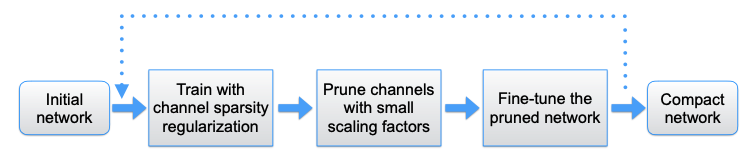

##### 通道级剪枝的优点和挑战

稀疏化可以在不同的等级(level)实现，如权值(weight)级、核心(kernel)级、通道(channel)级或者网络层(layer)级。

- 细粒度级别（如权值级）稀疏化有最高的灵活性和普遍性，从而有更高的压缩率，但在稀疏化的模型上执行快速推理时需要特殊的软件或硬件加速器；
- 而粗粒度的网络层级则无需特殊的包来获得推理加速，但一次会剪掉一层网络因此缺乏灵活性，实际上只有网络深度充分大时（例如超过50层）删除网络层才有效果；

相比之下，通道级的稀疏化在灵活性和易于实现之间提供了一个很好的权衡，能应用到任何典型的卷积网络和全连接网络（将每个神经元看成一个通道），产生的网络实际上是未剪枝网络的瘦化版，可以在传统的CNN平台上有效进行推理。

但通道级稀疏化需要对一个通道所有相关的输入输出连接剪枝，这使得直接在预训练模型上剪权值的方法并不有效，因为一个通道在输入和输出端上所有的权值都有接近于0的值并不现实。实际上在预训练的ResNets上剪通道仅有10%的削减。

##### 缩放因子与稀疏化诱导的惩罚

基本思想是未每个通道引入一个缩放因子$\gamma$，并将其乘到此通道的输出。然后同时训练网络权值和缩放因子，并在后者施加稀疏化正则，最后剪掉小因子的通道，并对剪枝后的网络调优。确切地说，这个方法的训练目标为：
$$
L = \sum_{(x,y)} l\left( f(x,W), y \right) + \gamma\sum_{\gamma\in\Gamma} g(\gamma)
$$
其中$(x,y)$表示训练输入和目标，$W$表示可训练参数，$g(\cdot)$是缩放因子上稀疏化诱导的惩罚，本文的实验中选择了L1范数$g(s)=|s|$，采用了次梯度下降来优化非光滑的L1惩罚项。

缩放因子发挥着通道选择的作用，因为它们与网络权值一起被优化，网络能自动识别无关紧要的通道，这样就能在不太影响泛化性能的情况下被删除。

##### 使用BN层的缩放因子

BN层使用一个批次的统计量来正规化内部激活值，另$z_{in}$和$z_{out}$表示BN层的输入和输出，$\mathcal B$表示当前批次，BN层执行下面的转换：
$$
\hat z = \frac{z_{in}-\mu_\mathcal B}{\sqrt{\sigma^2_{\mathcal B}+\epsilon}}; \quad z_{out}=\gamma\hat z+\beta
$$
其中$\mu_{\mathcal B}$和$\sigma_{\mathcal B}$是$\mathcal B$上输入激活值的均值和标准差，$\gamma$和$\beta$是可训练仿射变换参数（大小和偏移）。在实践中通常会在卷积层后面插入带有逐通道缩放/偏移参数的BN层，因此可以直接使用$\gamma$参数作为网络剪枝中需要的缩放因子，这样的好处是不会引入额外的开支。

实际上这可能也是最有效的为通道剪枝学习有效缩放因子的方法：

1. 若添加缩放层到一个不含BN的CNN网络 ，缩放因子对评估通道重要性并无意义，因为卷积层和缩放层都是线性变换，可以通过减少缩放因子的同时扩大卷积层权值来获得同样的结果；
2. 若在BN层前插入一个缩放层，则其缩放效果会被后面BN层中的正规化过程消除；
3. 若在BN层后面插入缩放层，则对每个通道有两个连续的缩放因子；

##### 通道剪枝与调优

经过通道级稀疏化诱导的正则化训练后，就获得一个许多缩放因子都接近0的模型。之后通过删除输入和输出连接及其权值，就可以剪掉缩放因子接近0的通道。我们通过一个所有层的全局阈值来削减通道，它被定义为所有缩放因子的某个 百分位。这样，我们就能获得一个参数更少、运行时内存更小、以及计算操作更少的更紧凑的模型。

当剪枝率较高时，剪枝可能会导致一些精度损失，这歌很大程度上可以通过后续的调优步骤补偿，在我们的实验中，调优后的剪枝模型在许多情况下甚至取得了比未剪枝模型更高的准确率。

##### 多次模型

可以将前面的方法从单次学习模式（系数正则化训练、剪枝、调优）扩展为多次模式。如下图所示：

##### 处理跨层连接和预激活结构

上面的网络兼职过程可以直接应用到大部分简单CNN结构中，如AlexNet和VGGNet，但在包含跨层连接和预激活涉及的网络，如ResNet和DenseNet中则需要一些调整。对这些网络而言，一层的输出会被看成是多个后继层的输入，再次之中一个BN层被放置在一个卷积层之前。这种情况下，稀疏化是通过在一层的输入端获得，例如网络层选择性地使用其获得的通道的子集。要在测试时获得参数和计算的减少，需要放置一个通道选择层来掩出(mask out)所确认的不重要的层。